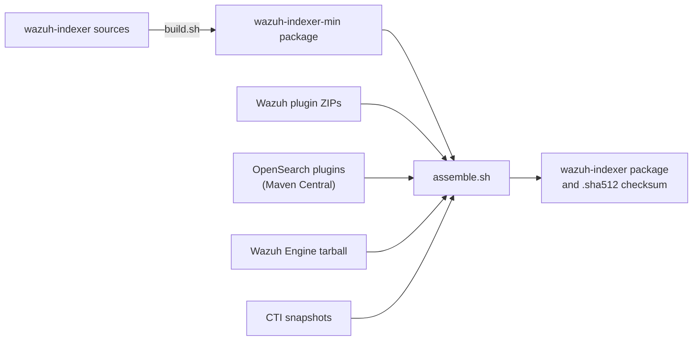

# Packages

This page is for the people who build and maintain the Wazuh Indexer Debian (DEB) and RPM
packages: how a package is put together, how it is named, built in continuous integration (CI)
and tested, and how its maintainer scripts behave on installation, upgrade and removal. For the
commands to build a package yourself, see [Build packages](build-packages.md).

Everything described here lives in the [`wazuh-indexer`](https://github.com/wazuh/wazuh-indexer)
repository, and every path on this page is relative to it: the build tooling is in
`build-scripts/`, the package definitions and maintainer scripts in `distribution/packages/src/`.

- [Supported systems](#supported-systems)
- [How a package is built](#how-a-package-is-built)
- [Package naming](#package-naming)
- [Continuous integration](#continuous-integration)
- [Testing](#testing)
- [Maintainer scripts](#maintainer-scripts)
- [Credential and TLS resolution](#credential-and-tls-resolution)
- [File ownership](#file-ownership)
- [Host dependencies](#host-dependencies)

## Supported systems

The build produces three formats, `deb`, `rpm` and `tar`, each for the `x64` and `arm64`
architectures. Windows is not supported.

The operating systems the packages are supported and tested on are listed in
[Compatibility](../ref/compatibility.md). That table is the one to update when support changes,
and it must always match the list in the
[Wazuh documentation](https://documentation.wazuh.com/current/installation-guide/wazuh-indexer/index.html).
The Indexer team keeps both up to date.

## How a package is built

A package is built in two stages, each driven by its own script:

- **Build** — `build-scripts/build.sh` compiles the OpenSearch fork with Gradle and produces the
  *minimal package*, `wazuh-indexer-min`: the search engine alone, with no plugins and no Wazuh
  configuration.
- **Assemble** — `build-scripts/assemble.sh` unpacks the minimal package, adds everything that
  makes it the Wazuh Indexer, and packs the *final package*, `wazuh-indexer`, the one installed
  on hosts.



GitHub Actions provides the infrastructure, but the build logic is self-contained in Gradle and
these Bash scripts, so the same process runs unchanged in the [Docker builder](#the-docker-builder),
in CI and on a workstation. `build.sh` keeps the shape of the per-component build script that
OpenSearch's [opensearch-build](https://github.com/opensearch-project/opensearch-build/tree/main/src/build_workflow#custom-build-scripts)
repository expects, which is why it also publishes Maven artifacts.

### Build

`build.sh` runs `publishToMavenLocal` and `publishNebulaPublicationToTestRepository`, then the
`:distribution:<type>:<target>:assemble` Gradle task for the requested format and architecture
(`<type>` is `packages` for DEB and RPM, `archives` for the tarball), and bundles the
`workload-management` plugin, which is built from this repository rather than downloaded. Gradle
writes the package to `distribution/<type>/<target>/build/distributions/`, and the script copies
it to `artifacts/dist/` under the name given with `-n`.

### Assemble

`assemble.sh` finds the minimal package in `artifacts/dist/`, unpacks it in `artifacts/tmp/`
(with `ar` and `tar` for DEB, `rpm2cpio` and `cpio` for RPM), and then:

1. Writes `VERSION.json` into the product directory, with a `commit` field holding the commit
   hashes the package was built from (see [Package naming](#package-naming)).
2. Installs the plugins with `opensearch-plugin`, from three lists at the top of the script:
   `plugins`, the OpenSearch plugins, downloaded from Maven Central at the OpenSearch version in
   `buildSrc/version.properties`; `internal_plugins`, built by `build.sh`; and `wazuh_plugins`,
   read from `artifacts/plugins/`.
3. Copies the Content Manager's Cyber Threat Intelligence (CTI) snapshots, when
   `artifacts/snapshots/` exists, into `plugins/wazuh-indexer-content-manager/snapshots/`.
4. Installs the Wazuh Engine from the tarball in `artifacts/engine/` into `engine/`.
5. Applies the Wazuh configuration. Once the Security plugin has created its default files in
   `opensearch-security/`, the script appends Wazuh's `*.wazuh.yml` files to them (see
   [Security](plugins/security.md)), deletes the demo users and role mappings the product does not
   use, replaces the `admin` and `kibanaserver` hashes with credential placeholders (see
   [How a password reaches the cluster](#how-a-password-reaches-the-cluster)) and disables
   multi-tenancy. It then installs `opensearch.prod.yml` as `opensearch.yml`, and removes
   symbolic links, `.bat` files and the Security plugin's `install_demo_configuration.sh`.
6. Downloads the latest nightly installation assistant tools: `config.yml`,
   `wazuh-passwords-tool.sh` and `wazuh-certs-tool.sh` into `tools/`, and the shared
   `wazuh-credentials.sh` library into `lib/`.
7. Packs the result, with `debmake` and `debuild` from `distribution/packages/src/deb/`, or with
   `rpmbuild` from `distribution/packages/src/rpm/wazuh-indexer.rpm.spec`. It drops the `-min`
   from the name and writes a `.sha512` checksum beside the package.

Assembly needs network access, to Maven Central and to the installation assistant's staging
bucket.

To add a plugin to the package, add an OpenSearch plugin to the `plugins` list in `assemble.sh`.
A Wazuh plugin goes in `wazuh_plugins` there and in the `maven_plugins` list of `copy_builds` in
`build-scripts/builder/entrypoint.sh`; one from a new repository also needs a clone entry and a
build function in that file. A file the service writes at runtime also needs an ownership
exception, as described in [File ownership](#file-ownership).

### The Docker builder

`build-scripts/builder/builder.sh` runs both stages inside a container (`compose.yml` and
`Dockerfile` in the same directory) that carries JDK 21 and every packaging tool, so nothing has
to be installed on the host. The container's `entrypoint.sh`:

1. Clones the six plugin repositories at the branch, tag or commit given for each, into named
   volumes that persist between runs.
2. Downloads the CTI snapshots with `build-scripts/download_snapshots.sh` from `CTI_API_URL`,
   which defaults to the pre-production CTI API.
3. Builds the plugins with `./gradlew publishToMavenLocal -x check`, versioned
   `<version>.<revision>`, in dependency order: Common Utils, Alerting, Security Analytics (its
   `commons` module first), Notifications, Reporting, and last the Setup and Content Manager
   plugins from `wazuh-indexer-plugins`.
4. Copies the plugin ZIPs to `artifacts/plugins/` and the Engine tarball to `artifacts/engine/`.
5. Clears `artifacts/dist/` and `artifacts/tmp/`, names the minimal package with `baptizer.sh`,
   and runs `build.sh` and `assemble.sh`.

The builder's flags and prerequisites, including how to obtain the Engine tarball, are in
[Build packages](build-packages.md).

`build.sh` and `assemble.sh` can also run directly, from the repository root, once
`artifacts/plugins/` and `artifacts/engine/` are populated. The builder exists so that this is
rarely worth doing: the host then needs `jq` at `/usr/bin/jq`, Maven, a JDK and `debmake` or
`rpmbuild`; `assemble.sh` overwrites `~/.devscripts` when it packs a DEB; and a minimal package
left in `artifacts/dist/` by an earlier run breaks assembly, because the script finds the
minimal package by pattern.

### The artifacts directory

Both stages read from and write to `artifacts/`, at the repository root:

| Directory | Contents | Written by |
| --- | --- | --- |
| `dist/` | The minimal package, the final package and its `.sha512` checksum | `build.sh`, `assemble.sh` |
| `maven/` | The OpenSearch fork's Maven publications | `build.sh` |
| `plugins/` | The Wazuh plugin ZIPs | Docker builder |
| `engine/` | The Wazuh Engine tarball | Docker builder |
| `snapshots/` | The CTI snapshots and their `manifest.json` | Docker builder |
| `tmp/` | Scratch space for unpacking, deleted when assembly succeeds | `assemble.sh` |

## Package naming

The stages hand packages to each other by file name, so names are generated rather than typed:
`build-scripts/baptizer.sh` prints the name for a combination of parameters. It only prints, so
it is safe to run with any combination to get familiar with the convention. Run it from the
repository root.

The version comes from the `version` field of `VERSION.json`, and the Wazuh plugins are versioned
`<version>.<revision>` from it. The `stage` field (`rc1`, for example) is not part of the name: it
is only sent as the version tag when the builder requests the CTI snapshots.

There are two conventions:

- **Release** — the name a published package carries. Selected with `-x` (the builder's
  `-S true`, the Workflow's `is_stage`).
  - DEB and tarball: `wazuh-indexer_<version>-<revision>_<architecture>.<extension>`
  - RPM: `wazuh-indexer-<version>-<revision>.<architecture>.rpm`
- **Development** — the default, the same for every format:
  `wazuh-indexer_<version>-<revision>_<architecture>_<commits>.<extension>`. `<commits>` is the
  short hash of the `wazuh-indexer` commit or, when all five plugin hashes are given (the builder
  always gives them), six hashes joined by `-`: `wazuh-indexer`, `wazuh-indexer-plugins`,
  `wazuh-indexer-reporting`, `wazuh-indexer-security-analytics`, `wazuh-indexer-notifications`
  and `wazuh-indexer-alerting`, in that order.

`-m` replaces the `wazuh-indexer` prefix with `wazuh-indexer-min`, the name `build.sh` gives the
minimal package. `assemble.sh` drops the `-min` again.

The architecture is spelled the way each package manager expects:

| Format | `x64` | `arm64` |
| --- | --- | --- |
| DEB | `amd64` | `arm64` |
| RPM | `x86_64` | `aarch64` |
| Tarball | `linux-x64` | `linux-arm64` |

```bash
bash build-scripts/baptizer.sh -d rpm -a x64 -r 0 -x
# wazuh-indexer-5.0.0-0.x86_64.rpm
bash build-scripts/baptizer.sh -d deb -a arm64 -r 0 -x
# wazuh-indexer_5.0.0-0_arm64.deb
bash build-scripts/baptizer.sh -d rpm -a x64 -r 0
# wazuh-indexer_5.0.0-0_x86_64_a55f704b69c.rpm
```

The `commit` field `assemble.sh` writes into `/usr/share/wazuh-indexer/VERSION.json` holds the
same six hashes, so an installed node records what it was built from even under a release name.
The `wazuh-indexer-common-utils` commit, which several of the plugins are built against, appears
in neither the name nor that field.

## Continuous integration

Packages are built by the `5_builderpackage_indexer.yml` Workflow, **(5.x) Build packages**. To
run it by hand, open the repository's **Actions** tab, select **(5.x) Build packages**, fill in the
form and click **Run workflow**. The inputs that change the result:

- **`revision`** (default `0`) — the package revision.
- **`is_stage`** (default `false`) — use the release naming convention.
- **`distribution`** and **`architecture`** — the formats and architectures to build, one job
  per combination.
- **`plugins_ref`** (default `main`) — the branch, tag or commit to build the plugin repositories
  and the Wazuh Engine from. Each repository uses the same-named branch when it has one, and
  otherwise the branch for the product version, so a feature branch pushed with the same name to
  several repositories is built together.
- **`upload`** and **`checksum`** — upload the packages, and their checksums, to the S3 bucket.

The Workflow first checks that every repository declares the same product and OpenSearch
versions (`build-scripts/check_compatibility_versions.sh`) and builds the Wazuh Engine through the
`wazuh/wazuh` repository's `5_builderpackage_engine-standalone.yml`. It then runs the same
`builder.sh` described above, on the dedicated runner, followed by the package tests.
`5_builderpackage_indexer_onpush.yml` calls it for every pull request that is ready for review
and changes more than Markdown files.

## Testing

Every package the Workflow builds is installed, removed and, when a previous version exists,
upgraded, in throwaway containers before it is uploaded. [Package testing](run-tests.md#package-testing) lists those tests and the
scripts behind them.

To try a package on a real service, use the Vagrant environment described in
[Test cluster (Vagrant)](run-tests.md#test-cluster-vagrant). More extensive testing, including
end-to-end (E2E) tests, is done by the quality assurance (QA) team.

## Maintainer scripts

| Package | Scripts | Dependencies |
| --- | --- | --- |
| DEB | `deb/debian/`: `preinst`, `postinst`, `prerm`, `postrm` | `Depends:` in `deb/debian/control` |
| RPM | `rpm/wazuh-indexer.rpm.spec`: `%pre`, `%post`, `%posttrans`, `%preun`, `%postun` | `Requires:` in the spec |

Paths are relative to `distribution/packages/src/`. The systemd unit, its environment file, the
SysV init script and the sysctl settings are shared by both packages, under `common/`. A change to
one package's scripts almost always needs its counterpart in the other.

The two package managers run these scripts in a different order, and that order decides where
each step has to go. [Fedora's scriptlet ordering](https://docs.fedoraproject.org/en-US/packaging-guidelines/Scriptlets/#ordering)
and the [Debian maintainer scripts](https://wiki.debian.org/MaintainerScripts) flowcharts are the
references.

### Upgrades keep the service state

An upgrade leaves the service as it found it: a node that was running is running again afterwards,
with no operator action, and a stopped node stays stopped.

1. Before the new files are unpacked, DEB `preinst upgrade` or RPM `%pre` (with `$1` set to `2`)
   refuses to upgrade a 4.x installation, then stops the service if it is active and creates the
   flag file `/etc/wazuh-indexer/.was_active`.
2. The package manager replaces the files.
3. DEB `postinst configure` (with the previous version in `$2`) or RPM `%posttrans` restarts the
   service if the flag exists, and deletes it. Without the flag, it prints how to start the
   service instead.

The RPM restart is in `%posttrans`, not `%post`, because during an RPM upgrade the new package's
`%post` runs before the old package's `%preun`, its file removal and its `%postun`. `%posttrans`
is the only scriptlet that runs after all of them. The old package's removal scriptlets act only
when `$1` is `0`, a real erase, and DEB `prerm upgrade` and `postrm upgrade` do nothing, so an
upgrade never disables the service. The spec declares the flag file `%ghost`, so RPM owns it
without shipping it.

For the operator's side of an upgrade, see [Upgrade](../ref/upgrade.md).

### Configuration files

The package manager never overwrites a configuration file the operator changed. The two formats
handle the conflict differently:

- **RPM** — the files marked `%config(noreplace)` in `%files`: `opensearch.yml`, `jvm.options`,
  `log4j2.properties`, the `opensearch-security/` files, `/etc/sysconfig/wazuh-indexer` and a few
  others. An upgrade replaces an unmodified file. A modified one is kept, and when the packaged
  version changed, the new version is written beside it with the `.rpmnew` suffix. On erase, a
  modified file is saved with the `.rpmsave` suffix.
- **DEB** — debhelper marks every file under `/etc` as a conffile. An upgrade replaces an
  unmodified conffile. For a modified one whose packaged version also changed, `dpkg` asks the
  operator which to keep, unless `--force-confold` or `--force-confnew` answers for them; the CI
  upgrade tests pass `--force-confnew`. `remove` keeps conffiles and `purge` deletes them.

`resolve-credentials.sh` writes the node and admin distinguished names (DNs) into `opensearch.yml`
and the password digests into `internal_users.yml` at installation, so on every host both files
count as modified from the start. Any change to their shipped content therefore produces an
`.rpmnew` file or a `dpkg` prompt on every upgrade. For the same reason, the RPM erase deletes
their `.rpmsave` copies: they carry credential material.

### Further reading

- [Debian Policy: configuration file handling](https://www.debian.org/doc/debian-policy/ap-pkg-conffiles.html)
- [Debian Wiki: maintainer scripts](https://wiki.debian.org/MaintainerScripts)
- [Fedora Packaging Guidelines: scriptlets](https://docs.fedoraproject.org/en-US/packaging-guidelines/Scriptlets/)
- [rpm.org: spec file format](https://rpm-software-management.github.io/rpm/manual/spec.html)
- [Maximum RPM: directives for the `%files` list](http://ftp.rpm.org/max-rpm/s1-rpm-inside-files-list-directives.html)

## Credential and TLS resolution

The Wazuh Indexer package resolves its own credentials and Transport Layer Security (TLS)
material rather than shipping defaults. This section covers when that runs and what it does; the
commands it needs from the host are listed in [Host dependencies](#host-dependencies). For the
accounts and roles themselves, see [Security](plugins/security.md).

### Resolution happens once

`resolve-credentials.sh` runs from three places — `postinst` / `%post`, the unit's `ExecStartPre`,
and a container entrypoint — but it does its work **once**. A run that resolves everything it was
responsible for records the fact in `/var/lib/wazuh-indexer/.initialized`, and every later run
exits immediately without reading a key, a certificate or the credentials file.

That is not an optimisation. A password an operator rotated, or a certificate pair they replaced
with their own, has to survive a service restart and a package upgrade, and the only way to
guarantee that is to stop looking. A partial run — one that could not issue a certificate, say —
deliberately does **not** record completion, so the next install can still finish the job.

`resolve-credentials.sh --clear` is the one way back. It exists for container images built by
installing the package, which would otherwise bake one host's credentials into a layer every
container shares.

`indexer-security-init.sh` keeps no state of its own. It is run by an operator, once, and the
package never calls it — so there is nothing for it to guard against repeating.

### How a password reaches the cluster

`internal_users.wazuh.yml` ships each account's `hash` as a `${NAME}` placeholder rather than a digest, so the package carries no usable credential. `resolve-credentials.sh` resolves the value, bcrypts it with the Security plugin's `hash.sh`, and substitutes the digest in place.

The placeholder is deliberately bare. The Security plugin substitutes `${env.X}`, `${envbc.X}` and `${envbase64.X}` itself, node-side, at every configuration load — which would tie each account to a variable that has to stay in the service environment for the life of the deployment. A placeholder with no such prefix is left untouched by the plugin.

Loading the result into the cluster stays a manual step, `indexer-security-init.sh`. A package cannot know whether other nodes of the same cluster are still to be installed elsewhere, so running it automatically would either race those nodes or overwrite what they uploaded.

### Resolver modes

`resolve-credentials.sh` takes one of four modes:

- `--install` — from `postinst` / `%post` on a fresh install. Creates what it can, never fails, and is the only moment that issues certificates.
- `--upgrade` — from `postinst` / `%post` on an upgrade. Fills in only what this host never had, and never touches the certificates.
- `--prestart` — from the unit's `ExecStartPre`. Refuses to start the service when something is unresolved.
- `--clear` — removes everything this component owns, so the next run resolves from nothing. Nothing in the package calls it; see [Resolution happens once](#resolution-happens-once).

### Certificate resolution

Which case applies is decided entirely by what is present in the certificate authority (CA) directory, with no mode flag — the presence of a private key beside the trust anchor is the signal, so a host never given one cannot sign:

| In the CA directory | Pair already in place | Result |
| --- | --- | --- |
| Nothing | No | Mint a CA, then self-issue |
| Anchor and key | No | Issue from the CA found |
| Anchor only | Yes | Use both, generate nothing |
| Anchor only | No | Unresolved; the service will not start |

The Subject Alternative Names (SANs) default to the hostname, the fully qualified domain name (FQDN), loopback and the global addresses of default-route interfaces. `WAZUH_INDEXER_CERT_SANS` replaces that list wholesale.

## File ownership

Root runs `bin/resolve-credentials.sh` — from the maintainer scripts and from the unit's
`ExecStartPre` — and that script sources `lib/wazuh-credentials.sh`. So the product tree is
**`root`-owned**, group `wazuh-indexer`, mode `750`/`640`: the service account reads and executes
everything and writes nothing. A service account able to rewrite either file could have root run
its own code.

Two directories under the product tree are exceptions, because the service writes them at runtime:

- `engine/` — sockets, logs and data
- `plugins/wazuh-indexer-content-manager/snapshots/` — the content manager deletes the shipped
  snapshot once it has consumed it

**Adding a file the service must write means adding a third exception**, in the DEB `postinst` and
in the spec's `%files`. Adding one it only reads needs nothing: the default covers it. The
acceptance suite asserts both the root ownership and the two exceptions, so getting this wrong
fails the build rather than shipping quietly.

The same reasoning applies outside the product tree. `/etc/default/wazuh-indexer` and
`/usr/lib/sysctl.d/wazuh-indexer.conf` are read by systemd as root, so both stay root-owned.

### When the package is purged

A purge (DEB `purge`, RPM erase) deletes the `wazuh-indexer` user and group, and that frees their
IDs. The next system account created would inherit them, and with them anything still on disk that
they own: the certificates and their private keys, the keystore, the logs and the indexed data,
none of which the purge deletes. So before `userdel` runs, the purge hands every file the account or
its group owns over to root:

- Files owned by `wazuh-indexer` become `root:root`, with group and other access removed
  (`go-rwx`).
- Files that only its group owns get group `root`, with group access removed.
- `find -P` and `chown -h` change symlinks themselves, and `chmod` never sees one, so a link the
  service account planted cannot aim the purge at another file.

It walks the default directories (`/etc/wazuh-indexer`, `/var/lib/wazuh-indexer`,
`/var/log/wazuh-indexer`, `/usr/share/wazuh-indexer`, `/run/wazuh-indexer`) plus every directory
`opensearch.yml` points the node at: `path.home`, `path.data`, `path.logs`, `path.repo` and
`path.shared_data`. That file is a conffile, already gone when `postrm purge` runs, so `prerm` /
`%preun` first records those paths in `/var/lib/wazuh-indexer/.data-paths`.

The paths are read by `bin/ListDataPaths.java`, run with the bundled Java Development Kit (JDK) in
source-file mode and `lib/*` on the class path. It loads the file with OpenSearch's own settings
loader and reads the `Environment` settings, so it accepts exactly what the node accepts: flat or
nested keys, a single value or a list. It prints nothing and fails when it cannot say for certain:
an unreadable or invalid file, a relative path, or a `${...}` placeholder the node would resolve
from its own environment. `prerm` then records `unknown`, and the purge keeps the user and group,
still handing over the default directories. Null values elsewhere in the file are accepted, since
an empty admin DN before the credentials are resolved says nothing about where data lives.

The record is only ever read as a list of paths, never sourced: a service account able to rewrite
it can at most make the purge touch files that it or its group already own, or keep the account.
The helper itself sits in the root-owned product tree, like `resolve-credentials.sh`, because root
runs it.

If any handover fails, on a read-only mount or a network file system that squashes root, say, the
user and group are kept, so their IDs stay reserved, and the purge names the directories it could
not hand over.

Nothing is deleted. On a reinstall, `postinst` / `%post` take the default directories back with the
`chown -R` they already run. A directory outside them is taken back only by the operator, and the
purge prints the command to do it. What the operator sees is described in
[Uninstall](../ref/uninstall.md).

**A directory the service writes outside those locations must be added to the purge's list**, in
the DEB `postrm` and in the spec's `%postun`, or its files are left with an orphaned owner.
`build-scripts/ci/test_purge.sh` asserts that no file with an orphaned owner is left, but only in
the directories it knows about.

## Host dependencies

Both packages declare these (`Depends:` in `debian/control`, `Requires:` in the spec, where
`AutoReqProv` is off so nothing is inferred). They are listed here because the failure modes are
not obvious from the command names.

| Command | Provided by (yum / apt) | Used for |
| --- | --- | --- |
| `openssl` | `openssl` | Minting the bootstrap CA and issuing this node's certificate pair |
| `cmp` | `diffutils` | Checking that the CA private key matches its trust anchor |
| `flock` | `util-linux` | Serializing writes to `/etc/wazuh/credentials.env`, which every component shares |
| `runuser` | `util-linux` | Running `securityadmin.sh` as the service user |
| `ip` | `iproute` / `iproute2` | Deriving the certificate's Subject Alternative Names from the default-route interfaces |
| `hostname` | `hostname` | The certificate's common name and its first SAN |
| `pgrep` | `procps-ng` / `procps` | Detecting a running node, in `indexer-security-init.sh` |
| `stat`, `install` | `coreutils` | Validating ownership and mode on the credentials file and the CA directory |

`coreutils`, `util-linux` and `hostname` are Essential or `required` priority on Debian, so the
DEB package does not list them.

A full server installation of any supported distribution carries all of these already. A minimal
or container base image frequently does not — a pristine `opensearchproject/opensearch:3.6.0` has
none of `openssl`, `cmp`, `flock`, `runuser`, `ip`, `hostname` or `pgrep`. The failures are quiet
and easy to misread:

- a missing `openssl` leaves the node with no certificates;
- a missing `flock` stops any credential from being published at all;
- a missing `cmp` reports `root-ca.key does not match root-ca.pem` against a CA that is perfectly
  valid, because the shared helper cannot run the comparison.
