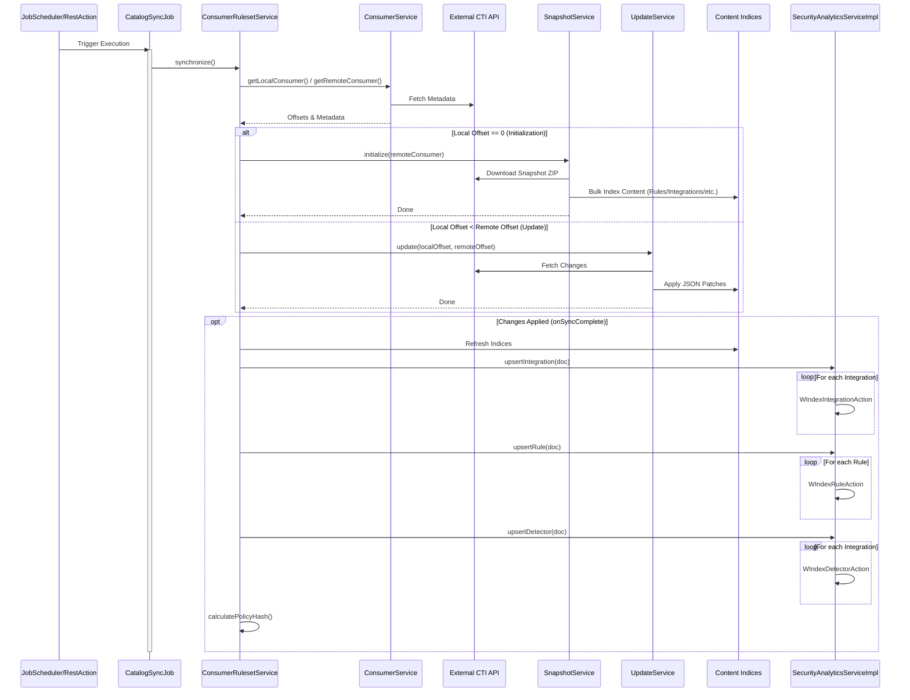
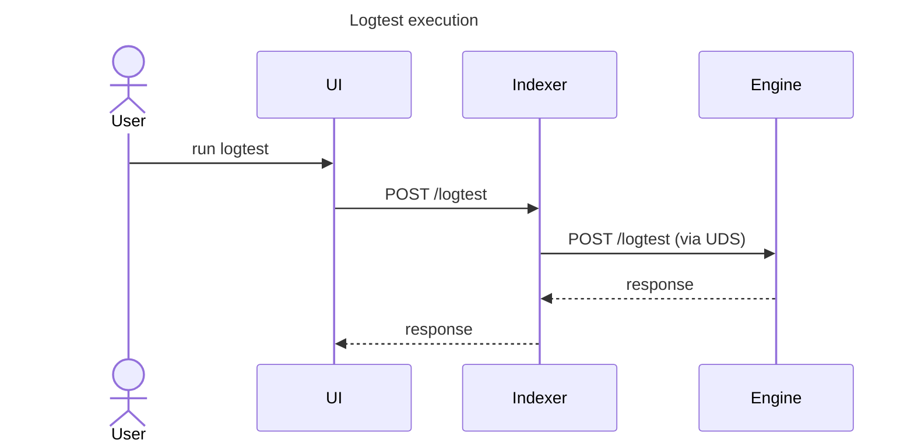
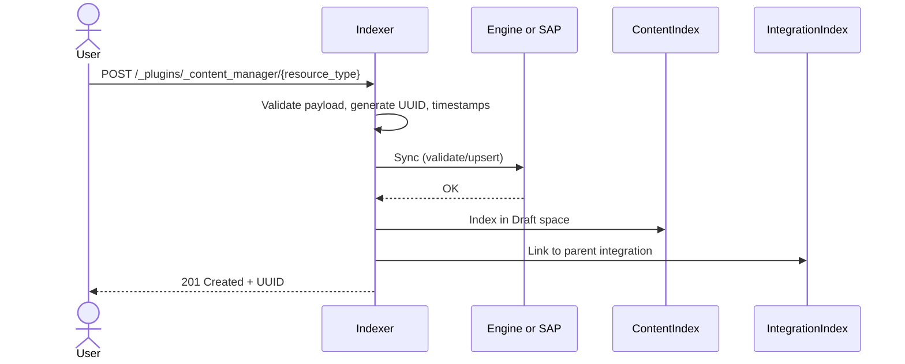
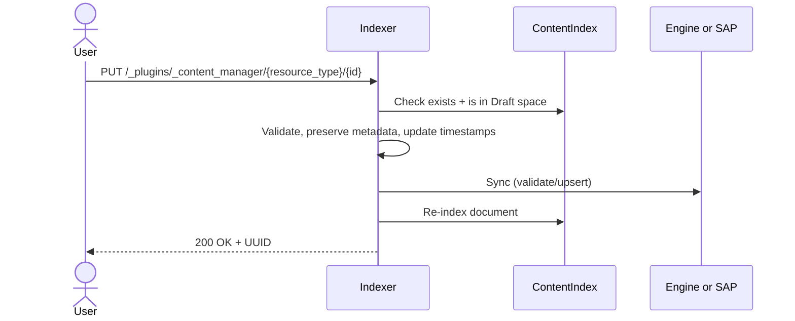
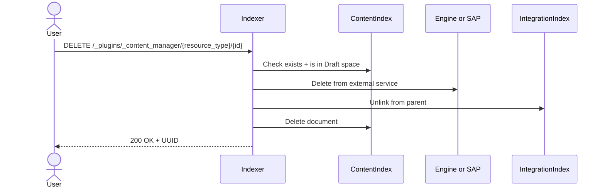
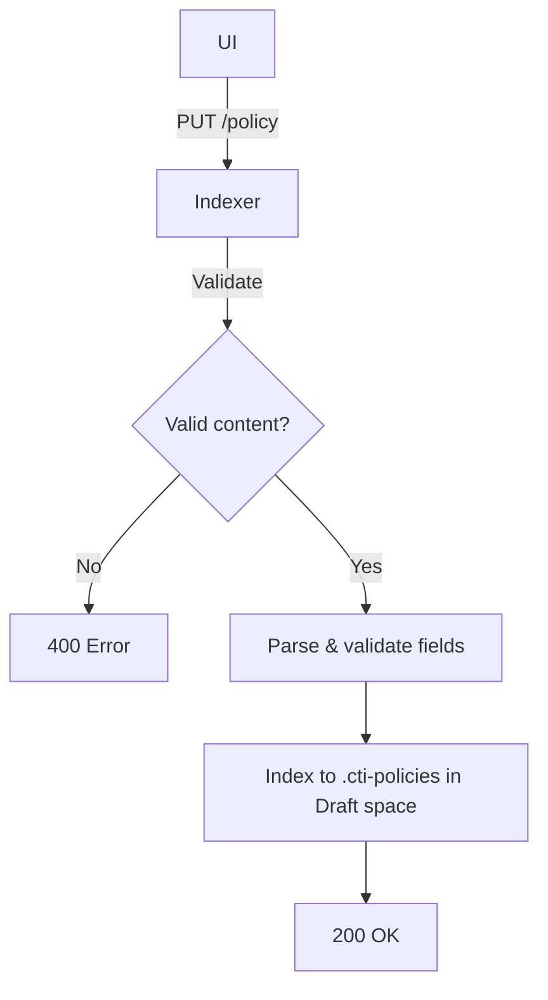

# Wazuh Indexer Content Manager Plugin — Development Guide

This document describes the architecture, components, and extension points of the Content Manager plugin, which manages security content synchronization from the Wazuh CTI API and provides REST endpoints for user-generated content management.

---

## Overview

The Content Manager plugin handles:

- **CTI Subscription:** Manages subscriptions and tokens with the CTI Console.
- **Job Scheduling:** Periodically checks for updates using the OpenSearch Job Scheduler.
- **Content Synchronization:** Keeps local indices in sync with the Wazuh CTI Catalog via snapshots and incremental JSON Patch updates.
- **Security Analytics Integration:** Pushes rules, integrations, and detectors to the Security Analytics Plugin (SAP).
- **User-Generated Content:** Full CUD for rules, decoders, integrations, KVDBs, and policies in the Draft space.
- **Engine Communication:** Validates and promotes content via Unix Domain Socket to the Wazuh Engine.
- **Space Management:** Manages content lifecycle through Draft → Test → Custom promotion.

---

## System Indices

The plugin manages the following indices:

| Index | Purpose |
|---|---|
| `.cti-consumers` | Sync state (offsets, snapshot links) |
| `.cti-policies` | Policy documents |
| `.cti-integrations` | Integration definitions |
| `.cti-rules` | Detection rules |
| `.cti-decoders` | Decoder definitions |
| `.cti-kvdbs` | Key-value databases |
| `.cti-iocs` | Indicators of Compromise |
| `.engine-filters` | Engine filter rules |
| `.wazuh-content-manager-jobs` | Job scheduler metadata |

---

## Plugin Architecture

### Entry Point

**`ContentManagerPlugin`** is the main class. It implements `Plugin`, `ClusterPlugin`, `JobSchedulerExtension`, and `ActionPlugin`. On startup it:

1. Initializes `PluginSettings`, `ConsumersIndex`, `CtiConsole`, `CatalogSyncJob`, `EngineServiceImpl`, and `SpaceService`.
2. Registers all REST handlers via `getRestHandlers()`.
3. Creates the `.cti-consumers` index on cluster manager nodes.
4. Schedules the periodic `CatalogSyncJob` via the OpenSearch Job Scheduler.
5. Optionally triggers an immediate sync on start.

### REST Handlers

The plugin registers 22 REST handlers, grouped by domain:

| Domain | Handler | Method | URI |
|---|---|---|---|
| **Subscription** | `RestGetSubscriptionAction` | GET | `/_plugins/_content_manager/subscription` |
| | `RestPostSubscriptionAction` | POST | `/_plugins/_content_manager/subscription` |
| | `RestDeleteSubscriptionAction` | DELETE | `/_plugins/_content_manager/subscription` |
| **Update** | `RestPostUpdateAction` | POST | `/_plugins/_content_manager/update` |
| **Logtest** | `RestPostLogtestAction` | POST | `/_plugins/_content_manager/logtest` |
| **Policy** | `RestPutPolicyAction` | PUT | `/_plugins/_content_manager/policy` |
| **Rules** | `RestPostRuleAction` | POST | `/_plugins/_content_manager/rules` |
| | `RestPutRuleAction` | PUT | `/_plugins/_content_manager/rules/{id}` |
| | `RestDeleteRuleAction` | DELETE | `/_plugins/_content_manager/rules/{id}` |
| **Decoders** | `RestPostDecoderAction` | POST | `/_plugins/_content_manager/decoders` |
| | `RestPutDecoderAction` | PUT | `/_plugins/_content_manager/decoders/{id}` |
| | `RestDeleteDecoderAction` | DELETE | `/_plugins/_content_manager/decoders/{id}` |
| **Integrations** | `RestPostIntegrationAction` | POST | `/_plugins/_content_manager/integrations` |
| | `RestPutIntegrationAction` | PUT | `/_plugins/_content_manager/integrations/{id}` |
| | `RestDeleteIntegrationAction` | DELETE | `/_plugins/_content_manager/integrations/{id}` |
| **KVDBs** | `RestPostKvdbAction` | POST | `/_plugins/_content_manager/kvdbs` |
| | `RestPutKvdbAction` | PUT | `/_plugins/_content_manager/kvdbs/{id}` |
| | `RestDeleteKvdbAction` | DELETE | `/_plugins/_content_manager/kvdbs/{id}` |
| **Promote** | `RestPostPromoteAction` | POST | `/_plugins/_content_manager/promote` |
| | `RestGetPromoteAction` | GET | `/_plugins/_content_manager/promote` |

---

## Class Hierarchy

The REST handlers follow a **Template Method** pattern through a three-level abstract class hierarchy:

```
BaseRestHandler
├── AbstractContentAction
│   ├── AbstractCreateAction
│   │   ├── RestPostRuleAction
│   │   ├── RestPostDecoderAction
│   │   ├── RestPostIntegrationAction
│   │   └── RestPostKvdbAction
│   ├── AbstractUpdateAction
│   │   ├── RestPutRuleAction
│   │   ├── RestPutDecoderAction
│   │   ├── RestPutIntegrationAction
│   │   └── RestPutKvdbAction
│   └── AbstractDeleteAction
│       ├── RestDeleteRuleAction
│       ├── RestDeleteDecoderAction
│       ├── RestDeleteIntegrationAction
│       └── RestDeleteKvdbAction
├── RestPutPolicyAction
├── RestGetSubscriptionAction
├── RestPostSubscriptionAction
├── RestDeleteSubscriptionAction
├── RestPostUpdateAction
├── RestPostLogtestAction
├── RestPostPromoteAction
└── RestGetPromoteAction
```

### AbstractContentAction

Base class for all content CUD actions. It:

- Overrides `prepareRequest()` from `BaseRestHandler`.
- Initializes shared services: `SpaceService`, `SecurityAnalyticsService`, `IntegrationService`.
- Validates that a Draft policy exists before executing any content action.
- Delegates to the abstract `executeRequest()` method for concrete logic.

### AbstractCreateAction

Handles **POST** requests to create new resources. The `executeRequest()` workflow:

1. **Validate request body** — ensures the request has content and valid JSON.
2. **Validate payload structure** — checks for required `resource` key and optional `integration` key.
3. **Resource-specific validation** — delegates to `validatePayload()` (abstract). Concrete handlers check required fields, duplicate titles, and parent integration existence.
4. **Generate ID and metadata** — creates a UUID, sets `date` and `modified` timestamps, defaults `enabled` to `true`.
5. **External sync** — delegates to `syncExternalServices()` (abstract). Typically upserts the resource in SAP or validates via the Engine.
6. **Index** — wraps the resource in the CTI document structure and indexes it in the Draft space.
7. **Link to parent** — delegates to `linkToParent()` (abstract). Usually adds the new resource ID to a parent integration's resource list.
8. **Update hash** — recalculates the Draft space policy hash via `SpaceService`.

Returns `201 Created` with the new resource UUID on success.

### AbstractUpdateAction

Handles **PUT** requests to update existing resources. The `executeRequest()` workflow:

1. **Validate ID** — checks the path parameter is present and correctly formatted.
2. **Check existence and space** — verifies the resource exists and belongs to the Draft space.
3. **Parse and validate payload** — same structural checks as create.
4. **Resource-specific validation** — delegates to `validatePayload()` (abstract).
5. **Update timestamps** — sets `modified` timestamp. Preserves immutable fields (creation date, author) from the existing document.
6. **External sync** — delegates to `syncExternalServices()` (abstract).
7. **Re-index** — overwrites the document in the index.
8. **Update hash** — recalculates the Draft space hash.

Returns `200 OK` with the resource UUID on success.

### AbstractDeleteAction

Handles **DELETE** requests. The `executeRequest()` workflow:

1. **Validate ID** — checks format and presence.
2. **Check existence and space** — resource must exist in Draft space.
3. **Pre-delete validation** — delegates to `validateDelete()` (optional override). Can prevent deletion if dependent resources exist.
4. **External sync** — delegates to `deleteExternalServices()` (abstract). Removes from SAP. Handles 404 gracefully.
5. **Unlink from parent** — delegates to `unlinkFromParent()` (abstract). Removes the resource ID from the parent integration's list.
6. **Delete from index** — removes the document.
7. **Update hash** — recalculates the Draft space hash.

Returns `200 OK` with the resource UUID on success.

---

## Engine Communication

The plugin communicates with the Wazuh Engine via a **Unix Domain Socket** for validation and promotion of content.

### EngineSocketClient

Located at: `engine/client/EngineSocketClient.java`

- Connects to the socket at `/usr/share/wazuh-indexer/engine/sockets/engine-api.sock`.
- Sends **HTTP-over-UDS** requests: builds a standard HTTP/1.1 request string (method, headers, JSON body) and writes it to the socket channel.
- Each request opens a new `SocketChannel` (using `StandardProtocolFamily.UNIX`) that is closed after the response is read.
- Parses the HTTP response, extracting the status code and JSON body.

### EngineService Interface

Defines the Engine operations:

| Method | Description |
|---|---|
| `logtest(JsonNode log)` | Forwards a log test payload to the Engine |
| `validate(JsonNode resource)` | Validates a resource payload |
| `promote(JsonNode policy)` | Validates a full policy for promotion |
| `validateResource(String type, JsonNode resource)` | Wraps a resource with its type and delegates to `validate()` |

### EngineServiceImpl

Implementation using `EngineSocketClient`. Maps methods to Engine API endpoints:

| Method | Engine Endpoint | HTTP Method |
|---|---|---|
| `logtest()` | `/logtest` | POST |
| `validate()` | `/content/validate/resource` | POST |
| `promote()` | `/content/validate/policy` | POST |

---

## Space Model

Resources live in **spaces** that represent their lifecycle stage. The `Space` enum defines four spaces:

| Space | Description |
|---|---|
| `STANDARD` | Production-ready CTI resources from the upstream catalog |
| `CUSTOM` | User-created resources that have been promoted to production |
| `DRAFT` | Resources under development — all user edits happen here |
| `TEST` | Intermediate space for validation before production |

### Promotion Flow

Spaces promote in a fixed chain:

```
DRAFT → TEST → CUSTOM
```

The `Space.promote()` method returns the next space in the chain. `STANDARD` and `CUSTOM` spaces cannot be promoted further.

### SpaceService

Located at: `cti/catalog/service/SpaceService.java`

Manages space-related operations:

- **`getSpaceResources(spaceName)`** — Fetches all resources (document IDs and hashes) from all managed indices for a given space.
- **`promoteSpace(indexName, resources, targetSpace)`** — Copies documents from one space to another via bulk indexing, updating the `space.name` field.
- **`calculateAndUpdate(targetSpaces)`** — Recalculates the aggregate SHA-256 hash for each policy in the given spaces. The hash is computed by concatenating hashes of the policy and all its linked resources (integrations, decoders, KVDBs, rules).
- **`buildEnginePayload(...)`** — Assembles the full policy payload (policy + all resources from target space with modifications applied) for Engine validation during promotion.
- **`deleteResources(indexName, ids, targetSpace)`** — Bulk-deletes resources from a target space.

### Document Structure

Every resource document follows this envelope structure:

```json
{
  "document": {
    "id": "<uuid>",
    "title": "...",
    "date": "2026-01-01T00:00:00Z",
    "modified": "2026-01-15T00:00:00Z",
    "enabled": true
  },
  "hash": {
    "sha256": "abc123..."
  },
  "space": {
    "name": "draft",
    "hash": {
      "sha256": "xyz789..."
    }
  }
}
```

---

## Content Synchronization Pipeline

### Overview



### Initialization Phase

When `local_offset = 0`:

1. Downloads a ZIP snapshot from the CTI API.
2. Extracts and parses JSON files for each content type.
3. Bulk-indexes content into respective indices.
4. Registers all content with the Security Analytics Plugin via `SecurityAnalyticsServiceImpl`.

### Update Phase

When `local_offset > 0` and `local_offset < remote_offset`:

1. Fetches changes in batches from the CTI API.
2. Applies JSON Patch operations (add, update, delete).
3. Pushes changes to the Security Analytics Plugin via `SecurityAnalyticsServiceImpl`.
4. Updates the local offset.

### Post-Synchronization Phase

1. Refreshes all content indices.
2. Upserts integrations, rules, and detectors into the Security Analytics Plugin via `SecurityAnalyticsServiceImpl`.
3. Recalculates SHA-256 hashes for policy integrity verification.

### Error Handling

If a critical error or data corruption is detected, the system resets `local_offset` to 0, triggering a full snapshot re-initialization on the next run.

---

## Configuration Settings

Settings are defined in `PluginSettings` and configured in `opensearch.yml`:

| Setting | Default | Description |
|---|---|---|
| `plugins.content_manager.cti.api` | `https://cti-pre.wazuh.com/api/v1` | Base URL for the Wazuh CTI API |
| `plugins.content_manager.catalog.sync_interval` | `60` | Sync interval in minutes (1–1440) |
| `plugins.content_manager.max_items_per_bulk` | `25` | Max documents per bulk request (10–25) |
| `plugins.content_manager.max_concurrent_bulks` | `5` | Max concurrent bulk requests (1–5) |
| `plugins.content_manager.client.timeout` | `10` | Timeout in seconds for HTTP/indexing (10–50) |
| `plugins.content_manager.catalog.update_on_start` | `true` | Trigger sync on plugin start |
| `plugins.content_manager.catalog.update_on_schedule` | `true` | Enable periodic sync job |
| `plugins.content_manager.catalog.content.context` | `development_0.0.3` | CTI content context identifier |
| `plugins.content_manager.catalog.content.consumer` | `development_0.0.3_test` | CTI content consumer identifier |
| `plugins.content_manager.catalog.create_detectors` | `true` | Enable automatic detector creation |

### REST API URIs

All endpoints are under `/_plugins/_content_manager`. The URI constants are defined in `PluginSettings`:

| Constant | Value |
|---|---|
| `PLUGINS_BASE_URI` | `/_plugins/_content_manager` |
| `SUBSCRIPTION_URI` | `/_plugins/_content_manager/subscription` |
| `UPDATE_URI` | `/_plugins/_content_manager/update` |
| `LOGTEST_URI` | `/_plugins/_content_manager/logtest` |
| `RULES_URI` | `/_plugins/_content_manager/rules` |
| `DECODERS_URI` | `/_plugins/_content_manager/decoders` |
| `INTEGRATIONS_URI` | `/_plugins/_content_manager/integrations` |
| `KVDBS_URI` | `/_plugins/_content_manager/kvdbs` |
| `PROMOTE_URI` | `/_plugins/_content_manager/promote` |
| `POLICY_URI` | `/_plugins/_content_manager/policy` |

---

## REST API Reference

The full API is defined in [openapi.yml](https://github.com/wazuh/wazuh-indexer-plugins/blob/main/plugins/content-manager/openapi.yml).

### Logtest

The Indexer acts as a proxy between the UI and the Engine. `POST /logtest` accepts the payload and forwards it to the Engine via UDS. No validation is performed. If the Engine responds, its response is returned directly. If the Engine is unreachable, a 500 error is returned.

<div class="warning">

A testing policy must be loaded in the Engine for logtest to work. Load a policy via the policy promotion endpoint.
</div>



### Content RUD (Rules, Decoders, Integrations, KVDBs)

All four resource types follow the same patterns via the abstract class hierarchy:

**Create (POST):**


**Update (PUT):**


**Delete (DELETE):**


### Draft Policy Update



### Policy Schema

The `.cti-policies` index stores policy configurations. See the [Policy document structure](#document-structure) above for the envelope format.

**Policy document fields:**

| Field | Type | Description |
|---|---|---|
| `id` | keyword | Unique identifier |
| `title` | keyword | Human-readable name |
| `date` | date | Creation timestamp |
| `modified` | date | Last modification timestamp |
| `root_decoder` | keyword | Root decoder for event processing |
| `integrations` | keyword[] | Active integration IDs |
| `filters` | keyword[] | Filter UUIDs |
| `enrichments` | keyword[] | Enrichment types (`file`, `domain-name`, `ip`, `url`, `geo`) |
| `author` | keyword | Policy author |
| `description` | text | Brief description |
| `documentation` | keyword | Documentation link |
| `references` | keyword[] | External reference URLs |

---

## Debugging

### Check Consumer Status

```bash
GET /.cti-consumers/_search
{
  "query": { "match_all": {} }
}
```

### Check Content by Space

```bash
GET /.cti-rules/_search
{
  "query": { "term": { "space.name": "draft" } },
  "size": 10
}
```

### Monitor Plugin Logs

```bash
tail -f var/log/wazuh-indexer/wazuh-cluster.log | grep -E "ContentManager|CatalogSyncJob|SnapshotServiceImpl|UpdateServiceImpl|AbstractContentAction"
```

---

## Important Notes

- The plugin only runs on **cluster manager nodes**.
- CTI API must be accessible for content synchronization.
- All user content CUD operations require a Draft policy to exist.
- The Engine socket must be available at the configured path for logtest, validation, and promotion.
- Offset-based synchronization ensures no content is missed.

---

## Related Documentation

- [Content Manager Tutorial: Adding a REST Endpoint](./content-manager-tutorial.md)
- [Setup Plugin Guide](./setup.md)
- [OpenSearch Plugin Development](https://docs.opensearch.org/3.3/install-and-configure/plugins/)
