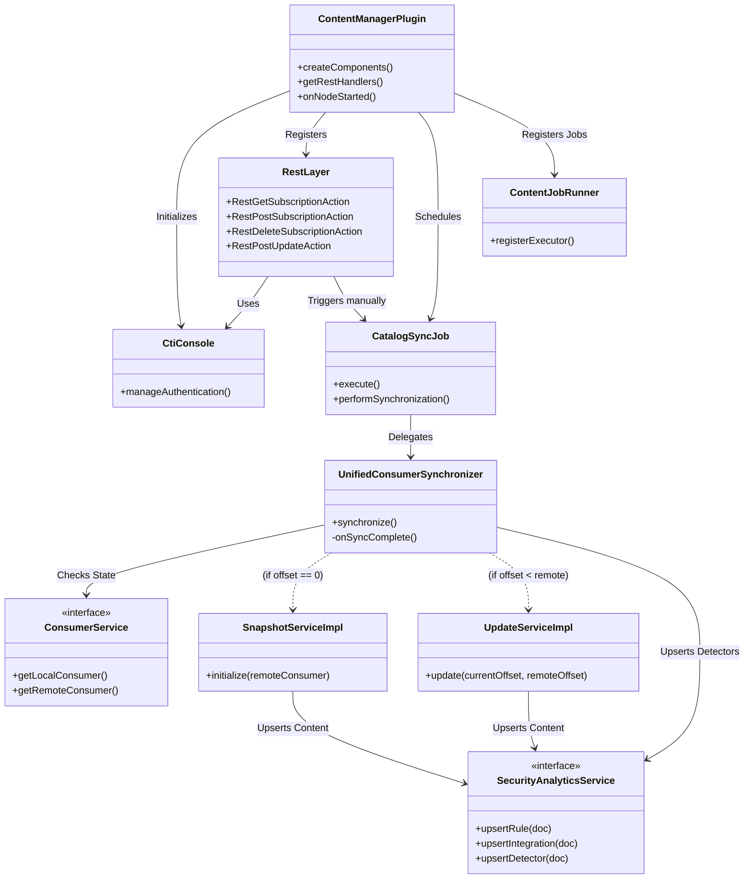
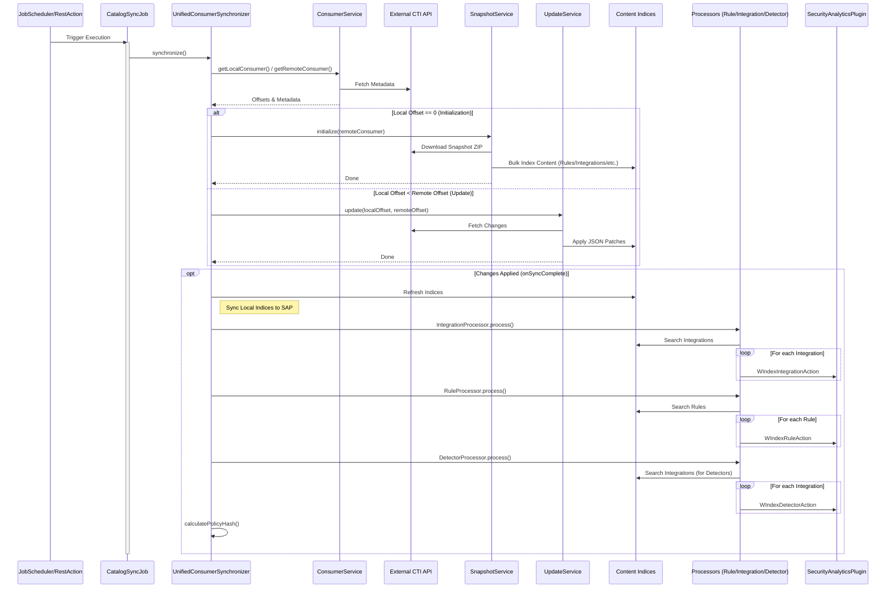

# Wazuh Indexer Content Manager Plugin — Development Guide

This document describes how to extend and configure the Wazuh Indexer Content Manager plugin, which is responsible for managing and synchronizing security content from the Wazuh CTI API.

---

## 📋 Overview

The Content Manager plugin handles:
- **Authentication:** Manages subscriptions and tokens with the CTI Console.
- **Job Scheduling:** Periodically checks for updates using the OpenSearch Job Scheduler.
- **Content Synchronization:** Keeps local indices in sync with the Wazuh CTI Catalog.
- **Security Analytics Integration:** Pushes ingestion rules and detectors to the Security Analytics engine for immediate activation.
- **Snapshot Initialization:** Downloads and indexes full content via zip snapshots.
- **Incremental Updates:** Applies JSON Patch operations based on offsets.
- **Context management:** Maintains synchronization state.

The plugin manages several indices:
- `.cti-consumers`: Stores consumer information and synchronization state.
- `.wazuh-content-manager-jobs`: Stores job scheduler metadata.
- Content Indices: Indices for specific content types (e.g., `.cti-rules`, `.cti-decoders`).

---

## 🔧 Plugin Architecture

### Main Components



#### 1. **ContentManagerPlugin**
Main class located at: `/plugins/content-manager/src/main/java/com/wazuh/contentmanager/ContentManagerPlugin.java`

This is the entry point of the plugin:
- Registers REST handlers for subscription and update management.
- Initializes the `CatalogSyncJob` and schedules it via the OpenSearch Job Scheduler.
- Initializes the `CtiConsole` for authentication management.

#### 2. **CatalogSyncJob**
Located at: `/plugins/content-manager/src/main/java/com/wazuh/contentmanager/jobscheduler/jobs/CatalogSyncJob.java`

This class acts as the orchestrator (`JobExecutor`). It is responsible for:
- Executing the content synchronization logic via the `UnifiedConsumerSynchronizer`.
- Managing concurrency using semaphores to prevent overlapping jobs.

#### 3. **Services**
The logic is split into specialized services:

##### 3.1 **ConsumerService**
Located at: `/plugins/content-manager/src/main/java/com/wazuh/contentmanager/cti/catalog/service/ConsumerServiceImpl.java`

Retrieves `LocalConsumer` state from `.cti-consumers` and `RemoteConsumer` state from the CTI API.

##### 3.2 **SnapshotService**
Located at: `/plugins/content-manager/src/main/java/com/wazuh/contentmanager/cti/catalog/service/SnapshotServiceImpl.java`

Handles downloading zip snapshots, unzipping, parsing JSON files, and bulk indexing content. 
It supports multiple content types (rules, decoders, etc.) and indexes them into their respective indices.

##### 3.3 **UpdateService**
Located at: `/plugins/content-manager/src/main/java/com/wazuh/contentmanager/cti/catalog/service/UpdateServiceImpl.java`

Fetches specific changes (offsets) from the CTI API and applies them using JSON Patch (`Operation` class). 
It ensures that any modified content is immediately propagated to the Security Analytics plugin.

##### 3.4 **SecurityAnalyticsService**
Interface defining the bridge to the Security Analytics Plugin (SAP).

Responsible for:
- `upsertRule(doc)`: Registering detection rules.
- `upsertIntegration(doc)`: Registering integration definitions.
- `upsertDetector(doc)`: Activating detectors based on integration rules.
- `deleteRule(id)`: Deletes a rule using the id of the rule.
- `deleteIntegration(id)`: Deletes a integration using the id.
- `deleteDetector(id)`: Deletes a detector using the id.

##### 3.5 **AuthService**
Located at: `/plugins/content-manager/src/main/java/com/wazuh/contentmanager/cti/console/service/AuthServiceImpl.java`

Manages the exchange of device codes for permanent access tokens.

#### 4. **Indices Management**

##### 4.1 **ConsumersIndex**
Located at: `/plugins/content-manager/src/main/java/com/wazuh/contentmanager/cti/catalog/index/ConsumersIndex.java`

Wraps operations for the `.cti-consumers` index.

##### 4.2 **ContentIndex**
Located at: `/plugins/content-manager/src/main/java/com/wazuh/contentmanager/cti/catalog/index/ContentIndex.java`

Manages operations for content indices. 

---

## ⚙️ Configuration Settings

The plugin is configured through the `PluginSettings` class. Settings can be defined in `opensearch.yml`:

| Setting                                              | Default                            | Description                                                                  |
|------------------------------------------------------|------------------------------------|------------------------------------------------------------------------------|
| `plugins.content_manager.cti.api`                    | `https://cti-pre.wazuh.com/api/v1` | Base URL for the Wazuh CTI API.                                              |
| `plugins.content_manager.catalog.sync_interval`      | `60`                               | Interval (in minutes) for the periodic synchronization job.                  |
| `plugins.content_manager.max_items_per_bulk`         | `25`                               | Maximum number of documents per bulk request during snapshot initialization. |
| `plugins.content_manager.max_concurrent_bulks`       | `5`                                | Maximum number of concurrent bulk requests.                                  |
| `plugins.content_manager.client.timeout`             | `10`                               | Timeout (in seconds) for HTTP and Indexing operations.                       |
| `plugins.content_manager.catalog.update_on_start`    | `true`                             | Triggers a content update when the plugin starts.                            |
| `plugins.content_manager.catalog.update_on_schedule` | `true`                             | Enables or disables the periodic content update job.                         |
| `plugins.content_manager.catalog.content.context`    | `development_0.0.3`                | Unified Context identifier for the CTI content.                              |
| `plugins.content_manager.catalog.content.consumer`   | `development_0.0.3_test`           | Unified Consumer identifier for the CTI content.                             |

---

## 🔄 How Content Synchronization Works



### 1. **Initialization Phase**

When the plugin starts on a cluster manager node:

1. Creates the `.cti-consumers` index if it doesn't exist
2. Checks the consumer's local_offset:
   - **If local_offset = 0**: Downloads and indexes a snapshot
   - **If local_offset > 0**: Proceeds with incremental updates
3.  **SAP Registration:** Iterates through each indexed item and invokes the `SecurityAnalyticsService` to perform an `upsertRule` or `upsertIntegration`, ensuring all content is registered for active detection.

### 2. **Update Phase**

When `local_offset > 0` and `local_offset < remote_offset`:

1.  **Fetch Changes:** Fetches changes in batches.
2.  **Apply Patch:** Applies JSON Patch operations (add, update, delete).
3.  **SAP Sync:** Pushes the specific changes to `SecurityAnalyticsService` to update the SAP.
4.  **Offset Update:** Updates the local_offset after successful application.

### 3. **Post-Synchronization Phase**

After changes are applied, the synchronizer performs maintenance:

1.  **Refresh:** Refreshes indices to ensure data is searchable.
2.  **Update Detectors:**
    * Searches for Integration Rules in the local index.
    * Iterates through them and calls `upsertDetector` on the SAP.
3.  **Integrity Check (`hashPolicy`):**
    * Calculates SHA-256 hashes for Rules, Decoders, and Policies to ensure local data integrity matches the source.

### 4. **Error Handling**

If a critical error occurs or data corruption is detected, the system resets `local_offset` to 0, triggering a snapshot re-initialization on the next run.

---

## 📡 REST API

### Subscription Management

#### GET /subscription

Retrieves the current subscription token. 

`GET /_plugins/content-manager/subscription`

#### POST /subscription 

Creates or updates a subscription. 

`POST /_plugins/content-manager/subscription { "device_code": "...", "client_id": "...", "expires_in": 3600, "interval": 5 }`

#### DELETE /subscription

Deletes the current token/subscription. 

`DELETE /_plugins/content-manager/subscription`

### Update Trigger

#### POST /update 

Manually triggers the `CatalogSyncJob`. 

`POST /_plugins/content-manager/update`

---

## 🔍 Debugging

### Check Consumer Status

```bash
GET /.cti-consumers/_search
{
  "query": {
    "match_all": {}
  }
}
```

### Check Content Index

```bash
GET /.cti-rules/_search
{
  "size": 10
}
```

### Monitor Plugin Logs

Look for entries from `ContentManagerPlugin`, `CatalogSyncJob`, `SnapshotServiceImpl`  and `UpdateServiceImpl` in the OpenSearch logs.

```bash
tail -f logs/opensearch.log | grep -E "ContentManager|CatalogSyncJob|SnapshotServiceImpl|UpdateServiceImpl"
```

---

## 📌 Important Notes

- The plugin only runs on **cluster manager nodes**
- CTI API must be accessible for content synchronization
- Offset-based synchronization ensures no content is missed

---

## 🔗 Related Documentation

- [Setup Plugin Guide](./setup.md)
- [OpenSearch Plugin Development](https://docs.opensearch.org/3.3/install-and-configure/plugins/)
