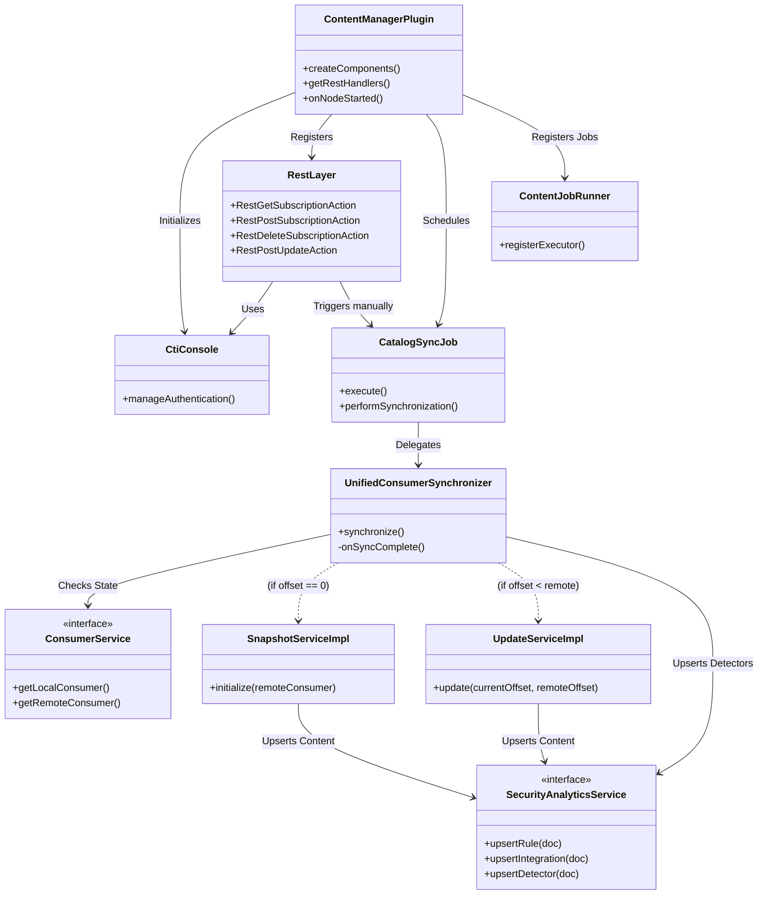
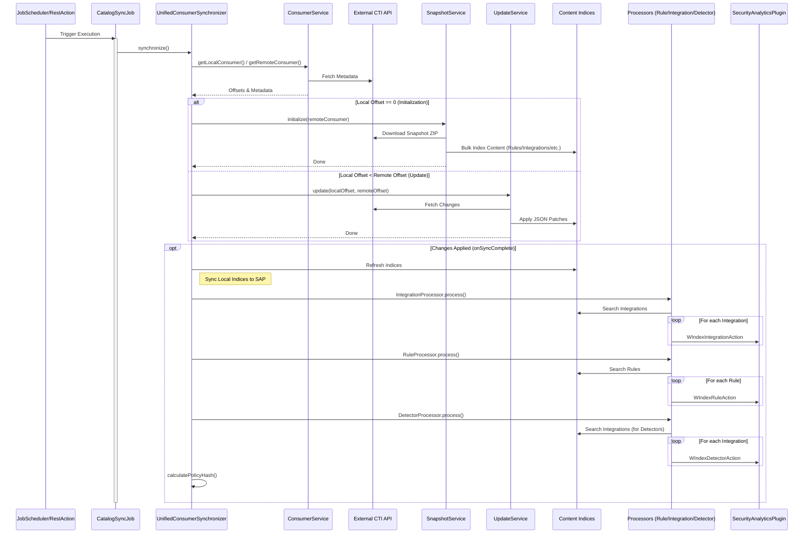
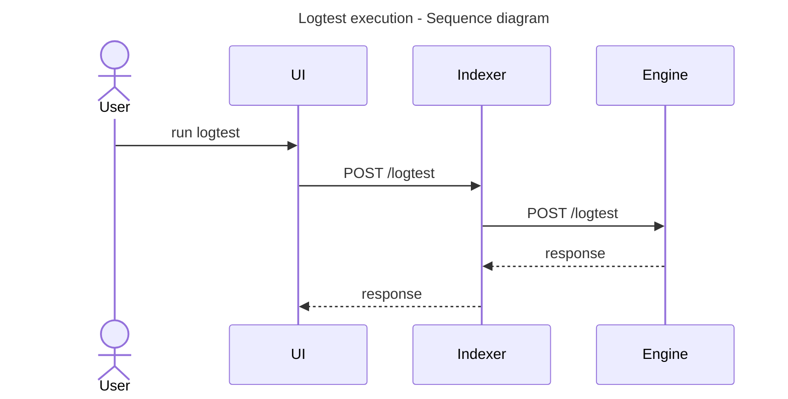
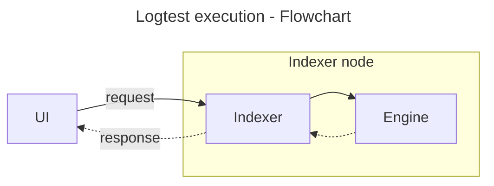
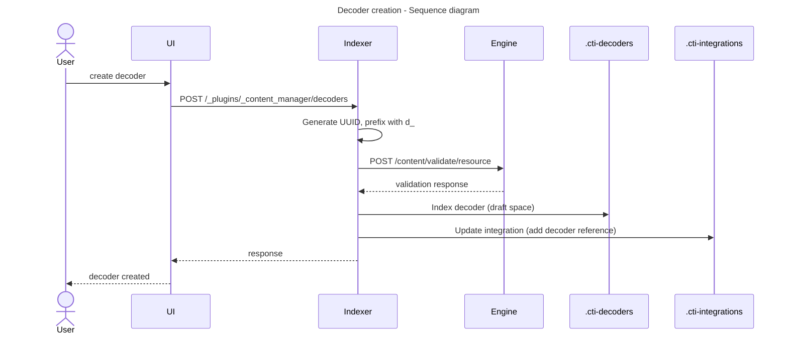
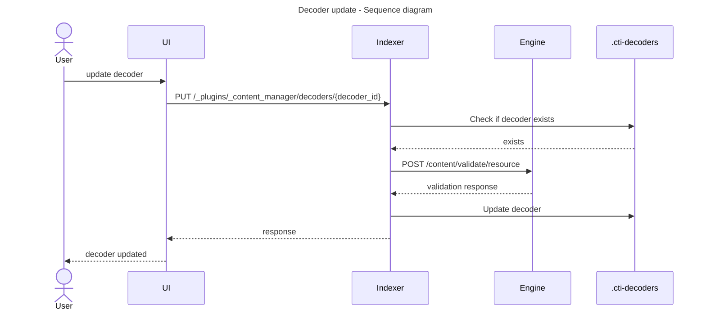
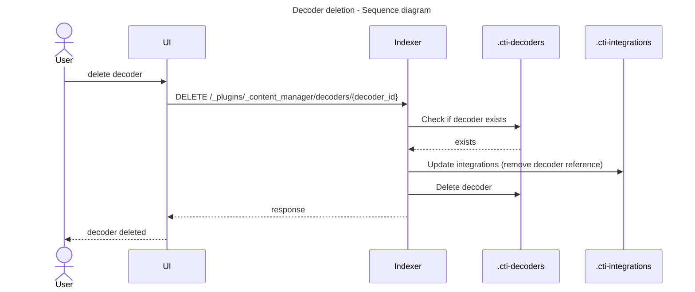
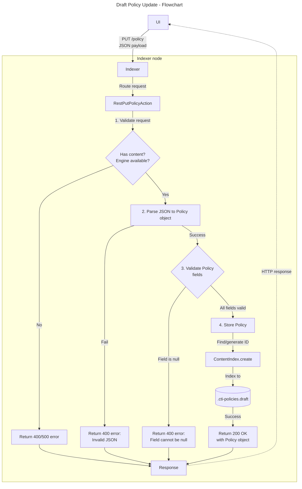

# Wazuh Indexer Content Manager Plugin — Development Guide

This document describes how to extend and configure the Wazuh Indexer Content Manager plugin, which is responsible for managing and synchronizing security content from the Wazuh CTI API.

---

## 📋 Overview

The Content Manager plugin handles:
- **Authentication:** Manages subscriptions and tokens with the CTI Console.
- **Job Scheduling:** Periodically checks for updates using the OpenSearch Job Scheduler.
- **Content Synchronization:** Keeps local indices in sync with the Wazuh CTI Catalog.
- **Security Analytics Integration:** Pushes ingestion rules and detectors to the Security Analytics engine for immediate activation.
- **Snapshot Initialization:** Downloads and indexes full content via zip snapshots.
- **Incremental Updates:** Applies JSON Patch operations based on offsets.
- **Context management:** Maintains synchronization state.

The plugin manages several indices:
- `.cti-consumers`: Stores consumer information and synchronization state.
- `.wazuh-content-manager-jobs`: Stores job scheduler metadata.
- Content Indices: Indices for specific content types (e.g., `.cti-rules`, `.cti-decoders`).

---

## 🔧 Plugin Architecture

### Main Components



#### 1. **ContentManagerPlugin**
Main class located at: `/plugins/content-manager/src/main/java/com/wazuh/contentmanager/ContentManagerPlugin.java`

This is the entry point of the plugin:
- Registers REST handlers for subscription and update management.
- Initializes the `CatalogSyncJob` and schedules it via the OpenSearch Job Scheduler.
- Initializes the `CtiConsole` for authentication management.

#### 2. **CatalogSyncJob**
Located at: `/plugins/content-manager/src/main/java/com/wazuh/contentmanager/jobscheduler/jobs/CatalogSyncJob.java`

This class acts as the orchestrator (`JobExecutor`). It is responsible for:
- Executing the content synchronization logic via the `UnifiedConsumerSynchronizer`.
- Managing concurrency using semaphores to prevent overlapping jobs.

#### 3. **Services**
The logic is split into specialized services:

##### 3.1 **ConsumerService**
Located at: `/plugins/content-manager/src/main/java/com/wazuh/contentmanager/cti/catalog/service/ConsumerServiceImpl.java`

Retrieves `LocalConsumer` state from `.cti-consumers` and `RemoteConsumer` state from the CTI API.

##### 3.2 **SnapshotService**
Located at: `/plugins/content-manager/src/main/java/com/wazuh/contentmanager/cti/catalog/service/SnapshotServiceImpl.java`

Handles downloading zip snapshots, unzipping, parsing JSON files, and bulk indexing content.
It supports multiple content types (rules, decoders, etc.) and indexes them into their respective indices.

##### 3.3 **UpdateService**
Located at: `/plugins/content-manager/src/main/java/com/wazuh/contentmanager/cti/catalog/service/UpdateServiceImpl.java`

Fetches specific changes (offsets) from the CTI API and applies them using JSON Patch (`Operation` class).
It ensures that any modified content is immediately propagated to the Security Analytics plugin.

##### 3.4 **SecurityAnalyticsService**
Interface defining the bridge to the Security Analytics Plugin (SAP).

Responsible for:
- `upsertRule(doc)`: Registering detection rules.
- `upsertIntegration(doc)`: Registering integration definitions.
- `upsertDetector(doc)`: Activating detectors based on integration rules.
- `deleteRule(id)`: Deletes a rule using the id of the rule.
- `deleteIntegration(id)`: Deletes a integration using the id.
- `deleteDetector(id)`: Deletes a detector using the id.

##### 3.5 **AuthService**
Located at: `/plugins/content-manager/src/main/java/com/wazuh/contentmanager/cti/console/service/AuthServiceImpl.java`

Manages the exchange of device codes for permanent access tokens.

#### 4. **Indices Management**

##### 4.1 **ConsumersIndex**
Located at: `/plugins/content-manager/src/main/java/com/wazuh/contentmanager/cti/catalog/index/ConsumersIndex.java`

Wraps operations for the `.cti-consumers` index.

##### 4.2 **ContentIndex**
Located at: `/plugins/content-manager/src/main/java/com/wazuh/contentmanager/cti/catalog/index/ContentIndex.java`

Manages operations for content indices.

---

## ⚙️ Configuration Settings

The plugin is configured through the `PluginSettings` class. Settings can be defined in `opensearch.yml`:

| Setting                                              | Default                            | Description                                                                  |
|------------------------------------------------------|------------------------------------|------------------------------------------------------------------------------|
| `plugins.content_manager.cti.api`                    | `https://cti-pre.wazuh.com/api/v1` | Base URL for the Wazuh CTI API.                                              |
| `plugins.content_manager.catalog.sync_interval`      | `60`                               | Interval (in minutes) for the periodic synchronization job.                  |
| `plugins.content_manager.max_items_per_bulk`         | `25`                               | Maximum number of documents per bulk request during snapshot initialization. |
| `plugins.content_manager.max_concurrent_bulks`       | `5`                                | Maximum number of concurrent bulk requests.                                  |
| `plugins.content_manager.client.timeout`             | `10`                               | Timeout (in seconds) for HTTP and Indexing operations.                       |
| `plugins.content_manager.catalog.update_on_start`    | `true`                             | Triggers a content update when the plugin starts.                            |
| `plugins.content_manager.catalog.update_on_schedule` | `true`                             | Enables or disables the periodic content update job.                         |
| `plugins.content_manager.catalog.content.context`    | `development_0.0.3`                | Unified Context identifier for the CTI content.                              |
| `plugins.content_manager.catalog.content.consumer`   | `development_0.0.3_test`           | Unified Consumer identifier for the CTI content.                             |

---

## 🔄 How Content Synchronization Works



### 1. **Initialization Phase**

When the plugin starts on a cluster manager node:

1. Creates the `.cti-consumers` index if it doesn't exist
2. Checks the consumer's local_offset:
   - **If local_offset = 0**: Downloads and indexes a snapshot
   - **If local_offset > 0**: Proceeds with incremental updates
3.  **SAP Registration:** Iterates through each indexed item and invokes the `SecurityAnalyticsService` to perform an `upsertRule` or `upsertIntegration`, ensuring all content is registered for active detection.

### 2. **Update Phase**

When `local_offset > 0` and `local_offset < remote_offset`:

1.  **Fetch Changes:** Fetches changes in batches.
2.  **Apply Patch:** Applies JSON Patch operations (add, update, delete).
3.  **SAP Sync:** Pushes the specific changes to `SecurityAnalyticsService` to update the SAP.
4.  **Offset Update:** Updates the local_offset after successful application.

### 3. **Post-Synchronization Phase**

After changes are applied, the synchronizer performs maintenance:

1.  **Refresh:** Refreshes indices to ensure data is searchable.
2.  **Update Detectors:**
    * Searches for Integration Rules in the local index.
    * Iterates through them and calls `upsertDetector` on the SAP.
3.  **Integrity Check (`hashPolicy`):**
    * Calculates SHA-256 hashes for Rules, Decoders, and Policies to ensure local data integrity matches the source.

### 4. **Error Handling**

If a critical error occurs or data corruption is detected, the system resets `local_offset` to 0, triggering a snapshot re-initialization on the next run.

---

## 📡 REST API

This API is formally defined in OpenAPI specification ([openapi.yml](https://github.com/wazuh/wazuh-indexer-plugins/blob/main/plugins/content-manager/openapi.yml)).

### User Generate Content Management Endpoints

#### Logtest

The Indexer acts as a middleman between the UI and the Engine. The Indexer's `POST /logtest` endpoints accepts the payload and sends it to the engine exactly as provided. No validation is performed. If the engine responds, the Indexer returns it as the response for its endpoint call. If the engine does not respond, a 500 error is returned.

<div class="warning">

A testing policy needs to be loaded in the Engine for the logtest to be executed successfully. Load a policy via the policy promotion endpoint.
</div>

**Diagrams**





#### Decoders

The Content Manager provides REST API endpoints for managing decoders in the draft space. Decoders are validated against the Wazuh engine before being stored.

<div class="warning">

A testing policy needs to be loaded in the Engine for the decoders to be executed successfully. Load a policy via the policy promotion endpoint.
</div>

**Diagrams**







#### Draft Policy Management

The indexer's draft policy management endpoint allows the user to update the Draft-Space policy stored in the Wazuh Indexer.


**Diagrams**



#### Policy Schema

The `.cti-policies` index stores policy configurations that define how the Wazuh Engine processes events. Each policy document contains the following fields:

| Field | Type | Description |
|-------|------|-------------|
| `id` | keyword | Unique identifier for the policy document |
| `title` | keyword | Human-readable name for the policy |
| `date` | date | Creation timestamp |
| `modified` | date | Last modification timestamp |
| `root_decoder` | keyword | Identifier of the root decoder to use for event processing |
| `integrations` | keyword | Array of integration IDs that define which content modules are active |
| `filters` | keyword | Array of filter UUIDs for user-generated filtering rules |
| `enrichments` | keyword | Array of enrichment types (e.g., `"file"`, `"domain-name"`, `"ip"`, `"url"`, `"geo"`) |
| `author` | keyword | Policy author identifier |
| `description` | text | Brief description of the policy purpose |
| `documentation` | keyword | Link or reference to detailed documentation |
| `references` | keyword | Array of external reference URLs |

**Example Policy Document:**

```json
{
  "title": "Production Policy",
  "root_decoder": "decoder/core/0",
  "integrations": [
    "integration/wazuh-core/0",
    "integration/wazuh-fim/0"
  ],
  "filters": [
    "5c1df6b6-1458-4b2e-9001-96f67a8b12c8",
    "f61133f5-90b9-49ed-b1d5-0b88cb04355e"
  ],
  "enrichments": ["file", "domain-name", "ip", "url", "geo"],
  "author": "security-team",
  "description": "Production environment policy with file and network enrichments",
  "documentation": "https://docs.wazuh.com/policies/production",
  "references": ["https://example.com/security-policy"]
}
```

## 🔍 Debugging

### Check Consumer Status

```bash
GET /.cti-consumers/_search
{
  "query": {
    "match_all": {}
  }
}
```

### Check Content Index

```bash
GET /.cti-rules/_search
{
  "size": 10
}
```

### Monitor Plugin Logs

Look for entries from `ContentManagerPlugin`, `CatalogSyncJob`, `SnapshotServiceImpl`  and `UpdateServiceImpl` in the OpenSearch logs.

```bash
tail -f logs/opensearch.log | grep -E "ContentManager|CatalogSyncJob|SnapshotServiceImpl|UpdateServiceImpl"
```

---

## 📌 Important Notes

- The plugin only runs on **cluster manager nodes**
- CTI API must be accessible for content synchronization
- Offset-based synchronization ensures no content is missed

---

## 🔗 Related Documentation

- [Setup Plugin Guide](./setup.md)
- [OpenSearch Plugin Development](https://docs.opensearch.org/3.3/install-and-configure/plugins/)
