# Wazuh Indexer Content Manager Plugin — Development Guide

This document describes the architecture, components, and extension points of the Content Manager plugin, which manages security content synchronization from the Wazuh CTI API and provides REST endpoints for user-generated content management.

---

## Overview

The Content Manager plugin handles:

- **Wazuh Cloud Credentials:** Stores the CTI access token in `.wazuh-internal-state` and caches it in `PluginSettings.accessToken` for REST handler use.
- **Pre-registration with Wazuh Cloud:** Supports pre-registration of the Wazuh instance with Wazuh Cloud, via environment variable.
- **Job Scheduling:** Periodically checks for updates using the OpenSearch Job Scheduler.
- **Update Check Service:** Sends a daily heartbeat to CTI so Wazuh can notify users when a newer version is available.
- **Content Synchronization:** Keeps local indices in sync with the Wazuh CTI Catalog via snapshots and incremental JSON Patch updates.
- **Security Analytics Integration:** Pushes rules, integrations, and detectors to the Security Analytics Plugin (SAP).
- **User-Generated Content:** Full CUD for rules, decoders, integrations, KVDBs, and policies in the Draft space.
- **Engine Communication:** Validates and promotes content via Unix Domain Socket to the Wazuh Engine.
- **Space Management:** Manages content lifecycle through Draft → Test → Custom promotion.


---

## Tuning the development environment

The `build.gradle`file defines the development environment for the plugin. There, you can configure and modify the plugin's behavior by setting custom values for any of the settings exposed by the plugin, or by setting up environment variables, as follows:

```gradle
testClusters.integTest {
  // JVM tweaks.
  jvmArgs '-Xms2g', '-Xmx2g'

  // Environment variables.
  systemProperty "wazuh.version", "${wazuh_version}-beta3"
  
  // Plugin settings.
  setting 'plugins.content_manager.catalog.update_on_start', 'true'
}
```

---

## Pre-registration with Wazuh Cloud

{{ #include ../../ref/modules/content-manager/index.md:deploy-key }}

**State diagram**

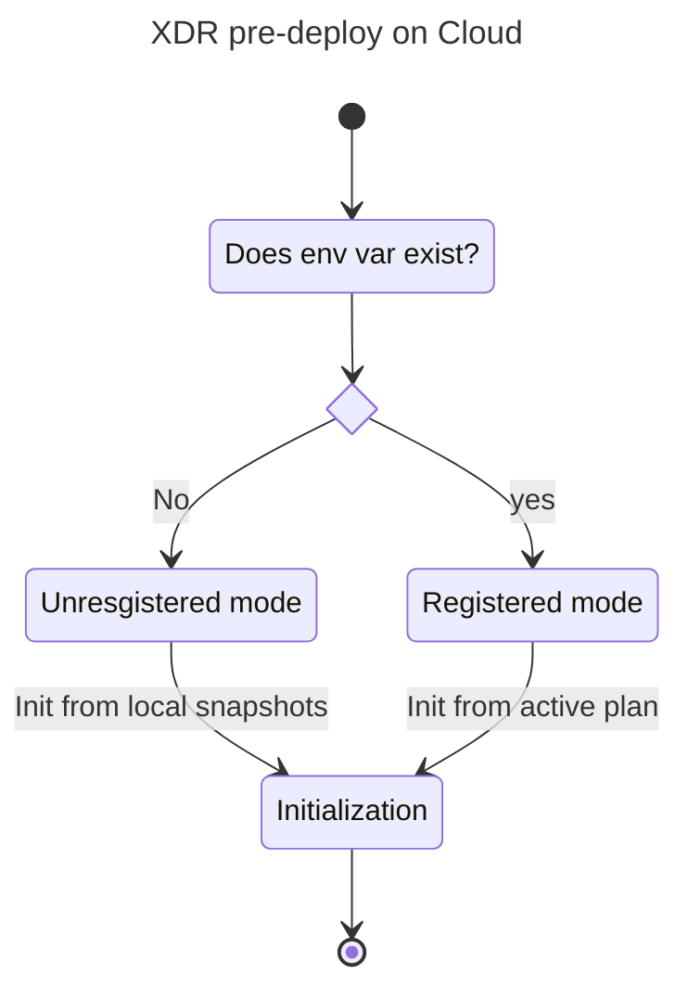
```mermaid
---
title: XDR pre-deploy on Cloud
---
stateDiagram-v2
    state if_state <<choice>>
    env_var_exists: Does env var exist?
    no_state: Unresgistered mode
    yes_state: Registered mode
    inititalization: Initialization


    [*] --> env_var_exists
    env_var_exists --> if_state
    if_state --> no_state: No
    if_state --> yes_state : yes

    no_state --> inititalization : Init from local snapshots
    yes_state --> inititalization : Init from active plan
    inititalization --> [*]
```

**Sequence diagram**

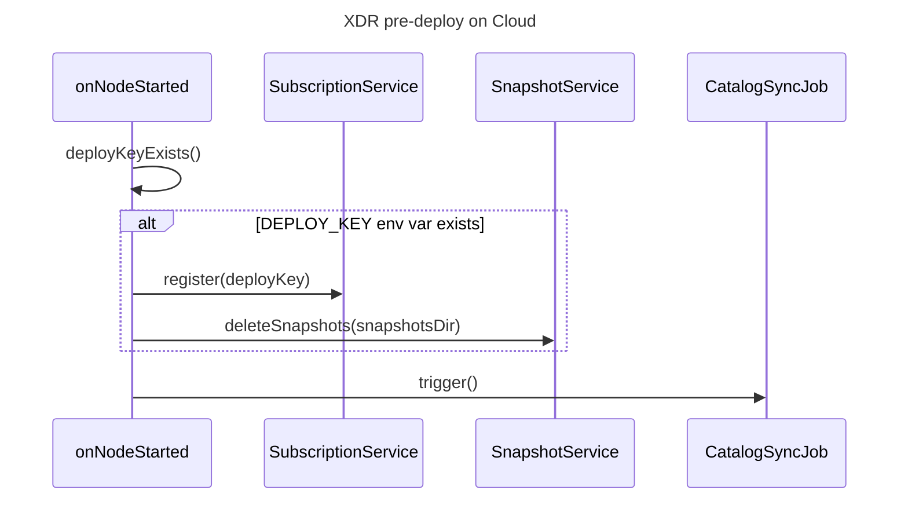
```mermaid
---
title: XDR pre-deploy on Cloud
---
sequenceDiagram
    onNodeStarted->>onNodeStarted: deployKeyExists()
    alt DEPLOY_KEY env var exists
        onNodeStarted->>SubscriptionService: register(deployKey)
        onNodeStarted->>SnapshotService: deleteSnapshots(snapshotsDir)
    end
    onNodeStarted->>CatalogSyncJob: trigger()

```

---

## System Indices

The plugin manages the following indices. All 8 content indices use an **alias-backed blue/green storage** scheme (see [Index Alias Convention](#index-alias-convention) below).

| Alias (public name)                    | Purpose                              | Hidden | Created by        |
| -------------------------------------- | ------------------------------------ | ------ | ----------------- |
| `.wazuh-cti-consumers`                 | Sync state (status, offsets)         | yes    | Content Manager   |
| `wazuh-threatintel-policies`           | Policy documents                     | no     | Content Manager   |
| `wazuh-threatintel-integrations`       | Integration definitions              | no     | Content Manager   |
| `wazuh-threatintel-rules`              | Detection rules                      | no     | Content Manager   |
| `wazuh-threatintel-decoders`           | Decoder definitions                  | no     | Content Manager   |
| `wazuh-threatintel-kvdbs`              | Key-value databases                  | no     | Content Manager   |
| `wazuh-threatintel-filters`            | Engine filter rules                  | no     | Content Manager   |
| `wazuh-threatintel-enrichments`        | Indicators of Compromise             | no     | Content Manager   |
| `.wazuh-threatintel-vulnerabilities`   | CVE vulnerability data               | yes    | Content Manager   |
| `.wazuh-content-manager-jobs`          | Job scheduler metadata               | yes    | Content Manager   |

---

## Index Alias Convention

Each content index uses an alias-backed **blue/green** storage scheme to enable zero-downtime content replacement during subscription plan changes.

### Naming

- **Alias (public name):** The stable name used by all readers, REST handlers, and dashboards. Example: `wazuh-threatintel-rules`.
- **Physical index:** The actual index storing data, suffixed with `-a` or `-b`. Example: `wazuh-threatintel-rules-a`.

Only one physical index is live at a time. The alias points to it with `is_write_index: true`. The other suffix is reserved as the shadow (staging) slot for the next plan-change swap.

### Key classes

| Class | Location | Responsibility |
|---|---|---|
| `ContentIndex` | `cti/catalog/index/ContentIndex.java` | Creates alias-backed physical indices. Has a 4-arg constructor for targeting shadow physical names directly. `createIndex()` creates the physical index and assigns the alias. `createShadowIndex()` creates a hidden physical index without an alias. |
| `IndexSwapHelper` | `cti/catalog/index/IndexSwapHelper.java` | Stateless utility class for swap operations: `resolveShadowName()`, `resolveLivePhysicalName()`, `createShadowIndices()`, `reindexUserContent()`, `atomicSwap()`, `deleteIndices()`. |
| `AbstractConsumerService` | `cti/catalog/service/AbstractConsumerService.java` | Detects plan changes and delegates to `performShadowSwap()` instead of the old `resetConsumer()` wipe-and-reload path. |

### Shadow swap flow (plan change)

When `AbstractConsumerService.syncConsumerServices()` detects a plan change (the plan-provided `resource` URL differs from the persisted one), it runs the shadow swap path:

```
1. Resolve shadow physical names (the -a/-b suffix not currently live)
2. Create hidden shadow physical indices (index.hidden=true, no alias)
3. Download snapshot into shadow indices (reuse SnapshotServiceImpl)
4. Reindex user content (space.name != "standard") from live → shadow
   (only for consumer types with hasUserContent()=true, i.e., ruleset)
5. Unhide non-CVE shadow indices (set index.hidden=false)
6. Atomic alias swap (single IndicesAliasesRequest for all 8 aliases)
7. Rewrite consumer document in .wazuh-cti-consumers
8. Run post-sync cascade (onSyncComplete: SAP sync, engine promote, etc.)
9. Delete old physical indices
```

**Error handling:**
- Failure before step 6: shadow indices are deleted, alias and consumer doc unchanged. Next sync retries.
- Failure between steps 6–7: alias is swapped but consumer doc still says old resource. Next sync re-detects the plan change and re-runs the shadow path (at most one wasted rebuild, no user-visible corruption).

**Concurrency:** The `CatalogSyncJob` semaphore spans the entire `synchronize()` call, which includes the shadow swap. No additional locking is needed.

### Normal incremental syncs

Regular incremental updates (no plan change) write through the alias to the live physical index. They are completely unaware of the `-a`/`-b` scheme.

---

## Plugin Architecture

### Entry Point

**`ContentManagerPlugin`** is the main class. It implements `Plugin`, `ClusterPlugin`, `JobSchedulerExtension`, and `SystemIndexPlugin` (which extends `ActionPlugin`). On startup it:

1. Initializes `PluginSettings`, `ConsumersIndex`, `CredentialsIndex`, `CtiConsole`, `CatalogSyncJob`, `EngineServiceImpl`, and `SpaceService`.
2. Registers all REST handlers via `getRestHandlers()`.
3. Creates the `.wazuh-cti-consumers` and `.wazuh-internal-state` indices on cluster manager nodes.
4. Schedules the periodic `CatalogSyncJob` via the OpenSearch Job Scheduler.
5. Optionally triggers an immediate sync on start.
6. Registers/schedules `TelemetryPingJob` (`wazuh-telemetry-ping-job`) when `plugins.content_manager.telemetry.enabled` is true.
7. Registers a dynamic settings consumer to enable/disable telemetry at runtime.

### Update Check Service internals

The update check flow is split into two classes:

- **`TelemetryPingJob`** (`jobscheduler/jobs/TelemetryPingJob.java`)
  - Runs through Job Scheduler every 1 day.
  - Reads cluster UUID from `ClusterService` metadata.
  - Reads Wazuh version through `ContentManagerPlugin.getVersion()`.
  - Prevents overlap using a `Semaphore` (`tryAcquire()` guard).
  - Exposes a `trigger()` method for immediate invocation, used by `ContentManagerPlugin` to fire the first ping as soon as the job document is indexed.

- **`TelemetryClient`** (`cti/console/client/TelemetryClient.java`)
  - Sends an asynchronous GET request to CTI `/ping`.
  - Headers sent:
    - `wazuh-uid`: cluster UUID
    - `wazuh-tag`: `v<version>`
  - Fire-and-forget behavior: callback logs success/failure without blocking scheduler threads.

### CTI HTTP Client User-Agent

All HTTP clients that communicate with CTI services include a custom `User-Agent` header set as a **default header on the HTTP client builder**:

```
User-Agent: Wazuh Indexer <version>
```

The version is read from `VERSION.json` at plugin startup and stored in `PluginSettings`. The user-agent string is built by `PluginSettings.getUserAgent()` using the `Constants.USER_AGENT_PREFIX` constant. If the version is unavailable, the fallback value `unknown` is used.

Affected clients:
- **Console `ApiClient`** (`cti/console/client/ApiClient.java`) — async HTTP client for CTI Console authentication and plans.
- **Catalog `ApiClient`** (`cti/catalog/client/ApiClient.java`) — async HTTP client for CTI Catalog consumer and changes.
- **`SnapshotClient`** (`cti/catalog/client/SnapshotClient.java`) — sync HTTP client for downloading CTI snapshots.
- **`TelemetryClient`** (`cti/console/client/TelemetryClient.java`) — inherits from Console `ApiClient`.

Runtime toggle behavior:

- `plugins.content_manager.telemetry.enabled` is a **dynamic** setting.
- Enabling it schedules the job; the immediate first ping is fired from within `scheduleTelemetryPingJob()` only after the job document has been successfully indexed, guaranteeing the ping only runs when the scheduled job is correctly registered.
- Disabling it removes the telemetry job document from `.wazuh-content-manager-jobs`.

### REST Handlers

The plugin registers 26 REST handlers, grouped by domain:

| Domain           | Handler                        | Method | URI                                            |
| ---------------- | ------------------------------ | ------ | ---------------------------------------------- |
| **Subscription** | `RestPostSubscriptionAction`   | POST   | `/_plugins/_content_manager/subscription`      |
|                  | `RestGetSubscriptionAction`    | GET    | `/_plugins/_content_manager/subscription`      |
|                  | `RestDeleteSubscriptionAction` | DELETE | `/_plugins/_content_manager/subscription`      |
| **Update**       | `RestPostUpdateAction`         | POST   | `/_plugins/_content_manager/update`            |
| **Logtest**      | `RestPostLogtestAction`        | POST   | `/_plugins/_content_manager/logtest`           |
| **Policy**       | `RestPutPolicyAction`          | PUT    | `/_plugins/_content_manager/policy/{space}`    |
| **Rules**        | `RestPostRuleAction`           | POST   | `/_plugins/_content_manager/rules`             |
|                  | `RestPutRuleAction`            | PUT    | `/_plugins/_content_manager/rules/{id}`        |
|                  | `RestDeleteRuleAction`         | DELETE | `/_plugins/_content_manager/rules/{id}`        |
| **Decoders**     | `RestPostDecoderAction`        | POST   | `/_plugins/_content_manager/decoders`          |
|                  | `RestPutDecoderAction`         | PUT    | `/_plugins/_content_manager/decoders/{id}`     |
|                  | `RestDeleteDecoderAction`      | DELETE | `/_plugins/_content_manager/decoders/{id}`     |
| **Integrations** | `RestPostIntegrationAction`    | POST   | `/_plugins/_content_manager/integrations`      |
|                  | `RestPutIntegrationAction`     | PUT    | `/_plugins/_content_manager/integrations/{id}` |
|                  | `RestDeleteIntegrationAction`  | DELETE | `/_plugins/_content_manager/integrations/{id}` |
| **KVDBs**        | `RestPostKvdbAction`           | POST   | `/_plugins/_content_manager/kvdbs`             |
|                  | `RestPutKvdbAction`            | PUT    | `/_plugins/_content_manager/kvdbs/{id}`        |
|                  | `RestDeleteKvdbAction`         | DELETE | `/_plugins/_content_manager/kvdbs/{id}`        |
| **Filters**      | `RestPostFilterAction`         | POST   | `/_plugins/_content_manager/filters`           |
|                  | `RestPutFilterAction`          | PUT    | `/_plugins/_content_manager/filters/{id}`      |
|                  | `RestDeleteFilterAction`       | DELETE | `/_plugins/_content_manager/filters/{id}`      |
| **Promote**      | `RestPostPromoteAction`        | POST   | `/_plugins/_content_manager/promote`           |
|                  | `RestGetPromoteAction`         | GET    | `/_plugins/_content_manager/promote`           |
| **Spaces**       | `RestDeleteSpaceAction`        | DELETE | `/_plugins/_content_manager/space/{space}`     |

---

## Class Hierarchy

The REST handlers follow a **Template Method** pattern through a three-level abstract class hierarchy. There are two parallel branches — one where the target space is always `draft` (`AbstractCreateAction` / `AbstractUpdateAction` / `AbstractDeleteAction`) and one where the target space is supplied at runtime from the request body (`AbstractCreateActionSpaces` / `AbstractUpdateActionSpaces` / `AbstractDeleteActionSpaces`). The latter is used for resources like Filters that can live in either `draft` or `standard` space.

```
BaseRestHandler
├── AbstractContentAction
│   ├── AbstractCreateAction               # Target space always: draft
│   │   ├── RestPostRuleAction
│   │   ├── RestPostDecoderAction
│   │   ├── RestPostIntegrationAction
│   │   └── RestPostKvdbAction
│   ├── AbstractUpdateAction               # Target space always: draft
│   │   ├── RestPutRuleAction
│   │   ├── RestPutDecoderAction
│   │   ├── RestPutIntegrationAction
│   │   └── RestPutKvdbAction
│   ├── AbstractDeleteAction               # Target space always: draft
│   │   ├── RestDeleteRuleAction
│   │   ├── RestDeleteDecoderAction
│   │   ├── RestDeleteIntegrationAction
│   │   └── RestDeleteKvdbAction
│   ├── AbstractCreateActionSpaces         # Target space from request body (draft|standard)
│   │   └── RestPostFilterAction
│   ├── AbstractUpdateActionSpaces         # Target space from request body (draft|standard)
│   │   └── RestPutFilterAction
│   └── AbstractDeleteActionSpaces         # Target space from request body (draft|standard)
│       └── RestDeleteFilterAction
├── RestPutPolicyAction
├── RestDeleteSpaceAction
├── RestPostSubscriptionAction
├── RestPostUpdateAction
├── RestPostLogtestAction
├── RestPostPromoteAction
└── RestGetPromoteAction
```

### AbstractContentAction

Base class for all content CUD actions. It:

- Overrides `prepareRequest()` from `BaseRestHandler`.
- Initializes shared services: `SpaceService`, `SecurityAnalyticsService`, `IntegrationService`.
- Validates that a Draft policy exists before executing any content action.
- Delegates to the abstract `executeRequest()` method for concrete logic.

### AbstractCreateAction / AbstractCreateActionSpaces

Handles **POST** requests to create new resources. `AbstractCreateAction` hard-codes the target space to `draft`. `AbstractCreateActionSpaces` reads the space from the request body instead, allowing `draft` or `standard` as the target.

The `executeRequest()` workflow:

1. **Validate request body** — ensures the request has content and valid JSON.
2. **Validate payload structure** — checks for required `resource` key and optional `integration` key.
3. **Resource-specific validation** — delegates to `validatePayload()` (abstract). Concrete handlers check required fields, duplicate titles, and parent integration existence.
4. **Generate ID and metadata** — creates a UUID, sets `date` and `modified` timestamps, defaults `enabled` to `true`.
5. **External sync** — delegates to `syncExternalServices()` (abstract). Typically upserts the resource in SAP or validates via the Engine.
6. **Index** — wraps the resource in the CTI document structure and indexes it in the Draft space.
7. **Link to parent** — delegates to `linkToParent()` (abstract). Usually adds the new resource ID to a parent integration's resource list.
8. **Update hash** — recalculates the Draft space policy hash via `SpaceService`.

Returns `201 Created` with the new resource UUID on success.

### AbstractUpdateAction / AbstractUpdateActionSpaces

Handles **PUT** requests to update existing resources. `AbstractUpdateAction` restricts updates to the `draft` space. `AbstractUpdateActionSpaces` accepts a space value (`draft` or `standard`) from the request body.

The `executeRequest()` workflow:

1. **Validate ID** — checks the path parameter is present and correctly formatted.
2. **Check existence and space** — verifies the resource exists and belongs to the Draft space.
3. **Parse and validate payload** — same structural checks as create.
4. **Resource-specific validation** — delegates to `validatePayload()` (abstract).
5. **Update timestamps** — sets `modified` timestamp. Preserves immutable fields (creation date, author) from the existing document.
6. **External sync** — delegates to `syncExternalServices()` (abstract).
7. **Re-index** — overwrites the document in the index.
8. **Update hash** — recalculates the Draft space hash.

Returns `200 OK` with the resource UUID on success.

### AbstractDeleteAction / AbstractDeleteActionSpaces

Handles **DELETE** requests. `AbstractDeleteAction` restricts deletions to the `draft` space. `AbstractDeleteActionSpaces` resolves the target space from the stored document (allowing deletion from both `draft` and `standard`).

The `executeRequest()` workflow:

1. **Validate ID** — checks format and presence.
2. **Check existence and space** — resource must exist in Draft space.
3. **Pre-delete validation** — delegates to `validateDelete()` (optional override). Can prevent deletion if dependent resources exist.
4. **External sync** — delegates to `deleteExternalServices()` (abstract). Removes from SAP. Handles 404 gracefully.
5. **Unlink from parent** — delegates to `unlinkFromParent()` (abstract). Removes the resource ID from the parent integration's list.
6. **Delete from index** — removes the document.
7. **Update hash** — recalculates the Draft space hash.

Returns `200 OK` with the resource UUID on success.

---

## YAML Content-Type Support

Decoders, KVDBs, and Filters accept `Content-Type: application/yaml` requests in addition to JSON. This is implemented through an opt-in pattern in the abstract handler hierarchy.

### Architecture

The YAML support is built on three mechanisms in `AbstractContentAction`:

1. **`isYamlRequest(RestRequest)`** — Detects YAML content type via `XContentType.YAML.equals(request.getMediaType())`. Returns `false` on any exception (e.g., test mocks that don't stub `getMediaType()`).

2. **`supportsYamlField()`** — Returns `false` by default. Overridden to `true` in concrete handlers that support YAML field storage: `RestPostDecoderAction`, `RestPutDecoderAction`, `RestPostKvdbAction`, `RestPutKvdbAction`, `RestPostFilterAction`, `RestPutFilterAction`.

3. **YAML/JSON branching in `executeRequest()`** — Both `AbstractCreateAction` and `AbstractUpdateAction` (and their `*Spaces` variants) branch on `isYamlRequest()` and `supportsYamlField()`:
   - **YAML path**: Parses the body via `YamlUtils.fromYaml()`, then validates the envelope structure with the same `validateResourcePayload()` call as the JSON path. The `rawYaml` for the `yaml` field is generated from the `resource` subtree via `YamlUtils.toYaml()`.
   - **JSON path**: Unchanged — parses via Jackson `ObjectMapper.readTree()`.

Both paths converge after parsing: resource-specific validation, ID generation, external sync, and indexing are identical regardless of content type.

### Envelope structure

YAML requests use the **same envelope** as JSON. The `integration` (or `space` for filters) and `resource` keys appear at the top level of the YAML document:

```yaml
---
integration: <uuid>
resource:
  metadata:
    title: "My Resource"
  content: { ... }
```

This is parsed into a `JsonNode` tree identical to what the JSON path produces.

### YAML field storage

When `supportsYamlField()` returns `true`, the handler populates a `yaml` field on the CTI wrapper before indexing:

- **YAML requests**: `rawYaml` is generated from the parsed `resource` subtree (not the raw request body, which includes the envelope).
- **JSON requests**: `YamlUtils.toYaml(resourceNode)` auto-generates the YAML representation.

The `yaml` field is stored as `text` in the index mappings (see `cti-decoders-mappings.json`, `cti-kvdbs-mappings.json`, `engine-filters-mappings.json`).

### Type fidelity

`YamlUtils` is configured with `DeserializationFeature.USE_BIG_DECIMAL_FOR_FLOATS` to preserve floating-point precision. A post-parse `fixDecimalScale()` step ensures values like `5.0` retain scale 1 in their `BigDecimal` representation, preventing coercion to integer `5` during serialization.

The `ContentIndex.create()` method skips `processPayload()` when it receives a fully-formed CTI wrapper (with `document`, `space`, and `hash` keys), avoiding a lossy `valueToTree()` round-trip that would strip `BigDecimal` scale.

### Key classes

| Class | Role |
| --- | --- |
| `YamlUtils` | YAML - JSON conversion with `USE_BIG_DECIMAL_FOR_FLOATS`, `fixDecimalScale()` |
| `Decoder` | Model with `yaml` field, `fromPayload()` generates YAML from document |
| `Kvdb` | Model with `yaml` field, same pattern as Decoder |
| `Filter` | Model with `yaml` field, same pattern as Decoder |
| `AbstractContentAction` | `isYamlRequest()`, `supportsYamlField()` base methods |
| `ContentIndex` | `create()` skips `processPayload()` for pre-built wrappers |

---

## Engine Communication

The plugin communicates with the Wazuh Engine via a **Unix Domain Socket** for validation and promotion of content.

### EngineSocketClient

Located at: `engine/client/EngineSocketClient.java`

- Connects to the socket at `/usr/share/wazuh-indexer/engine/sockets/engine-api.sock`.
- Sends **HTTP-over-UDS** requests: builds a standard HTTP/1.1 request string (method, headers, JSON body) and writes it to the socket channel.
- Each request opens a new `SocketChannel` (using `StandardProtocolFamily.UNIX`) that is closed after the response is read.
- Parses the HTTP response, extracting the status code and JSON body.

### EngineService Interface

Defines the Engine operations:

| Method                                             | Description                                                  |
| -------------------------------------------------- | ------------------------------------------------------------ |
| `logtest(JsonNode log)`                            | Forwards a log test payload to the Engine                    |
| `validate(JsonNode resource)`                      | Validates a resource payload                                 |
| `promote(JsonNode policy)`                         | Validates a full policy for promotion                        |
| `validateResource(String type, JsonNode resource)` | Wraps a resource with its type and delegates to `validate()` |

### EngineServiceImpl

Implementation using `EngineSocketClient`. Maps methods to Engine API endpoints:

| Method       | Engine Endpoint              | HTTP Method |
| ------------ | ---------------------------- | ----------- |
| `logtest()`  | `/logtest`                   | POST        |
| `validate()` | `/content/validate/resource` | POST        |
| `promote()`  | `/content/validate/policy`   | POST        |

---

## Space Model

Resources live in **spaces** that represent their lifecycle stage. The `Space` enum defines four spaces:

| Space      | Description                                                  |
| ---------- | ------------------------------------------------------------ |
| `STANDARD` | Production-ready CTI resources from the upstream catalog     |
| `CUSTOM`   | User-created resources that have been promoted to production |
| `DRAFT`    | Resources under development — all user edits happen here     |
| `TEST`     | Intermediate space for validation before production          |

### Promotion Flow

Spaces promote in a fixed chain:

```
DRAFT → TEST → CUSTOM
```

The `Space.promote()` method returns the next space in the chain. `STANDARD` and `CUSTOM` spaces cannot be promoted further.

### SpaceService

Located at: `cti/catalog/service/SpaceService.java`

Manages space-related operations:

- **`getSpaceResources(spaceName)`** — Fetches all resources (document IDs and hashes) from all managed indices for a given space.
- **`promoteSpace(indexName, resources, targetSpace)`** — Copies documents from one space to another via bulk indexing, updating the `space.name` field.
- **`calculateAndUpdate(targetSpaces)`** — Recalculates the aggregate SHA-256 hash for each policy in the given spaces. The hash is computed by concatenating hashes of the policy and all its linked resources (integrations, decoders, KVDBs, rules).
- **`buildEnginePayload(...)`** — Assembles the full policy payload (policy + all resources from target space with modifications applied) for Engine validation during promotion.
- **`deleteResources(indexName, ids, targetSpace)`** — Bulk-deletes resources from a target space.

### Document Structure

Every resource document follows this envelope structure:

```json
{
  "document": {
    "id": "<uuid>",
    "title": "...",
    "date": "2026-01-01T00:00:00Z",
    "modified": "2026-01-15T00:00:00Z",
    "enabled": true
  },
  "hash": {
    "sha256": "abc123..."
  },
  "space": {
    "name": "draft",
    "hash": {
      "sha256": "xyz789..."
    }
  }
}
```

---

## Content Synchronization Pipeline

### Overview

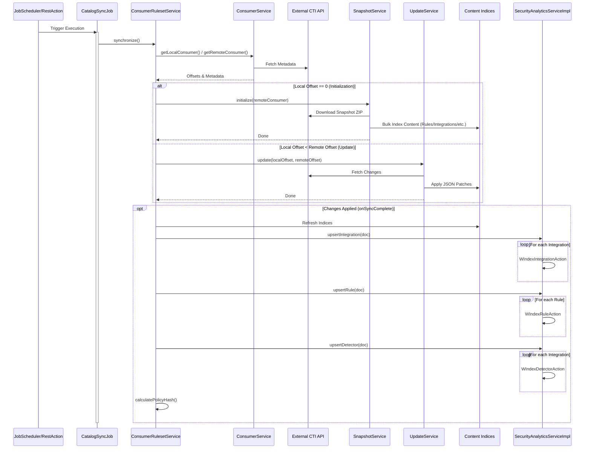
```mermaid
sequenceDiagram
    participant Scheduler as JobScheduler/RestAction
    participant SyncJob as CatalogSyncJob
    participant Synchronizer as ConsumerRulesetService
    participant ConsumerSvc as ConsumerService
    participant CTI as External CTI API
    participant Snapshot as SnapshotService
    participant Update as UpdateService
    participant Indices as Content Indices
    participant SAP as SecurityAnalyticsServiceImpl

    Scheduler->>SyncJob: Trigger Execution
    activate SyncJob

    SyncJob->>Synchronizer: synchronize()

    Synchronizer->>ConsumerSvc: getLocalConsumer() / getRemoteConsumer()
    ConsumerSvc->>CTI: Fetch Metadata
    ConsumerSvc-->>Synchronizer: Offsets & Metadata

    alt Local Offset == 0 (Initialization)
        Synchronizer->>Snapshot: initialize(remoteConsumer)
        Snapshot->>CTI: Download Snapshot ZIP
        Snapshot->>Indices: Bulk Index Content (Rules/Integrations/etc.)
        Snapshot-->>Synchronizer: Done
    else Local Offset < Remote Offset (Update)
        Synchronizer->>Update: update(localOffset, remoteOffset)
        Update->>CTI: Fetch Changes
        Update->>Indices: Apply JSON Patches
        Update-->>Synchronizer: Done
    end

    opt Changes Applied (onSyncComplete)
        Synchronizer->>Indices: Refresh Indices

        Synchronizer->>SAP: upsertIntegration(doc)
        loop For each Integration
            SAP->>SAP: WIndexIntegrationAction
        end

        Synchronizer->>SAP: upsertRule(doc)
        loop For each Rule
            SAP->>SAP: WIndexRuleAction
        end

        Synchronizer->>SAP: upsertDetector(doc)
        loop For each Integration
            SAP->>SAP: WIndexDetectorAction
        end

        Synchronizer->>Synchronizer: calculatePolicyHash()
    end

    deactivate SyncJob
```

### Initialization Phase

When `local_offset = 0`:

1. Downloads a ZIP snapshot from the CTI API.
2. Extracts and parses JSON files for each content type.
3. Bulk-indexes content into respective indices.
4. Registers all content with the Security Analytics Plugin via `SecurityAnalyticsServiceImpl`.

### Update Phase

When `local_offset > 0` and `local_offset < remote_offset`:

1. Fetches the changes in batches from the CTI API.
2. Applies JSON Patch operations (add, update, delete).
3. Pushes the changes to the Security Analytics Plugin via `SecurityAnalyticsServiceImpl`.
4. Updates the local offset.

### Post-Synchronization Phase

1. Refreshes all content indices.
2. Upserts integrations, rules, and detectors into the Security Analytics Plugin via `SecurityAnalyticsServiceImpl`.
3. Recalculates SHA-256 hashes for policy integrity verification.
4. Sets consumer `status` to `idle` in `.wazuh-cti-consumers`.

### Error Handling

If a critical error or data corruption is detected, the system resets `local_offset` to 0, triggering a full snapshot re-initialization on the next run.

---

## Configuration Settings

To register a new setting, follow the existing pattern in `PluginSettings.java`. That will make it available in `opensearch.yml`.

For existing settings, check [Settings Reference](../../ref/modules/content-manager/configuration.md#settings-reference)

When registering a new setting, document it in the section linked above.

### REST API URIs

All endpoints are under `/_plugins/_content_manager`. The URI constants are defined in `PluginSettings`:

| Constant           | Value                                     |
| ------------------ | ----------------------------------------- |
| `PLUGINS_BASE_URI` | `/_plugins/_content_manager`              |
| `SUBSCRIPTION_URI` | `/_plugins/_content_manager/subscription` |
| `UPDATE_URI`       | `/_plugins/_content_manager/update`       |
| `LOGTEST_URI`      | `/_plugins/_content_manager/logtest`      |
| `RULES_URI`        | `/_plugins/_content_manager/rules`        |
| `DECODERS_URI`     | `/_plugins/_content_manager/decoders`     |
| `INTEGRATIONS_URI` | `/_plugins/_content_manager/integrations` |
| `KVDBS_URI`        | `/_plugins/_content_manager/kvdbs`        |
| `FILTERS_URI`      | `/_plugins/_content_manager/filters`      |
| `PROMOTE_URI`      | `/_plugins/_content_manager/promote`      |
| `POLICY_URI`       | `/_plugins/_content_manager/policy`       |
| `SPACE_URI`        | `/_plugins/_content_manager/space`        |

---

## REST API Reference

The full API is defined in [openapi.yml](https://github.com/wazuh/wazuh-indexer-plugins/blob/main/plugins/content-manager/openapi.yml).

### Logtest

The Indexer acts as a proxy between the UI and the Engine. `POST /logtest` accepts the payload and forwards it to the Engine via UDS. No validation is performed. If the Engine responds, its response is returned directly. If the Engine is unreachable, a 500 error is returned.

<div class="warning">

A testing policy must be loaded in the Engine for logtest to work. Load a policy via the policy promotion endpoint.
</div>

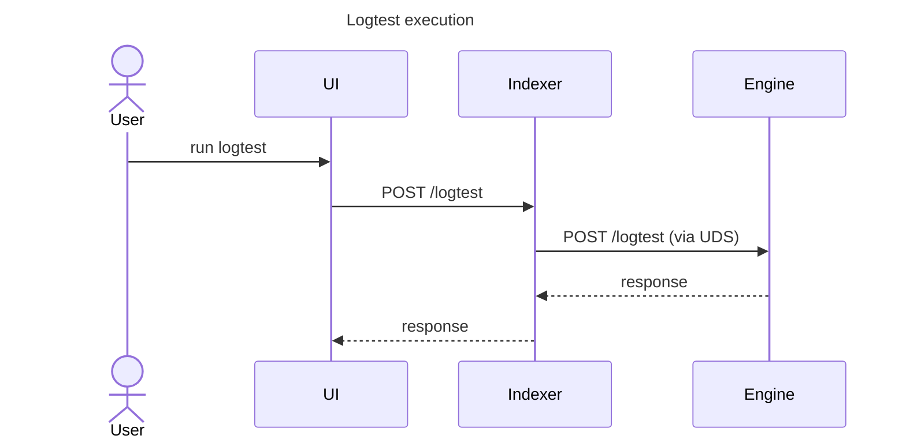
```mermaid
---
title: Logtest execution
---
sequenceDiagram
    actor User
    participant UI
    participant Indexer
    participant Engine

    User->>UI: run logtest
    UI->>Indexer: POST /logtest
    Indexer->>Engine: POST /logtest (via UDS)
    Engine-->>Indexer: response
    Indexer-->>UI: response
```

### Content CUD (Rules, Decoders, Integrations, KVDBs)

All four resource types follow the same patterns via the abstract class hierarchy:

**Create (POST):**
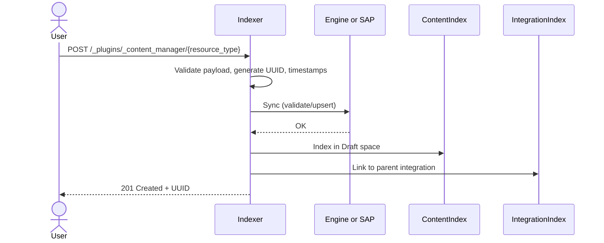
```mermaid
sequenceDiagram
    actor User
    participant Indexer
    participant Engine/SAP as Engine or SAP
    participant ContentIndex
    participant IntegrationIndex

    User->>Indexer: POST /_plugins/_content_manager/{resource_type}
    Indexer->>Indexer: Validate payload, generate UUID, timestamps
    Indexer->>Engine/SAP: Sync (validate/upsert)
    Engine/SAP-->>Indexer: OK
    Indexer->>ContentIndex: Index in Draft space
    Indexer->>IntegrationIndex: Link to parent integration
    Indexer-->>User: 201 Created + UUID
```

**Update (PUT):**
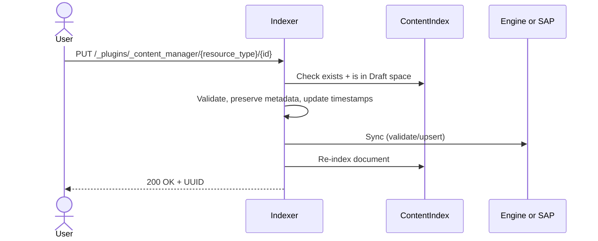
```mermaid
sequenceDiagram
    actor User
    participant Indexer
    participant ContentIndex
    participant Engine/SAP as Engine or SAP

    User->>Indexer: PUT /_plugins/_content_manager/{resource_type}/{id}
    Indexer->>ContentIndex: Check exists + is in Draft space
    Indexer->>Indexer: Validate, preserve metadata, update timestamps
    Indexer->>Engine/SAP: Sync (validate/upsert)
    Indexer->>ContentIndex: Re-index document
    Indexer-->>User: 200 OK + UUID
```

**Delete (DELETE):**
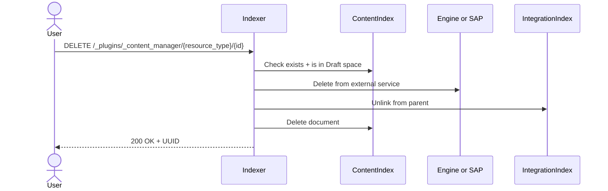
```mermaid
sequenceDiagram
    actor User
    participant Indexer
    participant ContentIndex
    participant Engine/SAP as Engine or SAP
    participant IntegrationIndex

    User->>Indexer: DELETE /_plugins/_content_manager/{resource_type}/{id}
    Indexer->>ContentIndex: Check exists + is in Draft space
    Indexer->>Engine/SAP: Delete from external service
    Indexer->>IntegrationIndex: Unlink from parent
    Indexer->>ContentIndex: Delete document
    Indexer-->>User: 200 OK + UUID
```

### Policy Update

The policy endpoint now accepts a `{space}` path parameter (`draft` or `standard`), allowing the same handler to serve both spaces with different validation rules.

- **Draft space** — all policy fields are accepted. The `integrations` and `filters` arrays allow reordering but not adding or removing entries. `author`, `description`, `documentation`, and `references` are required in addition to the boolean fields.
- **Standard space** — only `enrichments`, `filters`, `enabled`, `index_unclassified_events`, and `index_discarded_events` can be modified. All other fields are preserved from the existing standard policy document. After a successful update, if the standard space hash changed, the updated policy is automatically loaded into the Engine.

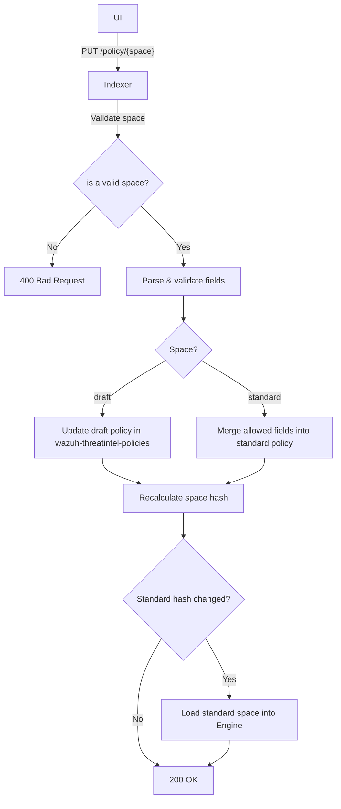
```mermaid
flowchart TD
    UI[UI] -->|"PUT /policy/{space}"| Indexer
    Indexer -->|Validate space| SpaceCheck{is a valid space?}
    SpaceCheck -->|No| Error400[400 Bad Request]
    SpaceCheck -->|Yes| Parse[Parse & validate fields]
    Parse --> SpaceBranch{Space?}
    SpaceBranch -->|draft| StoreDraft[Update draft policy in wazuh-threatintel-policies]
    SpaceBranch -->|standard| StoreStd[Merge allowed fields into standard policy]
    StoreDraft --> Hash[Recalculate space hash]
    StoreStd --> Hash
    Hash --> EngineCheck{Standard hash changed?}
    EngineCheck -->|Yes| Engine[Load standard space into Engine]
    EngineCheck -->|No| OK[200 OK]
    Engine --> OK
```

### Policy Schema

The `wazuh-threatintel-policies` index stores policy configurations. See the [Policy document structure](#document-structure) above for the envelope format.

**Policy document fields:**

| Field                      | Type      | Description                                                  | Editable in standard space |
| -------------------------- | --------- | ------------------------------------------------------------ | :------------------------: |
| `id`                       | keyword   | Unique identifier                                            | No                         |
| `title`                    | keyword   | Human-readable name                                          | No                         |
| `date`                     | date      | Creation timestamp                                           | No                         |
| `modified`                 | date      | Last modification timestamp                                  | No                         |
| `root_decoder`             | keyword   | Root decoder for event processing                            | No                         |
| `integrations`             | keyword[] | Active integration IDs                                       | No                         |
| `author`                   | keyword   | Policy author                                                | No                         |
| `description`              | text      | Brief description                                            | No                         |
| `documentation`            | keyword   | Documentation link                                           | No                         |
| `references`               | keyword[] | External reference URLs                                      | No                         |
| `filters`                  | keyword[] | Filter UUIDs (reordering allowed, no add/remove)             | Yes                        |
| `enrichments`              | keyword[] | Enrichment types (`file`, `domain-name`, `ip`, `url`, `geo`) | Yes                        |
| `enabled`                  | boolean   | Whether the policy is active                                 | Yes                        |
| `index_unclassified_events`| boolean   | Index events that match no rule                              | Yes                        |
| `index_discarded_events`   | boolean   | Index events explicitly discarded by rules                   | Yes                        |

### Filters CUD (Engine Filters)

Filters follow the same CUD pattern as other resource types but use the `AbstractCreateActionSpaces` / `AbstractUpdateActionSpaces` / `AbstractDeleteActionSpaces` hierarchy. The key difference is that the target space is supplied in the request body rather than being fixed to `draft`. Both `draft` and `standard` are accepted.

Filters are linked directly to their space's policy document (the `filters` array) rather than to a parent integration.

**Create (POST):**
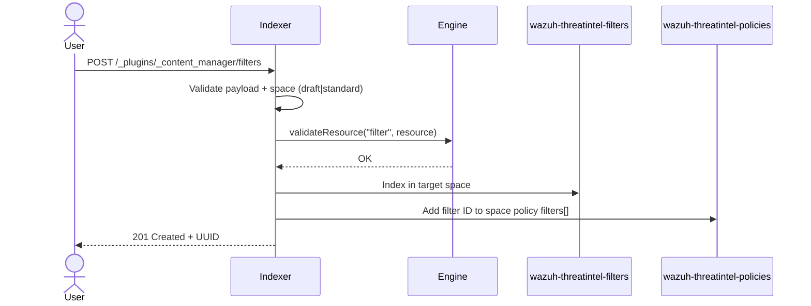
```mermaid
sequenceDiagram
    actor User
    participant Indexer
    participant Engine
    participant FilterIndex as wazuh-threatintel-filters
    participant PoliciesIndex as wazuh-threatintel-policies

    User->>Indexer: POST /_plugins/_content_manager/filters
    Indexer->>Indexer: Validate payload + space (draft|standard)
    Indexer->>Engine: validateResource("filter", resource)
    Engine-->>Indexer: OK
    Indexer->>FilterIndex: Index in target space
    Indexer->>PoliciesIndex: Add filter ID to space policy filters[]
    Indexer-->>User: 201 Created + UUID
```

**Update (PUT):**
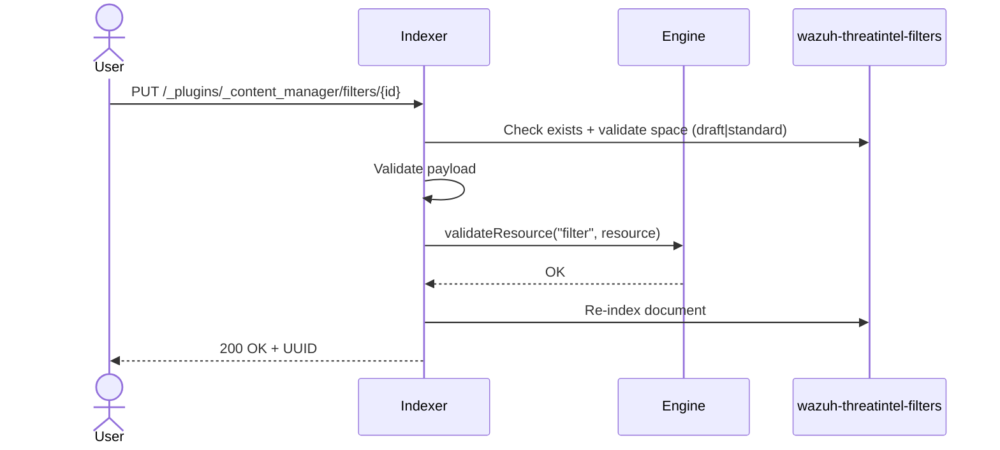
```mermaid
sequenceDiagram
    actor User
    participant Indexer
    participant Engine
    participant FilterIndex as wazuh-threatintel-filters

    User->>Indexer: PUT /_plugins/_content_manager/filters/{id}
    Indexer->>FilterIndex: Check exists + validate space (draft|standard)
    Indexer->>Indexer: Validate payload
    Indexer->>Engine: validateResource("filter", resource)
    Engine-->>Indexer: OK
    Indexer->>FilterIndex: Re-index document
    Indexer-->>User: 200 OK + UUID
```

**Delete (DELETE):**
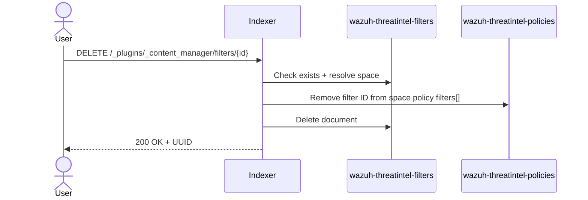
```mermaid
sequenceDiagram
    actor User
    participant Indexer
    participant FilterIndex as wazuh-threatintel-filters
    participant PoliciesIndex as wazuh-threatintel-policies

    User->>Indexer: DELETE /_plugins/_content_manager/filters/{id}
    Indexer->>FilterIndex: Check exists + resolve space
    Indexer->>PoliciesIndex: Remove filter ID from space policy filters[]
    Indexer->>FilterIndex: Delete document
    Indexer-->>User: 200 OK + UUID
```

### Space Reset

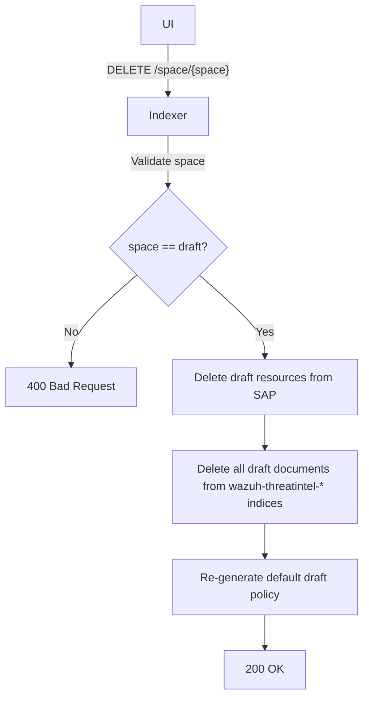
```mermaid
flowchart TD
    UI[UI] -->|"DELETE /space/{space}"| Indexer
    Indexer -->|Validate space| Check{space == draft?}
    Check -->|No| Error400[400 Bad Request]
    Check -->|Yes| DeleteSAP[Delete draft resources from SAP]
    DeleteSAP --> DeleteCTI[Delete all draft documents from wazuh-threatintel-* indices]
    DeleteCTI --> RegenPolicy[Re-generate default draft policy]
    RegenPolicy --> OK[200 OK]
```

Only the `draft` space can be reset. Attempting to reset any other space returns `400 Bad Request`. Failures in SAP cleanup are logged but do not block the reset — the primary goal is clearing the content indices and regenerating the policy.

---

## Debugging

### Check Consumer Status

```bash
GET /.wazuh-cti-consumers/_search
{
  "query": { "match_all": {} }
}
```

The `status` field indicates the sync lifecycle state:

- `ready` — sync complete; content is safe to read.
- `running` — sync in progress; content may be partially written.
- `failed` — the previous sync cycle was interrupted by an unexpected exception.

To find consumers that are currently syncing or that failed mid-sync:

```bash
GET /.wazuh-cti-consumers/_search
{
  "query": { "terms": { "status": ["ready"] } }
}
```

### Check Content by Space

```bash
GET /wazuh-threatintel-rules/_search
{
  "query": { "term": { "space.name": "draft" } },
  "size": 10
}
```

### Monitor Plugin Logs

```bash
tail -f var/log/wazuh-indexer/wazuh-cluster.log | grep -E "ContentManager|CatalogSyncJob|SnapshotServiceImpl|UpdateServiceImpl|AbstractContentAction"
```

---

## Important Notes

- The plugin only runs on **cluster manager nodes**.
- CTI API must be accessible for content synchronization.
- All user content CUD operations require a Draft policy to exist.
- The Engine socket must be available at the configured path for logtest, validation, and promotion.
- Offset-based synchronization ensures no content is missed.

---
## 🧪 Testing

The plugin includes integration tests defined in the `tests/content-manager` directory. These tests cover various scenarios for managing integrations, decoders, rules, and KVDBs through the REST API.

#### 01 - Integrations: Create Integration (9 scenarios)
| #   | Scenario                                                             |
| --- | -------------------------------------------------------------------- |
| 1   | Successfully create an integration                                   |
| 2   | Create an integration with the same title as an existing integration |
| 3   | Create an integration with missing title                             |
| 4   | Create an integration with missing author                            |
| 5   | Create an integration with missing category                          |
| 6   | Create an integration with an explicit id in the resource            |
| 7   | Create an integration with missing resource object                   |
| 8   | Create an integration with empty body                                |
| 9   | Create an integration without authentication                         |

#### 01 - Integrations: Update Integration (8 scenarios)
| #   | Scenario                                                                               |
| --- | -------------------------------------------------------------------------------------- |
| 1   | Successfully update an integration                                                     |
| 2   | Update an integration changing its title to a title that already exists in draft space |
| 3   | Update an integration with missing required fields                                     |
| 4   | Update an integration that does not exist                                              |
| 5   | Update an integration with an invalid UUID                                             |
| 6   | Update an integration with an id in the request body                                   |
| 7   | Update an integration attempting to add/remove dependency lists                        |
| 8   | Update an integration without authentication                                           |

#### 01 - Integrations: Delete Integration (7 scenarios)
| #   | Scenario                                                      |
| --- | ------------------------------------------------------------- |
| 1   | Successfully delete an integration with no attached resources |
| 2   | Delete an integration that has attached resources             |
| 3   | Delete an integration that does not exist                     |
| 4   | Delete an integration with an invalid UUID                    |
| 5   | Delete an integration without providing an ID                 |
| 6   | Delete an integration not in draft space                      |
| 7   | Delete an integration without authentication                  |

#### 02 - Decoders: Create Decoder (7 scenarios)
| #   | Scenario                                                |
| --- | ------------------------------------------------------- |
| 1   | Successfully create a decoder                           |
| 2   | Create a decoder without an integration reference       |
| 3   | Create a decoder with an explicit id in the resource    |
| 4   | Create a decoder with an integration not in draft space |
| 5   | Create a decoder with missing resource object           |
| 6   | Create a decoder with empty body                        |
| 7   | Create a decoder without authentication                 |

#### 02 - Decoders: Update Decoder (7 scenarios)
| #   | Scenario                                      |
| --- | --------------------------------------------- |
| 1   | Successfully update a decoder                 |
| 2   | Update a decoder that does not exist          |
| 3   | Update a decoder with an invalid UUID         |
| 4   | Update a decoder not in draft space           |
| 5   | Update a decoder with missing resource object |
| 6   | Update a decoder with empty body              |
| 7   | Update a decoder without authentication       |

#### 02 - Decoders: Delete Decoder (7 scenarios)
| #   | Scenario                                            |
| --- | --------------------------------------------------- |
| 1   | Successfully delete a decoder                       |
| 2   | Delete a decoder that does not exist                |
| 3   | Delete a decoder with an invalid UUID               |
| 4   | Delete a decoder not in draft space                 |
| 5   | Delete a decoder without providing an ID            |
| 6   | Delete a decoder without authentication             |
| 7   | Verify decoder is removed from index after deletion |

#### 03 - Rules: Create Rule (7 scenarios)
| #   | Scenario                                             |
| --- | ---------------------------------------------------- |
| 1   | Successfully create a rule                           |
| 2   | Create a rule with missing title                     |
| 3   | Create a rule without an integration reference       |
| 4   | Create a rule with an explicit id in the resource    |
| 5   | Create a rule with an integration not in draft space |
| 6   | Create a rule with empty body                        |
| 7   | Create a rule without authentication                 |

#### 03 - Rules: Update Rule (7 scenarios)
| #   | Scenario                             |
| --- | ------------------------------------ |
| 1   | Successfully update a rule           |
| 2   | Update a rule with missing title     |
| 3   | Update a rule that does not exist    |
| 4   | Update a rule with an invalid UUID   |
| 5   | Update a rule not in draft space     |
| 6   | Update a rule with empty body        |
| 7   | Update a rule without authentication |

#### 03 - Rules: Delete Rule (7 scenarios)
| #   | Scenario                                         |
| --- | ------------------------------------------------ |
| 1   | Successfully delete a rule                       |
| 2   | Delete a rule that does not exist                |
| 3   | Delete a rule with an invalid UUID               |
| 4   | Delete a rule not in draft space                 |
| 5   | Delete a rule without providing an ID            |
| 6   | Delete a rule without authentication             |
| 7   | Verify rule is removed from index after deletion |

#### 04 - KVDBs: Create KVDB (9 scenarios)
| #   | Scenario                                             |
| --- | ---------------------------------------------------- |
| 1   | Successfully create a KVDB                           |
| 2   | Create a KVDB with missing title                     |
| 3   | Create a KVDB with missing author                    |
| 4   | Create a KVDB with missing content                   |
| 5   | Create a KVDB without an integration reference       |
| 6   | Create a KVDB with an explicit id in the resource    |
| 7   | Create a KVDB with an integration not in draft space |
| 8   | Create a KVDB with empty body                        |
| 9   | Create a KVDB without authentication                 |

#### 04 - KVDBs: Update KVDB (7 scenarios)
| #   | Scenario                                   |
| --- | ------------------------------------------ |
| 1   | Successfully update a KVDB                 |
| 2   | Update a KVDB with missing required fields |
| 3   | Update a KVDB that does not exist          |
| 4   | Update a KVDB with an invalid UUID         |
| 5   | Update a KVDB not in draft space           |
| 6   | Update a KVDB with empty body              |
| 7   | Update a KVDB without authentication       |

#### 04 - KVDBs: Delete KVDB (7 scenarios)
| #   | Scenario                                         |
| --- | ------------------------------------------------ |
| 1   | Successfully delete a KVDB                       |
| 2   | Delete a KVDB that does not exist                |
| 3   | Delete a KVDB with an invalid UUID               |
| 4   | Delete a KVDB not in draft space                 |
| 5   | Delete a KVDB without providing an ID            |
| 6   | Delete a KVDB without authentication             |
| 7   | Verify KVDB is removed from index after deletion |

#### 05 - Policy: Policy Initialization (6 scenarios)
| #   | Scenario                                                                        |
| --- | ------------------------------------------------------------------------------- |
| 1   | The "wazuh-threatintel-policies" index exists                                                |
| 2   | Exactly four policy documents exist (one per space)                             |
| 3   | Standard policy has a different document ID than draft/test/custom              |
| 4   | Draft, test, and custom policies start with empty integrations and root_decoder |
| 5   | Each policy document contains the expected structure                            |
| 6   | Each policy has a valid SHA-256 hash                                            |

#### 05 - Policy: Update Draft Policy (12 scenarios)
| #   | Scenario                                                              |
| --- | --------------------------------------------------------------------- |
| 1   | Successfully update the draft policy                                  |
| 2   | Update policy with missing type field                                 |
| 3   | Update policy with wrong type value                                   |
| 4   | Update policy with missing resource object                            |
| 5   | Update policy with missing required fields in resource                |
| 6   | Update policy attempting to add an integration to the list            |
| 7   | Update policy attempting to remove an integration from the list       |
| 8   | Update policy with reordered integrations list (allowed)              |
| 9   | Update policy with empty body                                         |
| 10  | Update policy without authentication                                  |
| 11  | Verify policy changes are NOT reflected in test space until promotion |
| 12  | Verify policy changes are reflected in test space after promotion     |

#### 06 - Log Test (4 scenarios)
| #   | Scenario                             |
| --- | ------------------------------------ |
| 1   | Successfully test a log event        |
| 2   | Send log test with empty body        |
| 3   | Send log test with invalid JSON      |
| 4   | Send log test without authentication |

#### 07 - Promote: Preview Promotion (7 scenarios)
| #   | Scenario                                       |
| --- | ---------------------------------------------- |
| 1   | Preview promotion from draft to test           |
| 2   | Preview promotion from test to custom          |
| 3   | Preview promotion with missing space parameter |
| 4   | Preview promotion with empty space parameter   |
| 5   | Preview promotion with invalid space value     |
| 6   | Preview promotion from custom (not allowed)    |
| 7   | Preview promotion without authentication       |

#### 07 - Promote: Execute Promotion (18 scenarios)
| #   | Scenario                                                               |
| --- | ---------------------------------------------------------------------- |
| 1   | Successfully promote from draft to test                                |
| 2   | Verify resources exist in test space after draft to test promotion     |
| 3   | Verify promoted resources exist in both draft and test spaces          |
| 4   | Verify test space hash is regenerated after draft to test promotion    |
| 5   | Verify promoted resource hashes match between draft and test spaces    |
| 6   | Verify deleting a decoder in draft does not affect promoted test space |
| 7   | Successfully promote from test to custom                               |
| 8   | Verify resources exist in custom space after test to custom promotion  |
| 9   | Verify promoted resources exist in both test and custom spaces         |
| 10  | Verify custom space hash is regenerated after test to custom promotion |
| 11  | Verify promoted resource hashes match between test and custom spaces   |
| 12  | Promote from custom (not allowed)                                      |
| 13  | Promote with invalid space                                             |
| 14  | Promote with missing changes object                                    |
| 15  | Promote with incomplete changes (missing required resource arrays)     |
| 16  | Promote with non-update operation on policy                            |
| 17  | Promote with empty body                                                |
| 18  | Promote without authentication                                         |


---

## Related Documentation

- [Content Manager Tutorial: Adding a REST Endpoint](./content-manager-tutorial.md)
- [Setup Plugin Guide](./setup.md)
- [OpenSearch Plugin Development](https://docs.opensearch.org/3.6/install-and-configure/plugins/)
