# Wazuh Indexer Content Manager plugin — development guide

This document describes the architecture, components, and extension points of the Content Manager plugin, which manages threat intelligence content synchronization from the Wazuh CTI API and provides REST endpoints for user-generated content management.

---

## Overview

The Content Manager plugin handles:

- **Wazuh Cloud credentials:** stores the CTI access token in `.wazuh-internal-state` and caches it in `PluginSettings.accessToken` for REST handler use.
- **Pre-registration with Wazuh Cloud:** supports pre-registration of the Wazuh instance with Wazuh Cloud, via environment variable.
- **Job scheduling:** periodically checks for updates using the OpenSearch Job Scheduler.
- **Update check service:** sends a daily heartbeat to CTI so Wazuh can notify users when a newer version is available.
- **Content synchronization:** keeps local indices in sync with the Wazuh CTI Catalog via snapshots and incremental JSON Patch updates.
- **Security Analytics integration:** pushes rules, integrations, and detectors to the Security Analytics plugin.
- **User-generated content:** full CUD (create, update, delete) for rules, decoders, integrations, KVDBs, and policies in the draft space.
- **Engine communication:** validates and promotes content via Unix Domain Socket (UDS) to the Wazuh Engine.
- **Space management:** manages content lifecycle through draft → test → custom promotion.

---

## Tuning the development environment

The `build.gradle`file defines the development environment for the plugin. There, you can configure and modify the plugin's behavior by setting custom values for any of the settings exposed by the plugin, or by setting up environment variables, as follows:

```gradle
testClusters.integTest {
  // JVM tweaks.
  jvmArgs '-Xms2g', '-Xmx2g'

  // Environment variables.
  systemProperty "wazuh.version", "${wazuh_version}-beta3"

  // Plugin settings.
  setting 'plugins.content_manager.catalog.update_on_start', 'true'
}
```

---

## Pre-registration with Wazuh Cloud

{{ #include ../../ref/modules/content-manager/index.md:deploy-key }}

#### State diagram

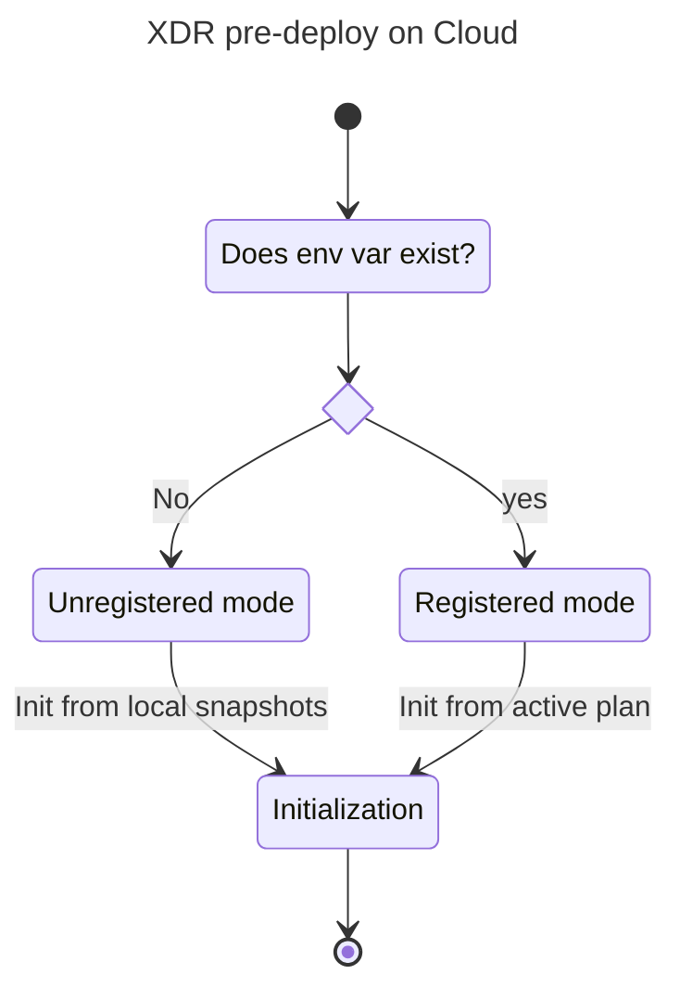
```mermaid
---
title: XDR pre-deploy on Cloud
---
stateDiagram-v2
    state if_state <<choice>>
    env_var_exists: Does env var exist?
    no_state: Unregistered mode
    yes_state: Registered mode
    initialization: Initialization


    [*] --> env_var_exists
    env_var_exists --> if_state
    if_state --> no_state: No
    if_state --> yes_state : yes

    no_state --> initialization : Init from local snapshots
    yes_state --> initialization : Init from active plan
    initialization --> [*]
```

#### Sequence diagram

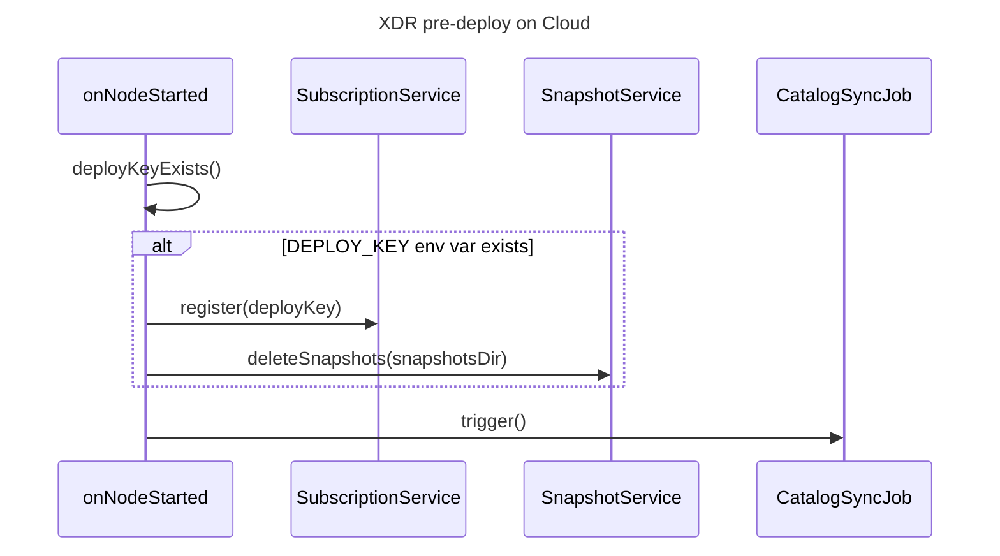
```mermaid
---
title: XDR pre-deploy on Cloud
---
sequenceDiagram
    onNodeStarted->>onNodeStarted: deployKeyExists()
    alt DEPLOY_KEY env var exists
        onNodeStarted->>SubscriptionService: register(deployKey)
        onNodeStarted->>SnapshotService: deleteSnapshots(snapshotsDir)
    end
    onNodeStarted->>CatalogSyncJob: trigger()

```

---

## System indices

The plugin manages the following indices. The 8 content indices marked "alias-backed" use the **alias-backed blue/green storage** scheme (see [Index alias convention](#index-alias-convention) below); `.wazuh-cti-consumers`, `.wazuh-internal-state`, and `.wazuh-content-manager-jobs` are single physical indices, not blue/green'd.

| Alias or index name                  | Purpose                                   | Hidden | Alias-backed |
| ------------------------------------ | ----------------------------------------- | ------ | ------------ |
| `.wazuh-cti-consumers`               | Sync state (status, offsets) per consumer | yes    | no           |
| `.wazuh-internal-state`              | Persisted CTI access token                | yes    | no           |
| `wazuh-threatintel-policies`         | Policy documents                          | no     | yes          |
| `wazuh-threatintel-integrations`     | Integration definitions                   | no     | yes          |
| `wazuh-threatintel-rules`            | Detection rules                           | no     | yes          |
| `wazuh-threatintel-decoders`         | Decoder definitions                       | no     | yes          |
| `wazuh-threatintel-kvdbs`            | Key-value databases                       | no     | yes          |
| `wazuh-threatintel-filters`          | Engine filter rules                       | no     | yes          |
| `wazuh-threatintel-enrichments`      | Indicators of Compromise (IoC)            | no     | yes          |
| `.wazuh-threatintel-vulnerabilities` | CVE vulnerability data                    | yes    | yes          |
| `.wazuh-content-manager-jobs`        | Job scheduler metadata                    | yes    | no           |

This is the authoritative index list for the plugin; the [Reference Manual's System Indices table](../../ref/modules/content-manager/index.md#system-indices) links here rather than repeating it.

---

## Index alias convention

Each content index uses an alias-backed **blue/green** storage scheme to enable zero-downtime content replacement during subscription plan changes.

### Naming

- **Alias (public name):** the stable name used by all readers, REST handlers, and dashboards. Example: `wazuh-threatintel-rules`.
- **Physical index:** the actual index storing data, suffixed with `-a` or `-b`. Example: `wazuh-threatintel-rules-a`.

Only one physical index is live at a time. The alias points to it with `is_write_index: true`. The other suffix is reserved as the shadow (staging) slot for the next plan-change swap.

### Key classes

| Class                     | Responsibility                                                                                                                                                                                                                                         |
| ------------------------- | ------------------------------------------------------------------------------------------------------------------------------------------------------------------------------------------------------------------------------------------------------ |
| `ContentIndex`            | Creates alias-backed physical indices. Has a 4-arg constructor for targeting shadow physical names directly. `createIndex()` creates the physical index and assigns the alias. `createShadowIndex()` creates a hidden physical index without an alias. |
| `IndexSwapHelper`         | Stateless utility class for swap operations: `resolveShadowName()`, `resolveLivePhysicalName()`, `createShadowIndices()`, `reindexUserContent()`, `atomicSwap()`, `deleteIndices()`.                                                                   |
| `AbstractConsumerService` | Detects plan changes and delegates to `performShadowSwap()` instead of the old `resetConsumer()` wipe-and-reload path.                                                                                                                                 |

### Shadow swap flow (plan change)

When `AbstractConsumerService.syncConsumerServices()` detects a plan change (the plan-provided `resource` URL differs from the persisted one), it runs the shadow swap path:

1. Resolve shadow physical names (the -a/-b suffix not currently live)
2. Create hidden shadow physical indices (index.hidden=true, no alias)
3. Download snapshot into shadow indices (reuse SnapshotServiceImpl)
4. Reindex user content (space.name != "standard") from live → shadow
   (only for consumer types with hasUserContent()=true, i.e., ruleset)
5. Unhide non-CVE shadow indices (set index.hidden=false)
6. Atomic alias swap (single IndicesAliasesRequest for all 8 aliases)
7. Rewrite consumer document in .wazuh-cti-consumers
8. Run post-sync cascade (onSyncComplete: Security Analytics sync, engine promote, etc.)
9. Delete old physical indices

### Failure modes

| Failure point                                                                          | System state after failure                                                                                                                                    | Next sync behavior                                                                                                                                                                                                        |
| -------------------------------------------------------------------------------------- | ------------------------------------------------------------------------------------------------------------------------------------------------------------- | ------------------------------------------------------------------------------------------------------------------------------------------------------------------------------------------------------------------------- |
| Before step 6 (alias swap)                                                             | Shadow indices are deleted; live alias and consumer document are untouched.                                                                                   | Retries the shadow swap from a clean state against the same target plan.                                                                                                                                                  |
| Between step 6 (alias swap) and step 7 (consumer doc rewrite)                          | Alias already points at the new physical indices, but `.wazuh-cti-consumers` still names the old `resource` URL.                                              | Re-detects the plan change (persisted resource still differs from the plan) and re-runs the shadow swap — at most one wasted rebuild, no user-visible corruption since readers already see the new content via the alias. |
| Concurrent REST writes to `draft`/`test`/`custom` during shadow population (steps 2–4) | Content written after the reindex snapshot (step 4) but before the alias swap (step 6) exists only in the old live indices.                                   | Lost on swap unless the write lands in the same sync cycle; acceptable because the `CatalogSyncJob` semaphore (below) makes this window narrow, not eliminated.                                                           |
| Engine/Security Analytics unavailable during the post-sync cascade (step 8)            | Alias and consumer document are already committed to the new source; only downstream propagation (Engine `promote()`, Security Analytics sync) is incomplete. | Cascade is idempotent and retried on the next scheduled sync, which now runs against the already-swapped source.                                                                                                          |

**Concurrency:** The `CatalogSyncJob` semaphore spans the entire `synchronize()` call, which includes the shadow swap. No additional locking is needed, but it also means the swap holds that semaphore for its full duration — normal incremental syncs for other consumers queue behind it.

### Normal incremental syncs

Regular incremental updates (no plan change) write through the alias to the live physical index. They are completely unaware of the `-a`/`-b` scheme.

---

## Plugin architecture

### Entry point

**`ContentManagerPlugin`** is the main class. It implements `Plugin`, `ClusterPlugin`, `JobSchedulerExtension`, and `SystemIndexPlugin` (which extends `ActionPlugin`). On startup, it:

1. Initializes `PluginSettings`, `ConsumersIndex`, `CredentialsIndex`, `CtiConsole`, `CatalogSyncJob`, `EngineServiceImpl`, and `SpaceService`.
2. Registers all REST handlers via `getRestHandlers()`.
3. Creates the `.wazuh-cti-consumers` and `.wazuh-internal-state` indices on cluster manager nodes.
4. Schedules the periodic `CatalogSyncJob` via the OpenSearch Job Scheduler.
5. Optionally triggers an immediate sync on start.
6. Registers/schedules `TelemetryPingJob` (`wazuh-telemetry-ping-job`) when `plugins.content_manager.telemetry.enabled` is true.
7. Registers a dynamic settings consumer to enable/disable telemetry at runtime.
8. Registers dynamic settings consumers for each resource creation limit (`max_integrations`, `max_decoders`, `max_rules`, `max_kvdbs`, `max_filters`) so limits can be updated at runtime via the Cluster Settings API.

### Update check service internals

The update check flow is split into two classes:

- **`TelemetryPingJob`** (`jobscheduler/jobs/TelemetryPingJob.java`)
  - Runs through Job Scheduler every 1 day.
  - Reads cluster UUID from `ClusterService` metadata.
  - Reads Wazuh version through `ContentManagerPlugin.getVersion()`.
  - Prevents overlap using a `Semaphore` (`tryAcquire()` guard).
  - Exposes a `trigger()` method for immediate invocation, used by `ContentManagerPlugin` to fire the first ping as soon as the job document is indexed.

- **`TelemetryClient`** (`cti/console/client/TelemetryClient.java`)
  - Sends an asynchronous GET request to CTI `/ping`.
  - Headers sent:
    - `wazuh-uid`: cluster UUID
    - `wazuh-tag`: `v<version>`
    - `Accept-Encoding`: `gzip, br`
  - Fire-and-forget behavior: callback logs success/failure without blocking scheduler threads.

### CTI HTTP client User-Agent and Accept-Encoding

All HTTP clients that communicate with CTI services include a custom `User-Agent` header set as a **default header on the HTTP client builder**:

```
User-Agent: Wazuh Indexer <version>
```

The version is read from `VERSION.json` at plugin startup and stored in `PluginSettings`. The user-agent string is built by `PluginSettings.getUserAgent()` using the `Constants.USER_AGENT_PREFIX` constant. If the version is unavailable, the fallback value `unknown` is used.

They also send `Accept-Encoding: gzip, br` so CTI responses are transferred compressed. Unlike `User-Agent`, this header is added **per request** (via each request builder) rather than as a client default header: HttpClient5's built-in content-compression handling silently overwrites an `Accept-Encoding` default header with its own value, so setting it on the request itself is required for it to reach the wire unchanged.

Affected clients:
- **Console `ApiClient`** (`cti/console/client/ApiClient.java`) — async HTTP client for CTI Console authentication and plans.
- **Catalog `ApiClient`** (`cti/catalog/client/ApiClient.java`) — async HTTP client for CTI Catalog consumer and changes.
- **`SnapshotClient`** (`cti/catalog/client/SnapshotClient.java`) — sync HTTP client for downloading CTI snapshots.
- **`TelemetryClient`** (`cti/console/client/TelemetryClient.java`) — inherits from Console `ApiClient`.

Runtime toggle behavior:

- `plugins.content_manager.telemetry.enabled` is a **dynamic** setting.
- Enabling it schedules the job; the immediate first ping is fired from within `scheduleTelemetryPingJob()` only after the job document has been successfully indexed, guaranteeing the ping only runs when the scheduled job is correctly registered.
- Disabling it removes the telemetry job document from `.wazuh-content-manager-jobs`.

### REST handlers

The plugin registers 27 REST handlers, grouped by domain:

| Domain            | Handler                              | Method | URI                                                |
| ----------------- | ------------------------------------ | ------ | -------------------------------------------------- |
| **Subscription**  | `RestPostSubscriptionAction`         | POST   | `/_plugins/_content_manager/subscription`          |
|                   | `RestGetSubscriptionAction`          | GET    | `/_plugins/_content_manager/subscription`          |
|                   | `RestDeleteSubscriptionAction`       | DELETE | `/_plugins/_content_manager/subscription`          |
| **Update**        | `RestPostUpdateAction`               | POST   | `/_plugins/_content_manager/update`                |
| **Version check** | `RestGetVersionCheckAction`          | GET    | `/_plugins/_content_manager/version/check`         |
| **Logtest**       | `RestPostLogtestAction`              | POST   | `/_plugins/_content_manager/logtest`               |
|                   | `RestPostLogtestNormalizationAction` | POST   | `/_plugins/_content_manager/logtest/normalization` |
|                   | `RestPostLogtestDetectionAction`     | POST   | `/_plugins/_content_manager/logtest/detection`     |
| **Policy**        | `RestPutPolicyAction`                | PUT    | `/_plugins/_content_manager/policy/{space}`        |
| **Rules**         | `RestPostRuleAction`                 | POST   | `/_plugins/_content_manager/rules`                 |
|                   | `RestPutRuleAction`                  | PUT    | `/_plugins/_content_manager/rules/{id}`            |
|                   | `RestDeleteRuleAction`               | DELETE | `/_plugins/_content_manager/rules/{id}`            |
| **Decoders**      | `RestPostDecoderAction`              | POST   | `/_plugins/_content_manager/decoders`              |
|                   | `RestPutDecoderAction`               | PUT    | `/_plugins/_content_manager/decoders/{id}`         |
|                   | `RestDeleteDecoderAction`            | DELETE | `/_plugins/_content_manager/decoders/{id}`         |
| **Integrations**  | `RestPostIntegrationAction`          | POST   | `/_plugins/_content_manager/integrations`          |
|                   | `RestPutIntegrationAction`           | PUT    | `/_plugins/_content_manager/integrations/{id}`     |
|                   | `RestDeleteIntegrationAction`        | DELETE | `/_plugins/_content_manager/integrations/{id}`     |
| **KVDBs**         | `RestPostKvdbAction`                 | POST   | `/_plugins/_content_manager/kvdbs`                 |
|                   | `RestPutKvdbAction`                  | PUT    | `/_plugins/_content_manager/kvdbs/{id}`            |
|                   | `RestDeleteKvdbAction`               | DELETE | `/_plugins/_content_manager/kvdbs/{id}`            |
| **Filters**       | `RestPostFilterAction`               | POST   | `/_plugins/_content_manager/filters`               |
|                   | `RestPutFilterAction`                | PUT    | `/_plugins/_content_manager/filters/{id}`          |
|                   | `RestDeleteFilterAction`             | DELETE | `/_plugins/_content_manager/filters/{id}`          |
| **Promote**       | `RestPostPromoteAction`              | POST   | `/_plugins/_content_manager/promote`               |
|                   | `RestGetPromoteAction`               | GET    | `/_plugins/_content_manager/promote`               |
| **Spaces**        | `RestDeleteSpaceAction`              | DELETE | `/_plugins/_content_manager/space/{space}`         |

---

## Class hierarchy

The REST handlers follow a **Template Method** pattern through a three-level abstract class hierarchy. There are two parallel branches — one where the target space is always `draft` (`AbstractCreateAction` / `AbstractUpdateAction` / `AbstractDeleteAction`) and one where the target space is supplied at runtime from the request body (`AbstractCreateActionSpaces` / `AbstractUpdateActionSpaces` / `AbstractDeleteActionSpaces`). The latter is used for resources like Filters that can live in either `draft` or `standard` space.

```
BaseRestHandler
├── AbstractContentAction
│   ├── AbstractCreateAction               # Target space always: draft
│   │   ├── RestPostRuleAction
│   │   ├── RestPostDecoderAction
│   │   ├── RestPostIntegrationAction
│   │   └── RestPostKvdbAction
│   ├── AbstractUpdateAction               # Target space always: draft
│   │   ├── RestPutRuleAction
│   │   ├── RestPutDecoderAction
│   │   ├── RestPutIntegrationAction
│   │   └── RestPutKvdbAction
│   ├── AbstractDeleteAction               # Target space always: draft
│   │   ├── RestDeleteRuleAction
│   │   ├── RestDeleteDecoderAction
│   │   ├── RestDeleteIntegrationAction
│   │   └── RestDeleteKvdbAction
│   ├── AbstractCreateActionSpaces         # Target space from request body (draft|standard)
│   │   └── RestPostFilterAction
│   ├── AbstractUpdateActionSpaces         # Target space from request body (draft|standard)
│   │   └── RestPutFilterAction
│   └── AbstractDeleteActionSpaces         # Target space from request body (draft|standard)
│       └── RestDeleteFilterAction
├── RestPutPolicyAction
├── RestDeleteSpaceAction
├── RestPostSubscriptionAction
├── RestPostUpdateAction
├── RestPostLogtestAction
├── RestPostPromoteAction
└── RestGetPromoteAction
```

### AbstractContentAction

Base class for all content CUD actions. It:

- Overrides `prepareRequest()` from `BaseRestHandler`.
- Initializes shared services: `SpaceService`, `SecurityAnalyticsService`, `IntegrationService`.
- Validates that a Draft policy exists before executing any content action.
- Delegates to the abstract `executeRequest()` method for concrete logic.

### AbstractCreateAction / AbstractCreateActionSpaces

Handles **POST** requests to create new resources. `AbstractCreateAction` hard-codes the target space to `draft`. `AbstractCreateActionSpaces` reads the space from the request body instead, allowing `draft` or `standard` as the target.

The `executeRequest()` workflow:

1. **Validate request body** — ensures the request has content and valid JSON.
2. **Validate payload structure** — checks for required `resource` key and optional `integration` key.
3. **Resource-specific validation** — delegates to `validatePayload()` (abstract). Concrete handlers check required fields, duplicate titles, parent integration existence, and the configured creation limit. The limit check counts existing Draft documents in the target index and returns HTTP 400 if the count is at or above `plugins.content_manager.max_<type>`; if the index does not exist yet, the check is skipped.
4. **Generate ID and metadata** — creates a UUID; sets `date` and `modified` timestamps to the current time unless the caller already supplied a non-blank value for either (`Resource.setCreationTime()` / `setLastModificationTime()`); defaults `enabled` to `true`.
5. **External sync** — delegates to `syncExternalServices()` (abstract). Typically upserts the resource in Security Analytics or validates via the Engine.
6. **Index** — wraps the resource in the CTI document structure and indexes it in the Draft space.
7. **Link to parent** — delegates to `linkToParent()` (abstract). Usually adds the new resource ID to a parent integration's resource list.
8. **Update hash** — recalculates the Draft space policy hash via `SpaceService`.

Returns `201 Created` with the new resource UUID on success.

### AbstractUpdateAction / AbstractUpdateActionSpaces

Handles **PUT** requests to update existing resources. `AbstractUpdateAction` restricts updates to the `draft` space. `AbstractUpdateActionSpaces` accepts a space value (`draft` or `standard`) from the request body.

The `executeRequest()` workflow:

1. **Validate ID** — checks the path parameter is present and correctly formatted.
2. **Check existence and space** — verifies the resource exists and belongs to the Draft space.
3. **Parse and validate payload** — same structural checks as create.
4. **Resource-specific validation** — delegates to `validatePayload()` (abstract).
5. **Update timestamps** — sets `modified` to the current time unless the caller already supplied a non-blank value. `preserveMetadata()` then unconditionally overwrites `date` with the existing document's stored creation date, ignoring any caller-supplied value — `date` is fully immutable once a resource is created.
6. **External sync** — delegates to `syncExternalServices()` (abstract).
7. **Re-index** — overwrites the document in the index.
8. **Update hash** — recalculates the Draft space hash.

Returns `200 OK` with the resource UUID on success.

### AbstractDeleteAction / AbstractDeleteActionSpaces

Handles **DELETE** requests. `AbstractDeleteAction` restricts deletions to the `draft` space. `AbstractDeleteActionSpaces` resolves the target space from the stored document (allowing deletion from both `draft` and `standard`).

The `executeRequest()` workflow:

1. **Validate ID** — checks format and presence.
2. **Check existence and space** — resource must exist in Draft space.
3. **Pre-delete validation** — delegates to `validateDelete()` (optional override). Can prevent deletion if dependent resources exist.
4. **External sync** — delegates to `deleteExternalServices()` (abstract). Removes from Security Analytics. Handles 404 gracefully.
5. **Unlink from parent** — delegates to `unlinkFromParent()` (abstract). Removes the resource ID from the parent integration's list.
6. **Delete from index** — removes the document.
7. **Update hash** — recalculates the Draft space hash.

Returns `200 OK` with the resource UUID on success.

### Integration `mode` field

Integration documents carry a `document.mode` field with one of two values:

- `protected` — the integration is Wazuh core content and **cannot be modified or deleted** through the REST API.
- `user-managed` — the integration can be modified by the user.

The value is set by whoever produces the content: CTI content carries its own `mode` (core integrations are `protected`, the rest `user-managed`), and integrations created through the REST API are always `user-managed`.

| Integration | Space | `PUT /integrations/{id}` |
| --- | --- | --- |
| `protected` | any | Rejected with `400 Bad Request`. |
| `user-managed` | `draft` | Fully editable (metadata, category, `enabled`). |
| `user-managed` | `standard` | Only `enabled` can change; every other field is preserved from the stored document. |

When a `standard` integration's `enabled` is toggled, its related Security Analytics **detector is disabled/enabled in lockstep** as part of the same update flow. The detector shares the integration's document id, so the Content Manager calls the Security Analytics `WSetDetectorEnabledAction` (`setDetectorEnabled(id, enabled)`) to flip **only** the `enabled` flag on the existing detector, preserving its inputs, triggers and monitors. If the detector sync fails the whole update is aborted, so the two never drift.

On the synchronization side, `buildDetectorRequest` resolves the detector's state as:

```
detector.enabled = integration.enabled && (user override ?? document.detector.enabled)
```

The integration gates it, so a disabled integration never leaves a running detector whatever the user chose for it. When the integration is on, the user's override wins and CTI's `document.detector.enabled` is the default — absent there means CTI has no preference and the integration alone decides. The rest of the `detector` block is CTI-owned and supplies only the schedule and the source indices.

The override is the user's Start/Stop from Security Analytics, kept in the [registry](#user-overrides-in-the-standard-space). Toggling the integration clears it, so re-enabling an integration brings its detector back rather than leaving a stale decision in charge.

---

## YAML content-type support

Decoders, KVDBs, and Filters accept `Content-Type: application/yaml` requests in addition to JSON. This is implemented through an opt-in pattern in the abstract handler hierarchy.

### Architecture

The YAML support is built on three mechanisms in `AbstractContentAction`:

1. **`isYamlRequest(RestRequest)`** — Detects YAML content type via `XContentType.YAML.equals(request.getMediaType())`. Returns `false` on any exception (e.g., test mocks that don't stub `getMediaType()`).

2. **`supportsYamlField()`** — Returns `false` by default. Overridden to `true` in concrete handlers that support YAML field storage: `RestPostDecoderAction`, `RestPutDecoderAction`, `RestPostKvdbAction`, `RestPutKvdbAction`, `RestPostFilterAction`, `RestPutFilterAction`.

3. **YAML/JSON branching in `executeRequest()`** — Both `AbstractCreateAction` and `AbstractUpdateAction` (and their `*Spaces` variants) branch on `isYamlRequest()` and `supportsYamlField()`:
   - **YAML path**: Parses the body via `YamlUtils.fromYaml()`, then validates the envelope structure with the same `validateResourcePayload()` call as the JSON path. The `rawYaml` for the `yaml` field is generated from the `resource` subtree via `YamlUtils.toYaml()`.
   - **JSON path**: Unchanged — parses via Jackson `ObjectMapper.readTree()`.

Both paths converge after parsing: resource-specific validation, ID generation, external sync, and indexing are identical regardless of content type.

### Envelope structure

YAML requests use the **same envelope** as JSON. The `integration` (or `space` for filters) and `resource` keys appear at the top level of the YAML document:

```yaml
---
integration: <uuid>
resource:
  metadata:
    title: "My Resource"
  content: { ... }
```

This is parsed into a `JsonNode` tree identical to what the JSON path produces.

### YAML field storage

When `supportsYamlField()` returns `true`, the handler populates a `yaml` field on the CTI wrapper before indexing:

- **YAML requests**: `rawYaml` is generated from the parsed `resource` subtree (not the raw request body, which includes the envelope).
- **JSON requests**: `YamlUtils.toYaml(resourceNode)` auto-generates the YAML representation.

The `yaml` field is stored as `text` in the index mappings (see `cti-decoders-mappings.json`, `cti-kvdbs-mappings.json`, `engine-filters-mappings.json`).

### Type fidelity

`YamlUtils` is configured with `DeserializationFeature.USE_BIG_DECIMAL_FOR_FLOATS` to preserve floating-point precision. A post-parse `fixDecimalScale()` step ensures values like `5.0` retain scale 1 in their `BigDecimal` representation, preventing coercion to integer `5` during serialization.

The `ContentIndex.create()` method skips `processPayload()` when it receives a fully-formed CTI wrapper (with `document`, `space`, and `hash` keys), avoiding a lossy `valueToTree()` round-trip that would strip `BigDecimal` scale.

### Key classes

| Class                   | Role                                                                          |
| ----------------------- | ----------------------------------------------------------------------------- |
| `YamlUtils`             | YAML - JSON conversion with `USE_BIG_DECIMAL_FOR_FLOATS`, `fixDecimalScale()` |
| `Decoder`               | Model with `yaml` field, `fromPayload()` generates YAML from document         |
| `Kvdb`                  | Model with `yaml` field, same pattern as Decoder                              |
| `Filter`                | Model with `yaml` field, same pattern as Decoder                              |
| `AbstractContentAction` | `isYamlRequest()`, `supportsYamlField()` base methods                         |
| `ContentIndex`          | `create()` skips `processPayload()` for pre-built wrappers                    |

---

## Engine communication

The plugin communicates with the Wazuh Engine via a **Unix Domain Socket (UDS)** for validation and promotion of content.

### EngineSocketClient

Located at: `engine/client/EngineSocketClient.java`

- Connects to the socket at `/usr/share/wazuh-indexer/engine/sockets/engine-api-http.sock`.
- Sends **HTTP-over-UDS** requests: builds a standard HTTP/1.1 request string (method, headers, JSON body) and writes it to the socket channel.
- Each request opens a new `SocketChannel` (using `StandardProtocolFamily.UNIX`) that is closed after the response is read.
- Parses the HTTP response, extracting the status code and JSON body.

### EngineService interface

Defines the Engine operations:

| Method                                             | Description                                                  |
| -------------------------------------------------- | ------------------------------------------------------------ |
| `logtest(JsonNode log)`                            | Forwards a log test payload to the Engine                    |
| `validate(JsonNode resource)`                      | Validates a resource payload                                 |
| `promote(JsonNode policy)`                         | Validates a full policy for promotion                        |
| `validateResource(String type, JsonNode resource)` | Wraps a resource with its type and delegates to `validate()` |

### EngineServiceImpl

Implementation using `EngineSocketClient`. Maps methods to Engine API endpoints:

| Method       | Engine endpoint              | HTTP method |
| ------------ | ---------------------------- | ----------- |
| `logtest()`  | `/logtest`                   | POST        |
| `validate()` | `/content/validate/resource` | POST        |
| `promote()`  | `/content/validate/policy`   | POST        |

---

## Space model

Resources live in **spaces** that represent their lifecycle stage. The `Space` enum defines four spaces:

| Space      | Description                                                  |
| ---------- | ------------------------------------------------------------ |
| `STANDARD` | Production-ready CTI resources from the upstream catalog     |
| `CUSTOM`   | User-created resources that have been promoted to production |
| `DRAFT`    | Resources under development — all user edits happen here     |
| `TEST`     | Intermediate space for validation before production          |

### Promotion flow

Spaces promote in a fixed chain:

```
DRAFT → TEST → CUSTOM
```

The `Space.promote()` method returns the next space in the chain. `STANDARD` and `CUSTOM` spaces cannot be promoted further.

### SpaceService

Located at: `cti/catalog/service/SpaceService.java`

Manages space-related operations:

- **`getSpaceResources(spaceName)`** — Fetches all resources (document IDs and hashes) from all managed indices for a given space.
- **`promoteSpace(indexName, resources, targetSpace)`** — Copies documents from one space to another via bulk indexing, updating the `space.name` field.
- **`calculateAndUpdate(targetSpaces)`** — Recalculates the aggregate SHA-256 hash for each policy in the given spaces. The hash is computed by concatenating hashes of the policy and all its linked resources (integrations, decoders, KVDBs, rules).
- **`buildEnginePayload(...)`** — Assembles the full policy payload (policy + all resources from target space with modifications applied) for Engine validation during promotion.
- **`deleteResources(indexName, ids, targetSpace)`** — Bulk-deletes resources from a target space.

### Document structure

Every resource document follows this envelope structure:

```json
{
  "document": {
    "id": "<uuid>",
    "title": "...",
    "date": "2026-01-01T00:00:00Z",
    "modified": "2026-01-15T00:00:00Z",
    "enabled": true
  },
  "hash": {
    "sha256": "abc123..."
  },
  "space": {
    "name": "draft",
    "hash": {
      "sha256": "xyz789..."
    }
  }
}
```

### User overrides in the `standard` space

The `standard` space is rebuilt from CTI, so what the user changes there is recorded in a registry document and re-applied afterwards: the policy's settings, the filters they created, and each integration's `enabled` state along with its detector's.

`UserOverridesService` manages a single document in the policies index under `wazuh-user-overrides` (`Constants.USER_OVERRIDES_DOC_ID`):

```json
{
  "user_overrides": {
    "standard": {
      "policy": {
        "enabled": true,
        "index_unclassified_events": true,
        "index_discarded_events": false,
        "enrichments": ["connection", "url_full"]
      },
      "filters": [{ "id": "<uuid>", "document": "<the stored filter, serialized>" }],
      "integrations": {
        "<uuid>": { "enabled": false },
        "<another uuid>": { "detector_enabled": false }
      }
    }
  }
}
```

Both integration fields are optional, and absence means the user never decided: the two entries above are "the user disabled this integration" and "the user stopped this one's detector without touching the integration".

It is the one document in that index with **no `space` field**: the pre-snapshot wipe selects by `space.name` and never sees it, and the plan-change reindex carries it into the new physical index.

Enrichments are stored as the resulting list, and on apply only the values CTI still publishes are kept. Filters are stored as serialized strings, to keep their fields out of the `"dynamic": "true"` policies mapping. Integrations are keyed by id rather than listed, so Security Analytics can record a detector decision with a single partial update — a `doc` merge combines objects recursively but replaces arrays wholesale.

Written on a `standard` policy update, on filter create, update and delete, and on integration update. The detector decision is written by Security Analytics itself, which cannot call this plugin — the dependency only runs the other way — but writes the registry document directly. Applied at the start of `ConsumerRulesetService.onSyncComplete`, before the space hash is recalculated and the engine reloaded. Idempotent, and a failure is logged without aborting the synchronization.

---

## Content synchronization pipeline

### Overview

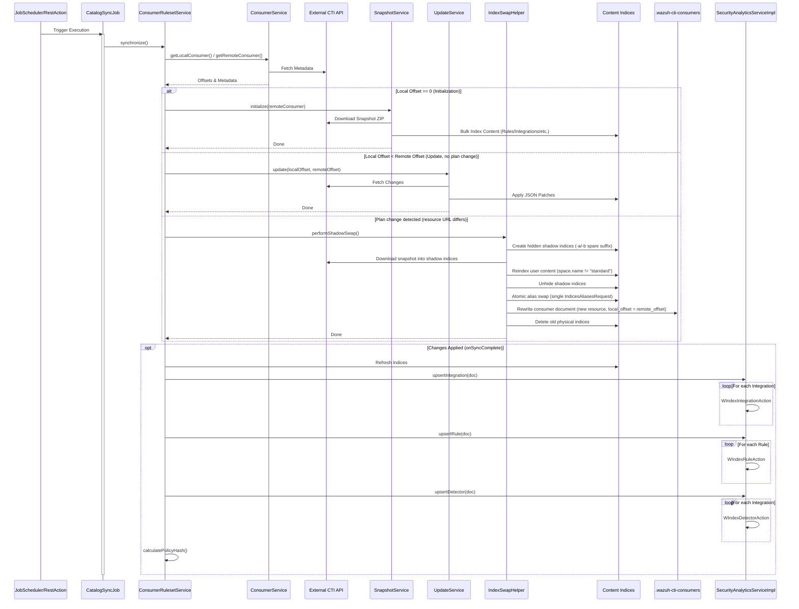
```mermaid
sequenceDiagram
    participant Scheduler as JobScheduler/RestAction
    participant SyncJob as CatalogSyncJob
    participant Synchronizer as ConsumerRulesetService
    participant ConsumerSvc as ConsumerService
    participant CTI as External CTI API
    participant Snapshot as SnapshotService
    participant Update as UpdateService
    participant Swap as IndexSwapHelper
    participant Indices as Content Indices
    participant Consumers as .wazuh-cti-consumers
    participant SA as SecurityAnalyticsServiceImpl

    Scheduler->>SyncJob: Trigger Execution
    activate SyncJob

    SyncJob->>Synchronizer: synchronize()

    Synchronizer->>ConsumerSvc: getLocalConsumer() / getRemoteConsumer()
    ConsumerSvc->>CTI: Fetch Metadata
    ConsumerSvc-->>Synchronizer: Offsets & Metadata

    alt Local Offset == 0 (Initialization)
        Synchronizer->>Snapshot: initialize(remoteConsumer)
        Snapshot->>CTI: Download Snapshot ZIP
        Snapshot->>Indices: Bulk Index Content (Rules/Integrations/etc.)
        Snapshot-->>Synchronizer: Done
    else Local Offset < Remote Offset (Update, no plan change)
        Synchronizer->>Update: update(localOffset, remoteOffset)
        Update->>CTI: Fetch Changes
        Update->>Indices: Apply JSON Patches
        Update-->>Synchronizer: Done
    else Plan change detected (resource URL differs)
        Synchronizer->>Swap: performShadowSwap()
        Swap->>Indices: Create hidden shadow indices (-a/-b spare suffix)
        Swap->>CTI: Download snapshot into shadow indices
        Swap->>Indices: Reindex user content (space.name != "standard")
        Swap->>Indices: Unhide shadow indices
        Swap->>Indices: Atomic alias swap (single IndicesAliasesRequest)
        Swap->>Consumers: Rewrite consumer document (new resource, local_offset = remote_offset)
        Swap->>Indices: Delete old physical indices
        Swap-->>Synchronizer: Done
    end

    opt Changes Applied (onSyncComplete)
        Synchronizer->>Indices: Refresh Indices

        Synchronizer->>SA: upsertIntegration(doc)
        loop For each Integration
            SA->>SA: WIndexIntegrationAction
        end

        Synchronizer->>SA: upsertRule(doc)
        loop For each Rule
            SA->>SA: WIndexRuleAction
        end

        Synchronizer->>SA: upsertDetector(doc)
        loop For each Integration
            SA->>SA: WIndexDetectorAction
        end

        Synchronizer->>Synchronizer: calculatePolicyHash()
    end

    deactivate SyncJob
```

The `opt Changes Applied (onSyncComplete)` cascade runs after all three branches, including the shadow swap — by the time it executes, `Indices` and `Consumers` already resolve through the swapped alias and rewritten consumer document.

### Initialization phase

When `local_offset = 0`:

1. Downloads a ZIP snapshot from the CTI API.
2. Extracts and parses JSON files for each content type.
3. Bulk-indexes content into respective indices.
4. Registers all content with the Security Analytics Plugin via `SecurityAnalyticsServiceImpl`.

### Update phase

When `local_offset > 0` and `local_offset < remote_offset`:

1. Fetches the changes in batches from the CTI API.
2. Applies JSON Patch operations (add, update, delete).
3. Pushes the changes to the Security Analytics Plugin via `SecurityAnalyticsServiceImpl`.
4. Updates the local offset.

### Post-synchronization phase

1. Refreshes all content indices.
2. Re-applies the [user overrides](#user-overrides-in-the-standard-space) to the `standard` space, before anything reads the rebuilt content.
3. Upserts integrations, rules, and detectors into the Security Analytics Plugin via `SecurityAnalyticsServiceImpl`.
4. Recalculates SHA-256 hashes for policy integrity verification.
5. Sets consumer `status` to `ready` in `.wazuh-cti-consumers` (or `failed` if an unexpected exception interrupted the cycle). See the [Reference Manual's architecture page](../../ref/modules/content-manager/architecture.md) for the full `ready` / `running` / `failed` lifecycle.

### Error handling

If a critical error or data corruption is detected, the system resets `local_offset` to 0, triggering a full snapshot re-initialization on the next run.

---

## Configuration settings

To register a new setting, follow the existing pattern in `PluginSettings.java`. That will make it available in `opensearch.yml`.

For existing settings, check the [settings reference](../../ref/modules/content-manager/configuration.md).

When registering a new setting, document it in the section linked above.

### REST API URIs

All endpoints are under `/_plugins/_content_manager`. The URI constants are defined in `PluginSettings`:

| Constant           | Value                                     |
| ------------------ | ----------------------------------------- |
| `PLUGINS_BASE_URI` | `/_plugins/_content_manager`              |
| `SUBSCRIPTION_URI` | `/_plugins/_content_manager/subscription` |
| `UPDATE_URI`       | `/_plugins/_content_manager/update`       |
| `LOGTEST_URI`      | `/_plugins/_content_manager/logtest`      |
| `RULES_URI`        | `/_plugins/_content_manager/rules`        |
| `DECODERS_URI`     | `/_plugins/_content_manager/decoders`     |
| `INTEGRATIONS_URI` | `/_plugins/_content_manager/integrations` |
| `KVDBS_URI`        | `/_plugins/_content_manager/kvdbs`        |
| `FILTERS_URI`      | `/_plugins/_content_manager/filters`      |
| `PROMOTE_URI`      | `/_plugins/_content_manager/promote`      |
| `POLICY_URI`       | `/_plugins/_content_manager/policy`       |
| `SPACE_URI`        | `/_plugins/_content_manager/space`        |

---

## REST API reference

The full API is defined in [openapi.yml](https://github.com/wazuh/wazuh-indexer-plugins/blob/main/plugins/content-manager/openapi.yml).

### Logtest

The Indexer acts as a proxy between the UI and the Engine. `POST /logtest` accepts the payload and forwards it to the Engine via UDS. No validation is performed. If the Engine responds, its response is returned directly. If the Engine is unreachable, a 500 error is returned.

<div class="warning">

A testing policy must be loaded in the Engine for logtest to work. Load a policy via the policy promotion endpoint.
</div>

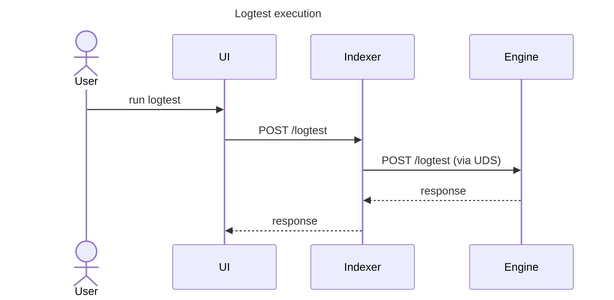
```mermaid
---
title: Logtest execution
---
sequenceDiagram
    actor User
    participant UI
    participant Indexer
    participant Engine

    User->>UI: run logtest
    UI->>Indexer: POST /logtest
    Indexer->>Engine: POST /logtest (via UDS)
    Engine-->>Indexer: response
    Indexer-->>UI: response
```

### Content CUD (rules, decoders, integrations, KVDBs)

All four resource types follow the same patterns via the abstract class hierarchy:

#### Create (POST)
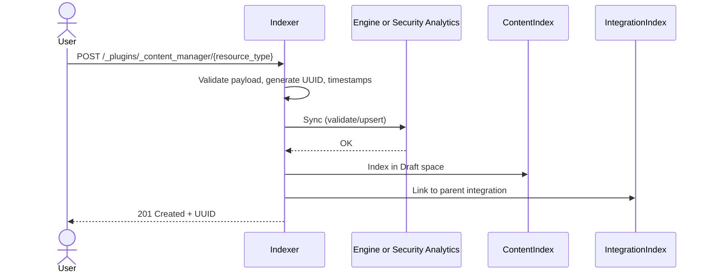
```mermaid
sequenceDiagram
    actor User
    participant Indexer
    participant EngineSA as Engine or Security Analytics
    participant ContentIndex
    participant IntegrationIndex

    User->>Indexer: POST /_plugins/_content_manager/{resource_type}
    Indexer->>Indexer: Validate payload, generate UUID, timestamps
    Indexer->>EngineSA: Sync (validate/upsert)
    EngineSA-->>Indexer: OK
    Indexer->>ContentIndex: Index in Draft space
    Indexer->>IntegrationIndex: Link to parent integration
    Indexer-->>User: 201 Created + UUID
```

#### Update (PUT)
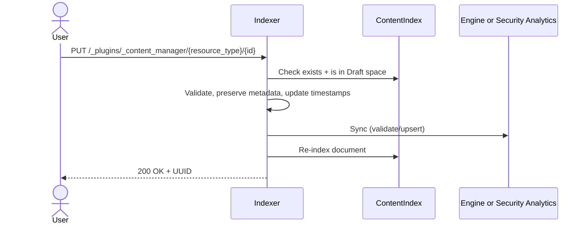
```mermaid
sequenceDiagram
    actor User
    participant Indexer
    participant ContentIndex
    participant EngineSA as Engine or Security Analytics

    User->>Indexer: PUT /_plugins/_content_manager/{resource_type}/{id}
    Indexer->>ContentIndex: Check exists + is in Draft space
    Indexer->>Indexer: Validate, preserve metadata, update timestamps
    Indexer->>EngineSA: Sync (validate/upsert)
    Indexer->>ContentIndex: Re-index document
    Indexer-->>User: 200 OK + UUID
```

#### Delete (DELETE)
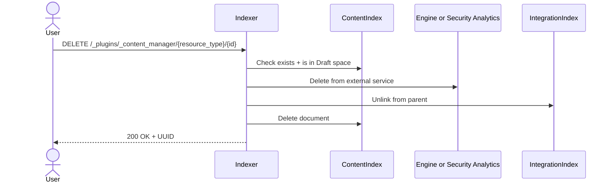
```mermaid
sequenceDiagram
    actor User
    participant Indexer
    participant ContentIndex
    participant EngineSA as Engine or Security Analytics
    participant IntegrationIndex

    User->>Indexer: DELETE /_plugins/_content_manager/{resource_type}/{id}
    Indexer->>ContentIndex: Check exists + is in Draft space
    Indexer->>EngineSA: Delete from external service
    Indexer->>IntegrationIndex: Unlink from parent
    Indexer->>ContentIndex: Delete document
    Indexer-->>User: 200 OK + UUID
```

### Policy update

The policy endpoint now accepts a `{space}` path parameter (`draft` or `standard`), allowing the same handler to serve both spaces with different validation rules.

- **Draft space** — all policy fields are accepted. The `integrations` and `filters` arrays allow reordering but not adding or removing entries. `author`, `description`, `documentation`, and `references` are required in addition to the boolean fields.
- **Standard space** — only `enrichments`, `filters`, `enabled`, `index_unclassified_events`, and `index_discarded_events` can be modified. All other fields are preserved from the existing standard policy document. After a successful update, if the standard space hash changed, the updated policy is automatically loaded into the Engine.

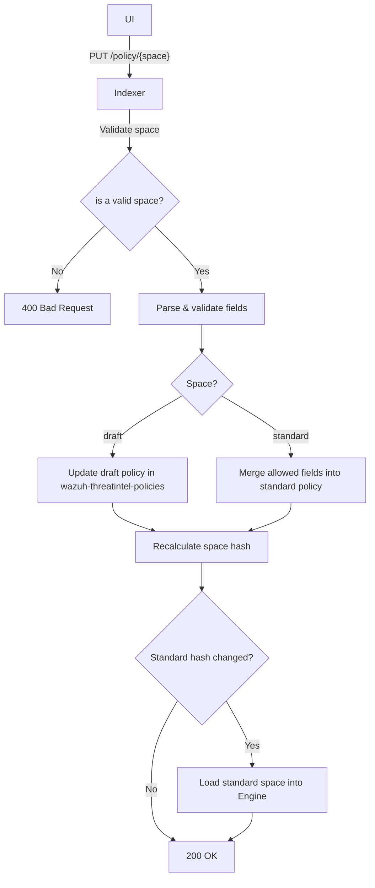
```mermaid
flowchart TD
    UI[UI] -->|"PUT /policy/{space}"| Indexer
    Indexer -->|Validate space| SpaceCheck{is a valid space?}
    SpaceCheck -->|No| Error400[400 Bad Request]
    SpaceCheck -->|Yes| Parse[Parse & validate fields]
    Parse --> SpaceBranch{Space?}
    SpaceBranch -->|draft| StoreDraft[Update draft policy in wazuh-threatintel-policies]
    SpaceBranch -->|standard| StoreStd[Merge allowed fields into standard policy]
    StoreDraft --> Hash[Recalculate space hash]
    StoreStd --> Hash
    Hash --> EngineCheck{Standard hash changed?}
    EngineCheck -->|Yes| Engine[Load standard space into Engine]
    EngineCheck -->|No| OK[200 OK]
    Engine --> OK
```

### Policy schema

The `wazuh-threatintel-policies` index stores policy configurations. See [Document structure](#document-structure) above for the envelope format.

#### Policy document fields

| Field                       | Type      | Description                                                  | Editable in standard space |
| --------------------------- | --------- | ------------------------------------------------------------ | :------------------------: |
| `id`                        | keyword   | Unique identifier                                            |             No             |
| `title`                     | keyword   | Human-readable name                                          |             No             |
| `date`                      | date      | Creation timestamp                                           |             No             |
| `modified`                  | date      | Last modification timestamp                                  |             No             |
| `root_decoder`              | keyword   | Root decoder for event processing                            |             No             |
| `integrations`              | keyword[] | Active integration IDs                                       |             No             |
| `author`                    | keyword   | Policy author                                                |             No             |
| `description`               | text      | Brief description                                            |             No             |
| `documentation`             | keyword   | Documentation link                                           |             No             |
| `references`                | keyword[] | External reference URLs                                      |             No             |
| `filters`                   | keyword[] | Filter UUIDs (reordering allowed, no add/remove)             |            Yes             |
| `enrichments`               | keyword[] | Enrichment types (`file`, `domain-name`, `ip`, `url`, `geo`) |            Yes             |
| `enabled`                   | boolean   | Whether the policy is active                                 |            Yes             |
| `index_unclassified_events` | boolean   | Index events that match no rule                              |            Yes             |
| `index_discarded_events`    | boolean   | Index events explicitly discarded by rules                   |            Yes             |

### Filters CUD (Engine filters)

Filters follow the same CUD pattern as other resource types but use the `AbstractCreateActionSpaces` / `AbstractUpdateActionSpaces` / `AbstractDeleteActionSpaces` hierarchy. The key difference is that the target space is supplied in the request body rather than being fixed to `draft`. Both `draft` and `standard` are accepted.

Filters are linked directly to their space's policy document (the `filters` array) rather than to a parent integration.

#### Create (POST)
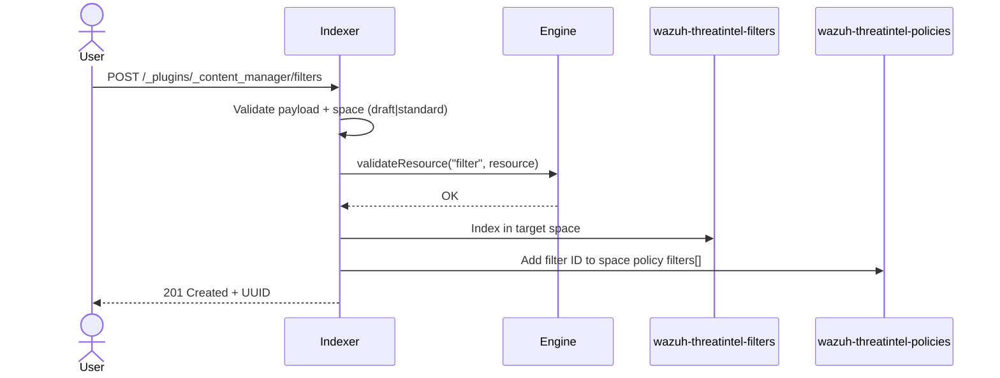
```mermaid
sequenceDiagram
    actor User
    participant Indexer
    participant Engine
    participant FilterIndex as wazuh-threatintel-filters
    participant PoliciesIndex as wazuh-threatintel-policies

    User->>Indexer: POST /_plugins/_content_manager/filters
    Indexer->>Indexer: Validate payload + space (draft|standard)
    Indexer->>Engine: validateResource("filter", resource)
    Engine-->>Indexer: OK
    Indexer->>FilterIndex: Index in target space
    Indexer->>PoliciesIndex: Add filter ID to space policy filters[]
    Indexer-->>User: 201 Created + UUID
```

#### Update (PUT)
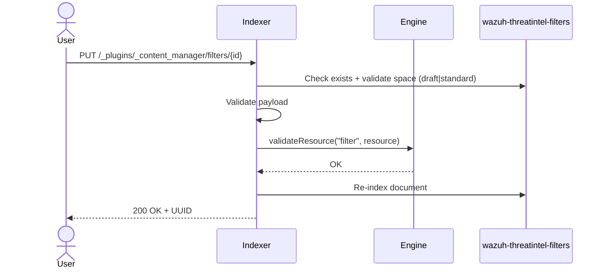
```mermaid
sequenceDiagram
    actor User
    participant Indexer
    participant Engine
    participant FilterIndex as wazuh-threatintel-filters

    User->>Indexer: PUT /_plugins/_content_manager/filters/{id}
    Indexer->>FilterIndex: Check exists + validate space (draft|standard)
    Indexer->>Indexer: Validate payload
    Indexer->>Engine: validateResource("filter", resource)
    Engine-->>Indexer: OK
    Indexer->>FilterIndex: Re-index document
    Indexer-->>User: 200 OK + UUID
```

#### Delete (DELETE)
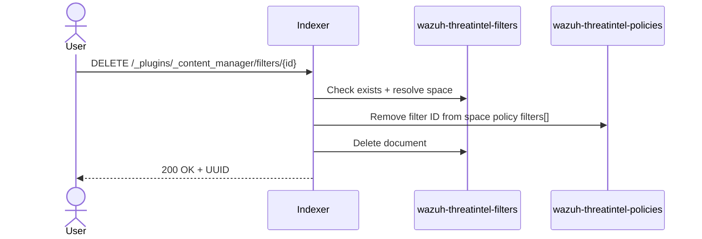
```mermaid
sequenceDiagram
    actor User
    participant Indexer
    participant FilterIndex as wazuh-threatintel-filters
    participant PoliciesIndex as wazuh-threatintel-policies

    User->>Indexer: DELETE /_plugins/_content_manager/filters/{id}
    Indexer->>FilterIndex: Check exists + resolve space
    Indexer->>PoliciesIndex: Remove filter ID from space policy filters[]
    Indexer->>FilterIndex: Delete document
    Indexer-->>User: 200 OK + UUID
```

### Space reset

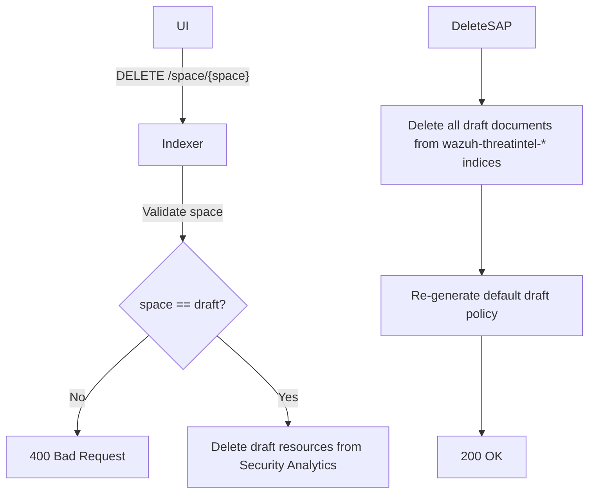
```mermaid
flowchart TD
    UI[UI] -->|"DELETE /space/{space}"| Indexer
    Indexer -->|Validate space| Check{space == draft?}
    Check -->|No| Error400[400 Bad Request]
    Check -->|Yes| DeleteSA[Delete draft resources from Security Analytics]
    DeleteSAP --> DeleteCTI[Delete all draft documents from wazuh-threatintel-* indices]
    DeleteCTI --> RegenPolicy[Re-generate default draft policy]
    RegenPolicy --> OK[200 OK]
```

Only the `draft` space can be reset. Attempting to reset any other space returns `400 Bad Request`. Failures in Security Analytics cleanup are logged but do not block the reset — the primary goal is clearing the content indices and regenerating the policy.

---

## Debugging

### Check consumer status

```bash
GET /.wazuh-cti-consumers/_search
{
  "query": { "match_all": {} }
}
```

The `status` field indicates the sync lifecycle state:

- `ready` — sync complete; content is safe to read.
- `running` — sync in progress; content may be partially written.
- `failed` — the previous sync cycle was interrupted by an unexpected exception.

To find consumers that are currently syncing or that failed mid-sync:

```bash
GET /.wazuh-cti-consumers/_search
{
  "query": { "terms": { "status": ["running", "failed"] } }
}
```

### Check content by space

```bash
GET /wazuh-threatintel-rules/_search
{
  "query": { "term": { "space.name": "draft" } },
  "size": 10
}
```

### Monitor plugin logs

```bash
tail -f var/log/wazuh-indexer/wazuh-cluster.log | grep -E "ContentManager|CatalogSyncJob|SnapshotServiceImpl|UpdateServiceImpl|AbstractContentAction"
```

---

## Important notes

- The plugin only runs on **cluster manager nodes**.
- CTI API must be accessible for content synchronization.
- All user content CUD operations require a Draft policy to exist.
- The Engine socket must be available at the configured path for logtest, validation, and promotion.
- Offset-based synchronization ensures no content is missed.

---

## Testing

The plugin includes integration tests defined in the `tests/content-manager` directory. These tests cover various scenarios for managing integrations, decoders, rules, and KVDBs through the REST API, grouped below by resource and operation.

| Resource / operation   | Scenario count | Covers                                                                                                                                                                                                                                                                                                                              |
| ---------------------- | -------------- | ----------------------------------------------------------------------------------------------------------------------------------------------------------------------------------------------------------------------------------------------------------------------------------------------------------------------------------- |
| Integrations: create   | 9              | Success; duplicate title; missing title/author/category; explicit `id` in resource; missing resource object; empty body; no authentication                                                                                                                                                                                          |
| Integrations: update   | 12             | Success; title collision with an existing draft integration; missing required fields; not found; invalid UUID; `id` in request body; attempting to add/remove dependency lists; no authentication; protected integration rejected; toggling `enabled` on a user-managed integration in the standard space; user-managed standard update changes only `enabled` (other fields preserved); protected standard integration rejected |
| Integrations: delete   | 7              | Success (no attached resources); has attached resources; not found; invalid UUID; missing ID; not in draft space; no authentication                                                                                                                                                                                                 |
| Decoders: create       | 7              | Success; missing integration reference; explicit `id` in resource; integration not in draft space; missing resource object; empty body; no authentication                                                                                                                                                                           |
| Decoders: update       | 7              | Success; not found; invalid UUID; not in draft space; missing resource object; empty body; no authentication                                                                                                                                                                                                                        |
| Decoders: delete       | 7              | Success; not found; invalid UUID; not in draft space; missing ID; no authentication; verify removal from index                                                                                                                                                                                                                      |
| Rules: create          | 7              | Success; missing title; missing integration reference; explicit `id` in resource; integration not in draft space; empty body; no authentication                                                                                                                                                                                     |
| Rules: update          | 7              | Success; missing title; not found; invalid UUID; not in draft space; empty body; no authentication                                                                                                                                                                                                                                  |
| Rules: delete          | 7              | Success; not found; invalid UUID; not in draft space; missing ID; no authentication; verify removal from index                                                                                                                                                                                                                      |
| KVDBs: create          | 9              | Success; missing title/author/content; missing integration reference; explicit `id` in resource; integration not in draft space; empty body; no authentication                                                                                                                                                                      |
| KVDBs: update          | 7              | Success; missing required fields; not found; invalid UUID; not in draft space; empty body; no authentication                                                                                                                                                                                                                        |
| KVDBs: delete          | 7              | Success; not found; invalid UUID; not in draft space; missing ID; no authentication; verify removal from index                                                                                                                                                                                                                      |
| Policy: initialization | 6              | `wazuh-threatintel-policies` index exists; exactly four policy documents (one per space); standard policy has a distinct document ID; draft/test/custom start with empty `integrations`/`root_decoder`; document structure; valid SHA-256 hash                                                                                      |
| Policy: update draft   | 12             | Success; missing/wrong `type`; missing resource object; missing required fields; attempting to add/remove an integration; reordering integrations (allowed); empty body; no authentication; changes not reflected in test space until promotion; changes reflected after promotion                                                  |
| Logtest                | 4              | Success; empty body; invalid JSON; no authentication                                                                                                                                                                                                                                                                                |
| Promote: preview       | 7              | Draft → test; test → custom; missing/empty/invalid `space` parameter; preview from custom (not allowed); no authentication                                                                                                                                                                                                          |
| Promote: execute       | 18             | Success draft → test and test → custom, each verified for resource presence, hash regeneration, and hash match; deleting a draft decoder doesn't affect a promoted test space; promote from custom (not allowed); invalid space; missing/incomplete `changes` object; non-update operation on policy; empty body; no authentication |

---

## Related documentation

- [Content Manager tutorial: adding a REST endpoint](./content-manager-tutorial.md)
- [Setup plugin guide](./setup.md)
- [OpenSearch plugin development](https://docs.opensearch.org/3.6/install-and-configure/plugins/)
