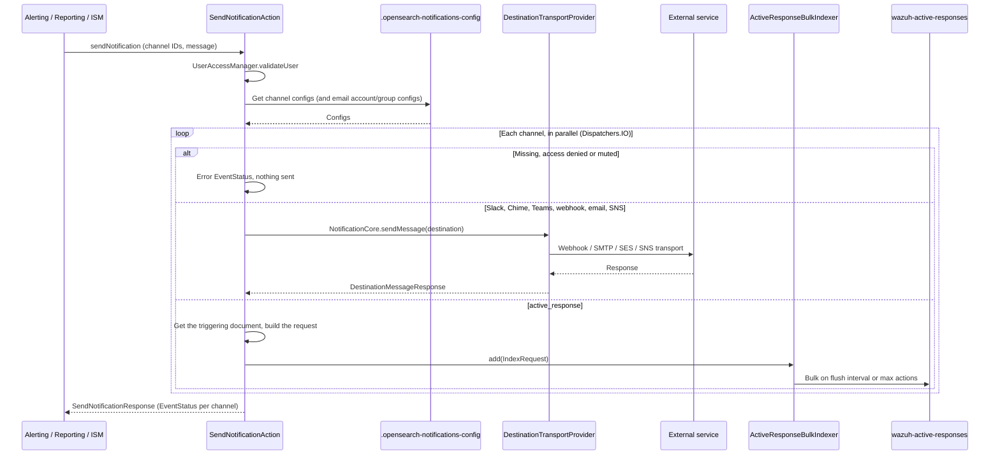

# Wazuh Indexer Notifications plugin — development guide

This document describes the architecture, components, and extension points of the Notifications plugin, which provides multi-channel notification capabilities to the Wazuh Indexer.

---

## Overview

The Notifications plugin handles:

- **Channel Management:** CRUD operations for notification channels (Slack, Email, Chime, Microsoft Teams, Webhooks, SNS, SES, Wazuh Active Response).
- **Message Delivery:** Abstracts different communication protocols (SMTP, HTTP, AWS SES/SNS) into a unified transport layer.
- **Test Notifications:** Allows sending test messages to validate channel configuration.
- **Plugin Features:** Exposes dynamic feature discovery so other plugins can query supported notification types.
- **Security Integration:** Integrates with the Wazuh Indexer Security plugin for RBAC-based access control.

---

## Project structure

The plugin is organized into three Gradle subprojects:

| Subproject | Description |
|---|---|
| `notifications/core-spi` | Service Provider Interface. Defines destination models (`SlackDestination`, `SmtpDestination`, `ChimeDestination`, etc.) and the `NotificationCore` contract. |
| `notifications/core` | Core implementation. Contains HTTP/SMTP/SES/SNS clients, transport providers, and all configurable settings (`PluginSettings`). |
| `notifications/notifications` | Main plugin module. Registers REST handlers, transport actions, index operations, metrics, and security access management. |

---

## Class hierarchy

### Destination models (core-spi)

```
BaseDestination
├── SlackDestination
├── ChimeDestination
├── MicrosoftTeamsDestination
├── CustomWebhookDestination
├── WebhookDestination
├── SmtpDestination
├── SesDestination
├── SnsDestination
└── ActiveResponseDestination
```

`ActiveResponseDestination` has no transport: `active_response` channels are handled in the `notifications` module (see [Notification flow](#notification-flow)).

### Transport layer (core)

```
DestinationTransport (interface)
├── WebhookDestinationTransport      (Slack, Chime, Teams, Webhooks)
├── SmtpDestinationTransport         (SMTP Email)
├── SesDestinationTransport          (AWS SES Email)
└── SnsDestinationTransport          (AWS SNS)
```

### REST handlers (notifications)

| Handler | Method | URI |
|---|---|---|
| `NotificationConfigRestHandler` | POST | `/_plugins/_notifications/configs` |
| | PUT | `/_plugins/_notifications/configs/{config_id}` |
| | GET | `/_plugins/_notifications/configs/{config_id}` |
| | GET | `/_plugins/_notifications/configs` |
| | DELETE | `/_plugins/_notifications/configs/{config_id}` |
| | DELETE | `/_plugins/_notifications/configs` |
| `NotificationFeaturesRestHandler` | GET | `/_plugins/_notifications/features` |
| `NotificationChannelListRestHandler` | GET | `/_plugins/_notifications/channels` |
| `SendTestMessageRestHandler` | POST | `/_plugins/_notifications/feature/test/{config_id}` |

---

## Setup environment

### Requirements

- **JDK:** 21 or later. The build compiles to Java 21 (`sourceCompatibility`, `targetCompatibility` and Kotlin `jvmTarget` in `notifications/build.gradle`). CI builds with JDK 21 and 25, and the Wazuh Indexer bundles JDK 25.
- **Gradle:** Use the included `./gradlew` wrapper (no separate install needed).
- **IDE:** IntelliJ IDEA with Kotlin plugin is recommended.

### Clone and build

The build resolves `wazuh-indexer-common-utils` from the local Maven repository, so publish it first by running `./gradlew publishToMavenLocal` in a checkout of that repository. The Gradle wrapper lives in the `notifications/` directory:

```bash
git clone <notifications-repo-url>
cd wazuh-indexer-notifications/notifications
./gradlew build
```

The distribution zips are generated at (paths relative to the repository root):
```
notifications/core/build/distributions/wazuh-indexer-notifications-core-<version>.zip
notifications/notifications/build/distributions/wazuh-indexer-notifications-<version>.zip
```

---

## Build packages

To create distribution packages:

```bash
# Full build (compile + test + assemble)
./gradlew build

# Assemble only (skip tests)
./gradlew assemble
```

The output zips can be installed on a Wazuh Indexer node with `opensearch-plugin`. Install the core plugin first, since the Notifications plugin extends it:

```bash
bin/opensearch-plugin install file:///path/to/wazuh-indexer-notifications-core-<version>.zip
bin/opensearch-plugin install file:///path/to/wazuh-indexer-notifications-<version>.zip
```

---

## Run tests

### Unit tests

```bash
./gradlew test
```

### Integration tests

The integration test suite is located at:
```
notifications/notifications/src/test/kotlin/org/opensearch/integtest/
```

To execute the full integration test suite, from the `notifications/` directory:

```bash
./gradlew :notifications:integTest
```

Key integration test classes:

| Test Class | Description |
|---|---|
| `SlackNotificationConfigCrudIT` | Full CRUD lifecycle for Slack channels. |
| `ChimeNotificationConfigCrudIT` | Full CRUD lifecycle for Chime channels. |
| `EmailNotificationConfigCrudIT` | Full CRUD lifecycle for Email channels (SMTP/SES). |
| `MicrosoftTeamsNotificationConfigCrudIT` | Full CRUD lifecycle for Microsoft Teams channels. |
| `WebhookNotificationConfigCrudIT` | Full CRUD lifecycle for custom webhooks. |
| `SnsNotificationConfigCrudIT` | Full CRUD lifecycle for SNS channels. |
| `CreateNotificationConfigIT` | Config creation edge cases and validation. |
| `DeleteNotificationConfigIT` | Config deletion including bulk delete. |
| `QueryNotificationConfigIT` | Filtering, sorting, and pagination queries. |
| `GetPluginFeaturesIT` | Feature discovery endpoint tests. |
| `GetNotificationChannelListIT` | Channel list endpoint tests. |
| `SendTestMessageRestHandlerIT` | Test message delivery flow. |
| `SendTestMessageWithMockServerIT` | Test message with mock destination. |
| `SecurityNotificationIT` | RBAC and access control tests. |
| `MaxHTTPResponseSizeIT` | HTTP response size limit enforcement. |
| `NotificationsBackwardsCompatibilityIT` | Backwards compatibility between versions. |

---

## Notification flow

The data flow when sending a notification follows this sequence:



1. An internal plugin (Alerting, Reporting, ISM) or a user invokes the Notification plugin via Transport or REST API. `SendNotificationAction` delegates to `SendMessageActionHelper.executeRequest`.
2. `UserAccessManager.validateUser` rejects a user without backend roles when `filter_by_backend_roles` is enabled.
3. The channel configs, and the `smtp_account`/`ses_account`/`email_group` configs that email channels reference, are read from the `.opensearch-notifications-config` index (`NotificationConfigIndex`). A missing, inaccessible or disabled (muted) channel gets an error `EventStatus` and is skipped.
4. For the remaining channels, in parallel, `sendMessageThroughSpi` calls `NotificationCore.sendMessage`, and the `DestinationTransportProvider` resolves the correct transport based on the destination type. Webhook URLs are checked against `host_deny_list` before sending.
5. The transport client delivers the message to the external service. There is no plugin-level retry: only the default retry strategy of the Apache HTTP client (`DefaultHttpRequestRetryStrategy`) applies, to webhook deliveries. A failed delivery is returned as a non-200 `DeliveryStatus`.
6. `active_response` channels never reach `NotificationCore`. `sendActiveResponseMessage` parses `<doc_id>|<index>` from the message, reads that document, copies its `wazuh` object (refusing with `400` when `location` is `local` and the document has no `wazuh.agent.id`), adds `wazuh.active_response` with the channel parameters, and adds an `IndexRequest` (op type `create`) for the `wazuh-active-responses` data stream to the `ActiveResponseBulkIndexer`. The status is `200` as soon as the request is queued; the `BulkProcessor` flushes every `opensearch.notifications.active_response.bulk_flush_interval_ms` or after `bulk_max_actions` requests, and bulk failures are only logged and counted in a metric.
7. The `EventStatus` list is returned to the caller in a `SendNotificationResponse`. If any channel's status is not `200`, the action fails with an `OpenSearchStatusException` that carries the whole `event_status_list`. Nothing is persisted about the delivery itself.

---

## Default channel initialization

The plugin creates a set of default notification channels on startup so that users have pre-configured templates for common integrations (Slack, Jira, PagerDuty, Shuffle). These channels are created **disabled** with placeholder URLs.

### Implementation

The feature is implemented in `DefaultChannelInitializer` (`notifications/notifications/src/main/kotlin/.../index/DefaultChannelInitializer.kt`).

### Adding or modifying default channels

To add a new default channel:

1. Add a new `ChannelDefinition` entry to the `DEFAULT_CHANNELS` list in `DefaultChannelInitializer.kt`.
2. Choose a unique, stable `id` prefixed with `default_` (e.g., `default_teams_channel`).
3. Set `isEnabled = false` and use a placeholder URL with clear instructions in the `description`.
4. Add a corresponding test case in `DefaultChannelInitializerTests.kt`.

### ClusterPlugin interface

The `NotificationPlugin` class implements `ClusterPlugin` to gain access to the `onNodeStarted(DiscoveryNode)` lifecycle hook.

### Testing

Unit tests for the default channel initialization are in:
```
notifications/notifications/src/test/kotlin/.../index/DefaultChannelInitializerTests.kt
```

The tests verify:
- All default channel definitions have valid configurations.
- Channel IDs are unique and follow the naming convention.
- The initializer correctly identifies missing channels and skips existing ones.

---

## Extending with a new destination

To add a new notification destination:

1. **Define the destination model** in `core-spi`:
   - Create a new class extending `BaseDestination` in `notifications/core-spi/src/main/kotlin/.../destination/`.

2. **Implement the transport** in `core`:
   - Create a new class implementing `DestinationTransport` in `notifications/core/src/main/kotlin/.../transport/`.
   - Register it in `DestinationTransportProvider`.

3. **Add the config type** to the `DEFAULT_ALLOWED_CONFIG_TYPES` list in `core/setting/PluginSettings.kt`.

4. **Write tests:** Add integration tests in `notifications/notifications/src/test/kotlin/org/opensearch/integtest/config/`.
