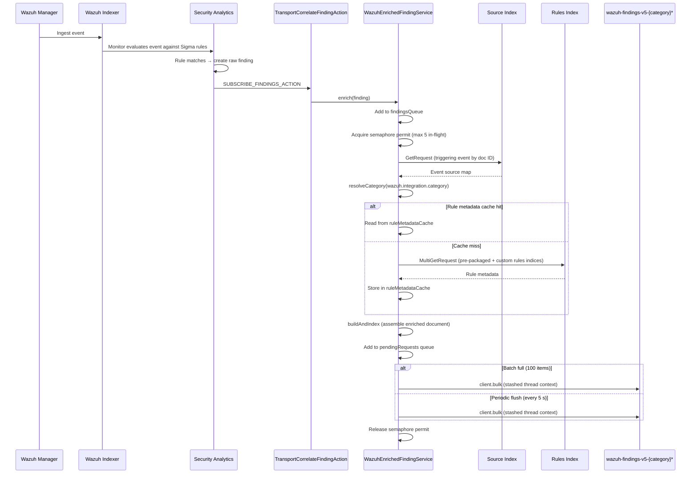
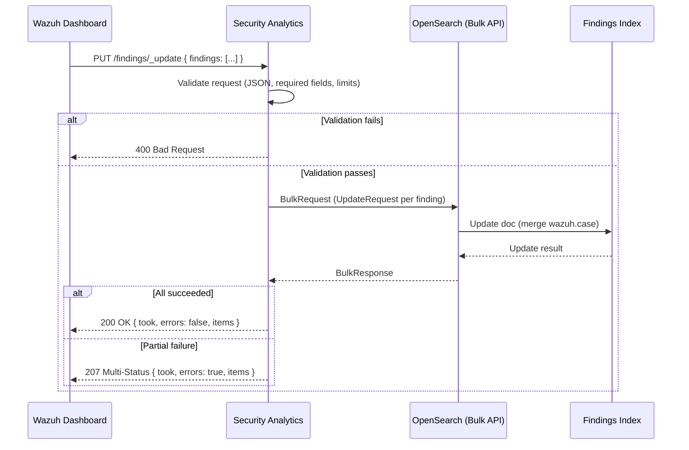

# Security Analytics

The Security Analytics plugin is a fork of the [OpenSearch Security Analytics plugin](https://opensearch.org/docs/3.6/security-analytics/) adapted for Wazuh. This page documents Wazuh-specific implementation details and extensions. See [Architecture](../../ref/modules/security-analytics/architecture.md) for the conceptual overview.

## Enriched findings pipeline

`WazuhEnrichedFindingService` implements the enrichment pipeline described in the Reference Manual's architecture page.

### Fire-and-forget execution

`WazuhEnrichedFindingService.enrich()` returns immediately after adding the finding to the internal queue. All network I/O and document assembly happen on async transport threads. Failures are logged at `WARN` level and never surface to the Security Analytics write path.

### Bounded concurrency

A `Semaphore` with `MAX_IN_FLIGHT` permits limits how many enrichment chains run simultaneously. Findings that arrive while all permits are held are queued in a `ConcurrentLinkedQueue` and processed as permits become available. This prevents transport-layer overload on resource-constrained nodes.

### Rule metadata cache

Rule metadata (severity level, compliance mappings, MITRE ATT&CK tags) is stored in an in-memory `ConcurrentHashMap` keyed by rule ID, bounded by `plugins.security_analytics.enriched_findings_rule_cache_max_size` (least-recently-used eviction). On a cache miss, the service issues a `MultiGetRequest` against both the pre-packaged rules index (`opensearch-pre-packaged-rules`) and the custom rules index (`opensearch-custom-rules`). Subsequent findings from the same detector reuse the cached entry, eliminating repeated round-trips.

### Bulk indexing

Index requests are accumulated in a `ConcurrentLinkedQueue<IndexRequest>`. Two flush paths drain this queue:

- **Batch trigger**: every time `pendingCount` reaches a multiple of `BULK_BATCH_SIZE`, the thread that incremented the counter calls `drainAndFlush()` immediately.
- **Periodic flush**: a fixed-delay scheduler fires `drainAndFlush()` every `FLUSH_INTERVAL` to drain any remainder that has not yet reached the batch threshold.

`drainAndFlush()` polls all pending requests into a single `BulkRequest` and calls `client.bulk()`. The call is wrapped in `threadPool.getThreadContext().stashContext()` so the security plugin accepts the request regardless of which thread pool the flush runs on.

### Category resolution

Before assembling an enriched document, the service reads `wazuh.integration.category` from the triggering event. If the field is absent or its value is not one of the recognized `LOG_CATEGORY` values, enrichment is skipped for that finding and a `WARN` log entry is emitted.

### Document layout

`buildAndIndex` starts from a shallow copy of the triggering event source and overlays the following fields:

| Field         | Source                                                                      |
| ------------- | --------------------------------------------------------------------------- |
| `@timestamp`  | `@timestamp` of the original triggering event                               |
| `event.*`     | Pre-existing `event` fields plus `doc_id`, `index`                          |
| `wazuh.rule`  | Sigma rule metadata (`id`, `title`, `tags`, `sigma_id`, and any of `level`, `status`, `compliance`, `mitre` present in the rule index entry) |

Rule metadata is nested under `wazuh.rule`. Because the event's `wazuh` map (which carries `wazuh.integration.*`) is shared with the shallow copy, the service defensively copies it before adding `rule`, so the original event source is never mutated.

### Sequence diagram



### Technical parameters

| Parameter            | Value                            | Description                                                     |
| -------------------- | -------------------------------- | --------------------------------------------------------------- |
| `BULK_BATCH_SIZE`    | `100`                            | Pending index requests accumulated before a batch-trigger flush |
| `MAX_IN_FLIGHT`      | `5`                              | Maximum concurrent async enrichment chains                      |
| `FLUSH_INTERVAL`     | `5 s`                            | Interval between periodic flush runs                            |
| Rule metadata cache  | Bounded (LRU), in-memory         | `ConcurrentHashMap`, keyed by rule ID                            |
| Index operation type | `CREATE`                         | Prevents overwriting existing enriched findings                 |

These parameters are exposed as settings — see `plugins.security_analytics.enriched_findings_*` in the [Configuration reference](../../ref/modules/security-analytics/configuration.md).

## Detector provisioning

Threat detectors for Wazuh integrations are created dynamically based on CTI content, via a request-driven model (`WIndexDetectorRequest`) rather than hardcoded configuration.

### Dynamic detector factory

The `DetectorFactory` class assembles the `Detector` object, consuming parameters provided by the Content Manager:

- **Enabled status**: controlled by CTI to activate or deactivate detectors globally.
- **Scan interval**: customizable per integration (e.g., critical integrations can have shorter intervals).
- **Source indices**: defines the target indices or index patterns the detector monitors.

### Fallback logic

To ensure system stability, `DetectorFactory` implements a fallback mechanism for source indices:
- If the `sources` list is provided and not empty, it is used as the detector's input.
- If `sources` is null or empty, the factory defaults to the legacy pattern: `wazuh-events-v5-{category}`.

### Dynamic configuration injection

`WTransportIndexDetectorAction` serves as the entry point for detector creation. It extracts the `enabled`, `interval`, and `sources` fields from the `WIndexDetectorRequest` and injects them into the factory method. This ensures that any change in the CTI catalog is reflected in the Security Analytics engine without requiring code changes or restarts.

## Case management

> **Status:** the schema below reflects the [issue #1220 follow-up](https://github.com/wazuh/wazuh-indexer-plugins/issues/1220) revision, not yet merged into the stable branch.

Case management adds triage capabilities to Security Analytics findings, allowing analysts to track status, classification, a multi-comment discussion thread, tags, and user attribution on individual findings.

### Case fields

WCS fields under `wazuh.case`, all defined in the findings index template:

- **`wazuh.case.title`** (`match_only_text`) — case summary.
- **`wazuh.case.description`** (`match_only_text`) — case description.
- **`wazuh.case.tags`** (`keyword`, array) — organizational tags.
- **`wazuh.case.user.name`** (`keyword`) — user who performed the update.
- **`wazuh.case.status`** (`keyword`) — workflow status: `active`, `acknowledged`, `completed`, `error`, `deleted`, `audit` (lowercase).
- **`wazuh.case.severity`** (`keyword`) — `informational`, `low`, `medium`, `high`, `critical` (lowercase).
- **`wazuh.case.priority`** (`keyword`) — `low`, `medium`, `high`, `urgent` (lowercase).
- **`wazuh.case.tlp`** (`keyword`) — `TLP:RED`, `TLP:AMBER`, `TLP:GREEN`, `TLP:CLEAR` (uppercase, `TLP:` prefix — the one enum field that isn't lowercase).
- **`wazuh.case.comments`** (`nested`, array) — replaces the old single `comment` field. Each entry has `author` (`keyword`), `created_at` (`date`), `updated_at` (`date`), and `comment` (`match_only_text`).

These fields are present in the index template but not populated at finding creation time — they are written exclusively through the update endpoint.

### REST endpoint

#### `RestUpdateFindingsAction`

**File:** `src/main/java/org/opensearch/securityanalytics/resthandler/RestUpdateFindingsAction.java`

**Route:** `PUT /_plugins/_security_analytics/findings/_update`

#### Design decisions

1. **Bulk-based**: the endpoint allows up to 50 finding updates per call.

2. **Partial doc update**: uses `UpdateRequest.doc()` which merges the provided fields into the existing document. Only `wazuh.case` is touched, other finding fields are never modified.

#### Request validation

The handler performs eager validation before building the bulk request:

| Check                     | HTTP status | Message                                                |
| ------------------------- | ----------- | ------------------------------------------------------ |
| Invalid/missing JSON body | `400`       | `Invalid JSON body: ...`                               |
| Missing `findings` array  | `400`       | `Request body must contain a "findings" array`         |
| Empty `findings` array    | `400`       | `Findings array is empty`                              |
| More than 50 items        | `400`       | `Cannot update more than 50 findings at once`          |
| Element not a JSON object | `400`       | `Element at index N is not a JSON object`              |
| Missing `_id`             | `400`       | `Element at index N is missing _id`                    |
| Missing `_index`          | `400`       | `Element at index N is missing _index`                 |
| Missing/invalid `case`    | `400`       | `Element at index N is missing or invalid case object` |

Validation errors short-circuit, the first error aborts the entire request.

#### Response format

```json
{
  "took": 12,
  "errors": false,
  "items": [
    {
      "_id": "...",
      "_index": "...",
      "status": 200,
      "result": "updated"
    }
  ]
}
```

- On full success: HTTP `200`
- On partial failure (some docs not found): HTTP `207 MULTI_STATUS`
- On total bulk failure: HTTP `500`

#### Registration

The handler is registered in `SecurityAnalyticsPlugin.getRestHandlers()`:

```java
new RestUpdateFindingsAction()
```

### Testing

Integration tests live in `src/test/java/org/opensearch/securityanalytics/resthandler/UpdateFindingsIT.java`.

The test class extends `SecurityAnalyticsRestTestCase` and covers:

- **Happy path**: single update with all fields, partial updates, bulk updates, overwrite scenarios
- **Validation**: empty array, missing fields (`_id`, `_index`, `case`), invalid JSON, exceeding max bulk items
- **Error handling**: non-existent document (expects `207`), response structure verification
- **Helpers**: creates a temporary index with the `wazuh.case` mapping and indexes minimal finding documents for testing

Tests use the REST test client (`makeRequest`) and don't require a full detector/monitor setup since the endpoint operates directly on documents by `_id` and `_index`.

### Sequence diagram


