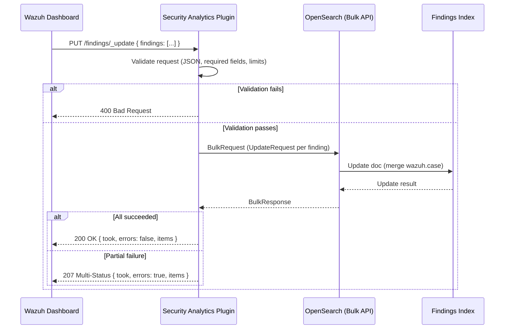

# Security Analytics

The Security Analytics Plugin (SAP) is a fork of the [OpenSearch Security Analytics plugin](https://opensearch.org/docs/3.6/security-analytics/) adapted for Wazuh. This page documents Wazuh-specific implementation details and extensions.

## Case Management

Case management adds triage capabilities to Security Analytics findings, allowing analysts to track status, comments, tags, and user attribution on individual findings.

### Case fields

| WCS field               | OpenSearch type   | Description                                                                         |
| ----------------------- | ----------------- | ----------------------------------------------------------------------------------- |
| `wazuh.case.status`     | `keyword`         | Workflow status: `ACTIVE`, `ACKNOWLEDGED`, `COMPLETED`, `ERROR`, `DELETED`, `AUDIT` |
| `wazuh.case.comment`    | `match_only_text` | Free-form analyst comment                                                           |
| `wazuh.case.tags`       | `keyword` (array) | Organizational tags                                                                 |
| `wazuh.case.created_at` | `date`            | Case creation timestamp                                                             |
| `wazuh.case.updated_at` | `date`            | Last update timestamp                                                               |
| `wazuh.case.user.name`  | `keyword`         | User who performed the update                                                       |

These fields are present in the index template but not populated at finding creation time, they are written exclusively through the update endpoint.

### REST endpoint

#### `RestUpdateFindingsAction`

**File:** `src/main/java/org/opensearch/securityanalytics/resthandler/RestUpdateFindingsAction.java`

**Route:** `PUT /_plugins/_security_analytics/findings/_update`

#### Design decisions

1. **Bulk-based**: the endpoint allows up to 50 finding updates per call.

2. **Partial doc update**: uses `UpdateRequest.doc()` which merges the provided fields into the existing document. Only `wazuh.case` is touched, other finding fields are never modified.

#### Request validation

The handler performs eager validation before building the bulk request:

| Check                     | HTTP status | Message                                                |
| ------------------------- | ----------- | ------------------------------------------------------ |
| Invalid/missing JSON body | `400`       | `Invalid JSON body: ...`                               |
| Missing `findings` array  | `400`       | `Request body must contain a "findings" array`         |
| Empty `findings` array    | `400`       | `Findings array is empty`                              |
| More than 50 items        | `400`       | `Cannot update more than 50 findings at once`          |
| Element not a JSON object | `400`       | `Element at index N is not a JSON object`              |
| Missing `_id`             | `400`       | `Element at index N is missing _id`                    |
| Missing `_index`          | `400`       | `Element at index N is missing _index`                 |
| Missing/invalid `case`    | `400`       | `Element at index N is missing or invalid case object` |

Validation errors short-circuit, the first error aborts the entire request.

#### Response format

```json
{
  "took": 12,
  "errors": false,
  "items": [
    {
      "_id": "...",
      "_index": "...",
      "status": 200,
      "result": "updated"
    }
  ]
}
```

- On full success: HTTP `200`
- On partial failure (some docs not found): HTTP `207 MULTI_STATUS`
- On total bulk failure: HTTP `500`

#### Registration

The handler is registered in `SecurityAnalyticsPlugin.getRestHandlers()`:

```java
new RestUpdateFindingsAction()
```

### Testing

Integration tests live in `src/test/java/org/opensearch/securityanalytics/resthandler/UpdateFindingsIT.java`.

The test class extends `SecurityAnalyticsRestTestCase` and covers:

- **Happy path**: single update with all fields, partial updates, bulk updates, overwrite scenarios
- **Validation**: empty array, missing fields (`_id`, `_index`, `case`), invalid JSON, exceeding max bulk items
- **Error handling**: non-existent document (expects `207`), response structure verification
- **Helpers**: creates a temporary index with the `wazuh.case` mapping and indexes minimal finding documents for testing

Tests use the REST test client (`makeRequest`) and don't require a full detector/monitor setup since the endpoint operates directly on documents by `_id` and `_index`.

### Sequence diagram


