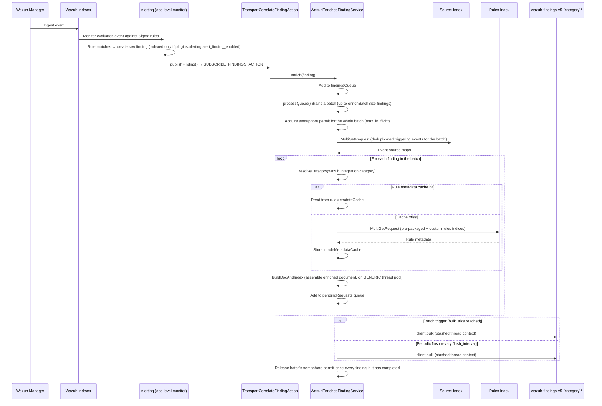
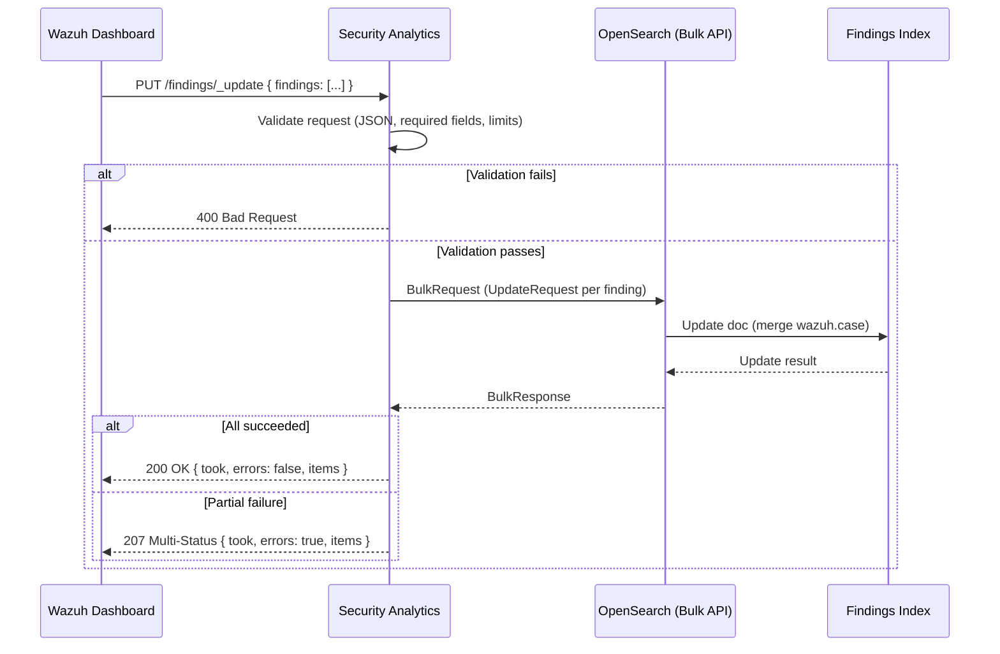

# Security Analytics

The Security Analytics plugin is a fork of the [OpenSearch Security Analytics plugin](https://opensearch.org/docs/3.6/security-analytics/) adapted for Wazuh. This page documents Wazuh-specific implementation details and extensions. See [Architecture](../../ref/modules/ruleset-management/architecture.md) for the conceptual overview.

> **A note on naming:** the Reference Manual documents this plugin as **Ruleset Management**, the name it is presented under in the Wazuh Dashboard. The Development Guide keeps the name Security Analytics, which is what the code, the `plugins.security_analytics.*` settings, the `/_plugins/_security_analytics/` API paths, the `.opensearch-sap-*` indices and the `wazuh-indexer-security-analytics` repository all use. Both names describe the same plugin — see [Ruleset Management](../../ref/modules/ruleset-management/index.md) for the user-facing reference.

## Enriched findings pipeline

`WazuhEnrichedFindingService` implements the enrichment pipeline described in the Reference Manual's architecture page.

Its input is the in-memory `Finding` the Alerting plugin publishes for every match: the doc-level monitor fan-out (`TransportDocLevelMonitorFanOutAction.createFindings()`) calls `AlertingPluginInterface.publishFinding()`, `TransportCorrelateFindingAction` receives it as `SUBSCRIBE_FINDINGS_ACTION` and dispatches it to `enrich()`. Publishing does not depend on Alerting storing the finding: the raw `.opensearch-sap-{log_type}-findings-*` indices are only written when `plugins.alerting.alert_finding_enabled` is `true`, which defaults to `false` in the Wazuh fork, so with the shipped defaults the enriched `wazuh-findings-v5-{category}*` documents are the only stored findings.

### Fire-and-forget execution

`WazuhEnrichedFindingService.enrich()` returns immediately after adding the finding to the internal queue. All network I/O and document assembly happen on async transport threads. Failures are logged at `WARN` level and never surface to the Security Analytics write path.

### Bounded, batch-oriented concurrency

Enrichment is batch-oriented, not per-finding: `processQueue()` drains the internal `findingsQueue` in batches of up to `enriched_findings_enrich_batch_size` findings (default `100`, range 1–1000, dynamic) and acquires a single semaphore permit for the whole batch, not one permit per finding. The semaphore is an `AdjustableSemaphore` sized by `enriched_findings_max_in_flight` (default `5`, range 1–10, dynamic) — its permit count can be resized live via `setMaxInFlight()` when the setting changes, with no restart required. Batches that arrive while all permits are held stay queued in `findingsQueue` until a permit frees up.

Within a batch, per-finding completion is tracked with an `AtomicInteger remaining` counter; the batch's single permit is only released once every finding in the batch has completed (`onOneDone` callback).

### Batched triggering-event fetch

Instead of one `GetRequest` per finding, the service fetches all triggering events for a batch in a single deduplicated `MultiGetRequest` (deduplicated by `index|docId`, since multiple findings in a batch can share the same source event). This is the core throughput optimization: it eliminates roughly `enrichBatchSize - 1` out of every `enrichBatchSize` round-trips to the event index under load. Rule-metadata lookups are unaffected by this batching and remain per-finding (see below).

### Rule metadata cache

Rule metadata (severity level, compliance mappings, MITRE ATT&CK tags) is cached in a `LinkedHashMap` in access-order mode wrapped with `Collections.synchronizedMap`, with an overridden `removeEldestEntry` providing LRU eviction — not a plain `ConcurrentHashMap` (which has no eviction capability). The cache is bounded by `plugins.security_analytics.enriched_findings_rule_cache_max_size` (default `10000`, minimum `0`). Unlike the other enriched-findings settings, this one is **static**: it has no registered settings-update-consumer, so changing it requires a node restart.

On a cache miss, the service issues a `MultiGetRequest` against both the pre-packaged rules index (`.opensearch-sap-pre-packaged-rules-config`, `Rule.PRE_PACKAGED_RULES_INDEX`) and the custom rules index (`.opensearch-sap-custom-rules-config`, `Rule.CUSTOM_RULES_INDEX`). Subsequent findings from the same detector reuse the cached entry, eliminating repeated round-trips.

### Bulk indexing

Index requests are accumulated in a `ConcurrentLinkedQueue<IndexRequest>`. Two flush paths drain this queue:

- **Batch trigger**: every time the pending count reaches a multiple of `enriched_findings_bulk_size` (default `100`, range 10–1000, dynamic), the thread that incremented the counter calls `drainAndFlush()` immediately.
- **Periodic flush**: a fixed-delay scheduler fires `drainAndFlush()` every `enriched_findings_flush_interval` (default `5` seconds, range 1–60, dynamic) to drain any remainder that has not yet reached the batch threshold. Changing this setting at runtime cancels and reschedules the flush job (`setFlushInterval()`).

`drainAndFlush()` polls all pending requests into a single `BulkRequest` and calls `client.bulk()`. The call is wrapped in `threadPool.getThreadContext().stashContext()` so the security plugin accepts the request regardless of which thread pool the flush runs on.

### Document build offloading

Synchronous document-assembly work (copying event sources, interpolating templates) runs on the `GENERIC` thread pool rather than the transport/listener thread that completed the upstream `MultiGetRequest` — this keeps that work from competing with request handling on the transport thread.

### Category resolution

Before assembling an enriched document, the service reads `wazuh.integration.category` from the triggering event. If the field is absent or its value is not one of the recognized `LOG_CATEGORY` values, enrichment is skipped for that finding and a `WARN` log entry is emitted.

### Document layout

`buildDocAndIndex` starts from a shallow copy of the triggering event source and overlays the following fields:

| Field         | Source                                                                      |
| ------------- | --------------------------------------------------------------------------- |
| `@timestamp`  | `@timestamp` of the original triggering event                               |
| `event.*`     | Pre-existing `event` fields plus `doc_id`, `index`                          |
| `wazuh.rule`  | Sigma rule metadata (`id`, `title`, `tags`, and any of `sigma_id`, `level`, `status`, `compliance`, `mitre` present in the rule index entry) |

Rule metadata is nested under `wazuh.rule`. `title` and `tags` come from the matched `DocLevelQuery`, not from the rule index entry: the query's tags are the rule's level, its log type (the integration) and then its Sigma tags, so `wazuh.rule.tags` carries all three. `mitre` keeps the per-category layout of `SigmaMitre.toMitreMap()`; subtechniques are never folded into `technique`. Because the event's `wazuh` map (which carries `wazuh.integration.*`) is shared with the shallow copy, the service defensively copies it before adding `rule`, so the original event source is never mutated.

### Sequence diagram


```mermaid
sequenceDiagram
    participant A as Wazuh Manager
    participant I as Wazuh Indexer
    participant AL as Alerting (doc-level monitor)
    participant TC as TransportCorrelateFindingAction
    participant WS as WazuhEnrichedFindingService
    participant SI as Source Index
    participant RI as Rules Index
    participant WF as wazuh-findings-v5-{category}*

    A->>I: Ingest event
    I->>AL: Monitor evaluates event against Sigma rules
    AL->>AL: Rule matches → create raw finding (indexed only if plugins.alerting.alert_finding_enabled)
    AL->>TC: publishFinding() → SUBSCRIBE_FINDINGS_ACTION
    TC->>WS: enrich(finding)
    WS->>WS: Add to findingsQueue
    WS->>WS: processQueue() drains a batch (up to enrichBatchSize findings)
    WS->>WS: Acquire semaphore permit for the whole batch (max_in_flight)
    WS->>SI: MultiGetRequest (deduplicated triggering events for the batch)
    SI-->>WS: Event source maps
    loop For each finding in the batch
        WS->>WS: resolveCategory(wazuh.integration.category)
        alt Rule metadata cache hit
            WS->>WS: Read from ruleMetadataCache
        else Cache miss
            WS->>RI: MultiGetRequest (pre-packaged + custom rules indices)
            RI-->>WS: Rule metadata
            WS->>WS: Store in ruleMetadataCache
        end
        WS->>WS: buildDocAndIndex (assemble enriched document, on GENERIC thread pool)
        WS->>WS: Add to pendingRequests queue
    end
    alt Batch trigger (bulk_size reached)
        WS->>WF: client.bulk (stashed thread context)
    else Periodic flush (every flush_interval)
        WS->>WF: client.bulk (stashed thread context)
    end
    WS->>WS: Release batch's semaphore permit once every finding in it has completed
```

### Tuning settings

- **`plugins.security_analytics.enriched_findings_bulk_size`** (default `100`, range 10–1000, dynamic) — bulk flush batch size: number of pending index requests accumulated before a batch-trigger flush.
- **`plugins.security_analytics.enriched_findings_max_in_flight`** (default `5`, range 1–10, dynamic) — maximum number of concurrent in-flight enrichment batches.
- **`plugins.security_analytics.enriched_findings_flush_interval`** (default `5` seconds, range 1–60, dynamic) — interval between periodic flush runs.
- **`plugins.security_analytics.enriched_findings_enrich_batch_size`** (default `100`, range 1–1000, dynamic) — number of findings drained from the queue per in-flight permit.
- **`plugins.security_analytics.enriched_findings_rule_cache_max_size`** (default `10000`, minimum `0`, **static — requires a node restart**) — maximum number of rule-metadata entries cached in memory.
- **Index operation type** (`CREATE`, not configurable) — prevents overwriting existing enriched findings.

See the [Configuration reference](../../ref/modules/ruleset-management/configuration.md) for the full settings list.

## Detector provisioning

Threat detectors for Wazuh integrations are created dynamically based on CTI content, via a request-driven model (`WIndexDetectorRequest`) rather than hardcoded configuration.

### Dynamic detector factory

The `DetectorFactory` class assembles the `Detector` object, consuming parameters provided by the Content Manager:

- **Enabled status**: controlled by CTI to activate or deactivate detectors globally.
- **Scan interval**: customizable per integration (e.g., critical integrations can have shorter intervals).
- **Source indices**: defines the target indices or index patterns the detector monitors.

### Fallback logic

To ensure system stability, `DetectorFactory` implements a fallback mechanism for source indices:
- If the `sources` list is provided and not empty, it is used as the detector's input.
- If `sources` is null or empty, the factory defaults to the legacy pattern: `wazuh-events-v5-{category}`.

### Dynamic configuration injection

`WTransportIndexDetectorAction` serves as the entry point for detector creation. It extracts the `enabled`, `interval`, and `sources` fields from the `WIndexDetectorRequest` and injects them into the factory method. This ensures that any change in the CTI catalog is reflected in the Security Analytics engine without requiring code changes or restarts.

## Case management

Case management adds triage capabilities to Security Analytics findings, allowing analysts to track status, classification, a multi-comment discussion thread, tags, and user attribution on individual findings.

### Case fields

WCS fields under `wazuh.case`, all defined in the findings index template:

- **`wazuh.case.title`** (`match_only_text`) — case summary.
- **`wazuh.case.description`** (`match_only_text`) — case description.
- **`wazuh.case.tags`** (`keyword`, array) — organizational tags.
- **`wazuh.case.user.name`** (`keyword`) — user who performed the update.
- **`wazuh.case.status`** (`keyword`) — workflow status: `active`, `acknowledged`, `completed`, `error`, `deleted`, `audit` (lowercase).
- **`wazuh.case.severity`** (`keyword`) — `informational`, `low`, `medium`, `high`, `critical` (lowercase).
- **`wazuh.case.priority`** (`keyword`) — `low`, `medium`, `high`, `urgent` (lowercase).
- **`wazuh.case.tlp`** (`keyword`) — `TLP:RED`, `TLP:AMBER`, `TLP:GREEN`, `TLP:CLEAR` (uppercase, `TLP:` prefix — the one enum field that isn't lowercase).
- **`wazuh.case.created_at`**, **`wazuh.case.updated_at`** (`date`) — case timestamps.
- **`wazuh.case.comments`** (array of objects) — replaces the old single `comment` field. Each entry has `author` (`keyword`), `created_at` (`date`), `updated_at` (`date`), and `comment` (`match_only_text`). The WCS source declares the field `nested`, but the generated findings template maps it through dynamic templates, so the shipped indices map it as a plain `object`.

These fields are present in the index template but not populated at finding creation time — they are written exclusively through the update endpoint.

### REST endpoint

#### `RestUpdateFindingsAction`

**File:** `src/main/java/org/opensearch/securityanalytics/resthandler/RestUpdateFindingsAction.java`

**Route:** `PUT /_plugins/_security_analytics/findings/_update`

#### Design decisions

1. **Bulk-based**: the number of finding updates per call is capped by the dynamic setting `plugins.security_analytics.max_case_management_bulk_size` (`SecurityAnalyticsSettings.MAX_CASE_MANAGEMENT_BULK_SIZE`, default `10`, range 0–100), read from `ClusterSettings` on every request. `0` disables the endpoint.

2. **Partial doc update**: uses `UpdateRequest.doc()` which merges the provided fields into the existing document. Only `wazuh.case` is touched, other finding fields are never modified. Arrays (`tags`, `comments`) are replaced, not appended to.

3. **Schema validation**: `CaseValidator.validateAndNormalize()` checks each `case` object against the WCS fields before the bulk request is built. Unknown keys (in `case`, `case.user` or a comment) and enum values outside the allowed sets are rejected; `status`, `severity` and `priority` are lowercased and `tlp` uppercased in place, so stored values are always in the canonical case that keyword queries must use.

#### Request validation

The handler performs eager validation before building the bulk request:

| Check                     | HTTP status | Message                                                |
| ------------------------- | ----------- | ------------------------------------------------------ |
| Invalid/missing JSON body | `400`       | `Invalid JSON body: ...`                               |
| Missing `findings` array  | `400`       | `Request body must contain a "findings" array`         |
| Empty `findings` array    | `400`       | `Findings array is empty`                              |
| Bulk size limit set to `0` | `400`      | `Case management is disabled`                          |
| More than the limit       | `400`       | `Cannot update more than N findings at once` (N = `max_case_management_bulk_size`) |
| Element not a JSON object | `400`       | `Element at index N is not a JSON object`              |
| Missing `_id`             | `400`       | `Element at index N is missing _id`                    |
| Missing `_index`          | `400`       | `Element at index N is missing _index`                 |
| Missing/invalid `case`    | `400`       | `Element at index N is missing or invalid case object` |
| `case` fails `CaseValidator` | `400`    | `Element at index N: <reason>` (e.g. `unknown case field "comment"`) |

Validation errors short-circuit, the first error aborts the entire request.

#### Response format

```json
{
  "took": 12,
  "errors": false,
  "items": [
    {
      "_id": "...",
      "_index": "...",
      "status": 200,
      "result": "updated"
    }
  ]
}
```

- On full success: HTTP `200`
- On partial failure (some docs not found): HTTP `207 MULTI_STATUS`
- On total bulk failure: HTTP `500`

#### Registration

The handler is registered in `SecurityAnalyticsPlugin.getRestHandlers()`:

```java
new RestUpdateFindingsAction(clusterSettings)
```

### Testing

Integration tests live in `src/test/java/org/opensearch/securityanalytics/resthandler/UpdateFindingsIT.java`.

The test class extends `SecurityAnalyticsRestTestCase` and covers:

- **Happy path**: single update with all fields, partial updates, bulk updates, overwrite scenarios
- **Validation**: empty array, missing fields (`_id`, `_index`, `case`), invalid JSON, exceeding max bulk items
- **Error handling**: non-existent document (expects `207`), response structure verification
- **Helpers**: creates a temporary index with the `wazuh.case` mapping and indexes minimal finding documents for testing

Tests use the REST test client (`makeRequest`) and don't require a full detector/monitor setup since the endpoint operates directly on documents by `_id` and `_index`.

### Sequence diagram


```mermaid
sequenceDiagram
    participant UI as Wazuh Dashboard
    participant SA as Security Analytics
    participant OS as OpenSearch (Bulk API)
    participant FI as Findings Index

    UI->>SA: PUT /findings/_update { findings: [...] }
    SA->>SA: Validate request (JSON, required fields, limits)
    alt Validation fails
        SA-->>UI: 400 Bad Request
    else Validation passes
        SA->>OS: BulkRequest (UpdateRequest per finding)
        OS->>FI: Update doc (merge wazuh.case)
        FI-->>OS: Update result
        OS-->>SA: BulkResponse
        alt All succeeded
            SA-->>UI: 200 OK { took, errors: false, items }
        else Partial failure
            SA-->>UI: 207 Multi-Status { took, errors: true, items }
        end
    end
```
