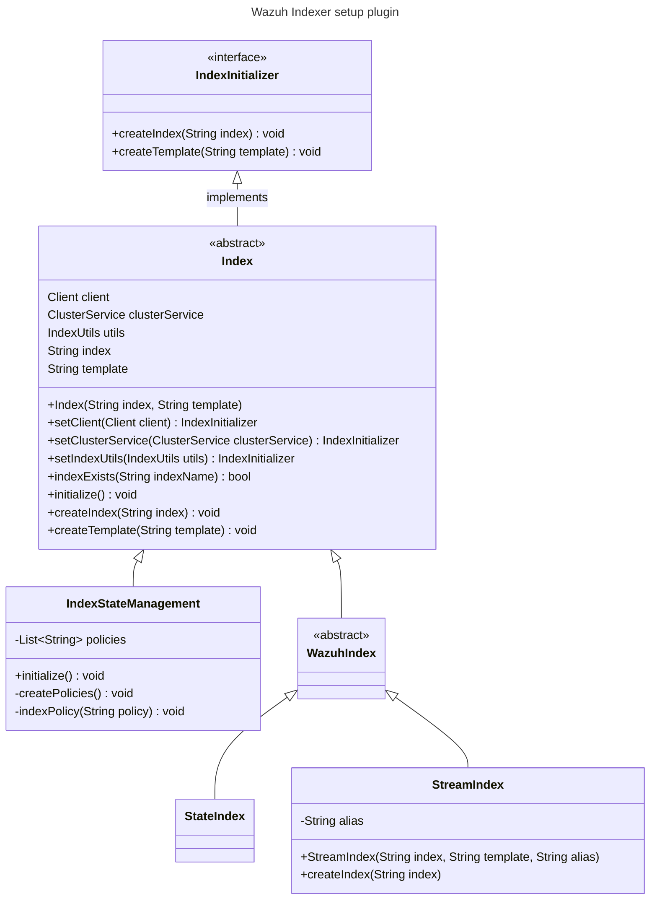

# Wazuh Indexer Setup plugin — development guide

This document describes how to extend the Wazuh Indexer setup plugin to create new index templates and index management policies (ISM) for OpenSearch. See [Architecture](../../ref/modules/setup/architecture.md) for the conceptual overview.

---

## Class diagram



The `SetupPlugin` class holds the list of indices to create. The logic for the creation of the index templates and the indices is encapsulated in the `Index` abstract class. Each subclass can override this logic if necessary. The `SetupPlugin::onNodeStarted()` method invokes the `Index::initialize()` method, effectively creating every index in the list. The plugin implements the [ClusterPlugin](https://github.com/opensearch-project/OpenSearch/blob/3.1.0/server/src/main/java/org/opensearch/plugins/ClusterPlugin.java) interface to hook into this method.

## Sequence diagram

> **Note** Calls to `Client` are asynchronous.

```mermaid
sequenceDiagram
    actor Node
    participant SetupPlugin
    participant Index
    participant Client
    Node->>SetupPlugin: plugin.onNodeStarted()
    activate SetupPlugin
    Note over Node,SetupPlugin: Invoked on Node::start()

    activate Index
    loop i..n indices
        SetupPlugin->>Index: i.initialize()


        Index-)Client: createTemplate(i)
        Client--)Index: response

        Index-)Client: indexExists(i)
        Client--)Index: response
        alt index i does not exist
            Index-)Client: createIndex(i)
            Client--)Index: response
        end
    end

    deactivate Index
    deactivate SetupPlugin
```



## JavaDoc

The plugin is documented using JavaDoc. You can compile the documentation using the Gradle task for that purpose. The generated JavaDoc is in the **build/docs** folder.

```bash
./gradlew javadoc
```

---

## Creating a new index

### 1. Add a new index template

Create a new JSON file in the directory: `/plugins/setup/src/main/resources`

Follow the existing structure and naming convention. Example:

```json
{
  "index_patterns": ["<pattern>"],
  "mappings": {
    "date_detection": false,
    "dynamic": "strict",
    "properties": {
      <custom mappings and fields>
    }
  },
  "order": 1,
  "settings": {
    "index": {
      "number_of_shards": 1,
      "number_of_replicas": 1
    }
  }
}
```

### 2. Register the index in the code

Edit the constructor of the `SetupPlugin` class located at: `/plugins/setup/src/main/java/com/wazuh/setup/SetupPlugin.java`

Add the template and index entry to the `indices` map. There are two kind of indices:

- **Stream index**. Stream indices contain time-based events of any kind (alerts, statistics, logs...).
- **Stateful index**. Stateful indices represent the most recent information of a subject (active vulnerabilities, installed packages, open ports, ...). These indices are different of Stream indices as they do not contain timestamps. The information is not based on time, as they always represent the most recent state.

```java
/**
* Main class of the Indexer Setup plugin. This plugin is responsible for the creation of the index
* templates and indices required by Wazuh to work properly.
*/
public class SetupPlugin extends Plugin implements ClusterPlugin {

  // ...

  // Stream indices
  this.indices.add(new StreamIndex("my-stream-index-000001", "my-index-template-1", "my-alias"));
  // State indices
  this.indices.add(new StateIndex("my-state-index", "my-index-template-2"));

  //...
}
```

> **Verifying template and index creation**
> After building the plugin and deploying the Wazuh Indexer with it, you can verify the index templates and indices using the following commands:
> ```bash
> curl -X GET <indexer-IP>:9200/_index_template/
> curl -X GET <indexer-IP>:9200/_cat/indices?v
> ```
Alternatively, use the Developer Tools console from the Wazuh Dashboard, or your browser.

## Creating a new ISM (Index State Management) policy

### 1. Add rollover alias to the index template

Edit the existing index template JSON file and add the following setting:
```json
"plugins.index_state_management.rollover_alias": "<index-name>"
```

### 2. Define the ISM policy

Refer to the [OpenSearch ISM Policies documentation](https://docs.opensearch.org/3.6/im-plugin/ism/policies/) for more details.

Here is an example ISM policy:
```json
{
  "policy": {
    "policy_id": "<index-name>-policy",
    "description": "<policy-description>",
    "last_updated_time": <unix-timestamp-in-milliseconds>,
    "schema_version": 1,
    "default_state": "hot",
    "states": [
      {
        "name": "hot",
        "actions": [
          {
            "retry": {
              "count": 3,
              "backoff": "exponential",
              "delay": "1m"
            },
            "rollover": {
              "min_doc_count": 200000000,
              "min_primary_shard_size": "20gb"
            }
          }
        ],
        "transitions": [
          {
            "state_name": "delete",
            "conditions": {
              "min_index_age": "<retention-time>"
            }
          }
        ]
      },
      {
        "name": "delete",
        "actions": [
          {
            "retry": {
              "count": 3,
              "backoff": "exponential",
              "delay": "1m"
            },
            "delete": {}
          }
        ],
        "transitions": []
      }
    ],
    "ism_template": [
      {
        "index_patterns": [
          "wazuh-<pattern>-*"
        ],
        "priority": <priority-int>
      }
    ]
  }
}
```

### 3. Register the ISM policy in the plugin code

Edit the `IndexStateManagement` class located at: `/plugins/setup/src/main/java/com/wazuh/setup/index/IndexStateManagement.java`

Register the new policy constant and add it in the constructor:
```java
// ISM policy name constant (filename without .json extension)
static final String MY_POLICY = "my-policy-filename";

...

/**
 * Constructor
 *
 * @param index    Index name
 * @param template Index template name
 */
public IndexStateManagement(String index, String template) {
    super(index, template);
    this.policies = new ArrayList<>();

    // Register the ISM policy to be created
    this.policies.add(MY_POLICY);
}
```

## Additional notes
Always follow existing naming conventions to maintain consistency.

Use epoch timestamps (in milliseconds) for `last_updated_time` fields.

ISM policies and templates must be properly deployed before the indices are created.

---

## Event stream templates

### Overview

All event data streams share a single base template: `templates/streams/events.json`. At deployment time, the plugin generates one index template per event category by dynamically setting the `index_patterns` and `rollover_alias` fields from the base template. This means:

- **Source of truth**: Only `events.json` exists in the repository.
- **At runtime**: One index template is created for each category (e.g., `wazuh-events-v5-cloud-services-template`, `wazuh-events-v5-security-template`, etc.).

The `StreamIndex` class handles this: when constructed with only an index name (no explicit template path), it defaults to `templates/streams/events` and rewrites the `index_patterns` and `rollover_alias` to match the specific index.

#### How it works

```java
// Single-arg constructor defaults to the shared events template
new StreamIndex("wazuh-events-v5-cloud-services")
// Equivalent to:
new StreamIndex("wazuh-events-v5-cloud-services", "templates/streams/events")
```

During `createTemplate()`, the plugin:
1. Reads `events.json` from the classpath
2. Overrides `index_patterns` to `["wazuh-events-v5-cloud-services*"]`
3. Overrides `rollover_alias` to `"wazuh-events-v5-cloud-services"`
4. Creates the composable index template in OpenSearch

#### Verifying deployed templates

To list all event templates in a running cluster:

```bash
GET /_index_template/wazuh-events-*
```

### Specialized stream templates

Some data streams use their own dedicated templates instead of the shared `events.json`:

| Data Stream | Template | Notes |
|---|---|---|
| `wazuh-events-raw-v5` | `templates/streams/raw.json` | Stores original unprocessed events |
| `wazuh-events-v5-unclassified` | `templates/streams/unclassified.json` | Stores uncategorized events for investigation |
| `wazuh-active-responses` | `templates/streams/active-responses.json` | Active Response execution requests |

These are registered with the two-arg constructor:

```java
new StreamIndex("wazuh-events-raw-v5", "templates/streams/raw")
new StreamIndex("wazuh-events-v5-unclassified", "templates/streams/unclassified")
new StreamIndex("wazuh-active-responses", "templates/streams/active-responses")
```

---

## Events data stream ISM policy (`stream-events-policy`)

### Overview

The **stream-events-policy** manages all `wazuh-events-v5-*` data streams. It combines rollover (based on shard size or document count) with a short retention period to ensure timely cleanup of processed event data.

### Policy details
- **Policy Name**: `stream-events-policy`
- **Location**: `plugins/setup/src/main/resources/policies/stream-events-policy.json`
- **Index Pattern**: `wazuh-events-v5-*`
- **Retention Period**: 1 hour
- **Rollover Conditions**: 25 GB primary shard size or 200,000,000 documents
- **Priority**: 50

### Policy states

1. **Hot State**
   - Actions: Rollover when primary shard reaches 25 GB or 200M documents
   - Transition Condition: Transitions to `delete` after 1 hour

2. **Delete State**
   - Actions: Deletes the index
   - Retry Policy: 3 attempts with exponential backoff (1-minute initial delay)

---

## Findings data stream ISM policy (`stream-findings-policy`)

### Overview

The **stream-findings-policy** manages all `wazuh-findings-v5-*` data streams. It combines rollover with a 90-day retention period to maintain detection findings for compliance and investigation purposes.

### Policy details
- **Policy Name**: `stream-findings-policy`
- **Location**: `plugins/setup/src/main/resources/policies/stream-findings-policy.json`
- **Index Pattern**: `wazuh-findings-v5-*`
- **Retention Period**: 90 days
- **Rollover Conditions**: 25 GB primary shard size or 200,000,000 documents
- **Priority**: 50

### Policy states

1. **Hot State**
   - Actions: Rollover when primary shard reaches 25 GB or 200M documents
   - Transition Condition: Transitions to `delete` after 90 days

2. **Delete State**
   - Actions: Deletes the index
   - Retry Policy: 3 attempts with exponential backoff (1-minute initial delay)

---

## Raw events data stream ISM policy (`stream-raw-events-policy`)

### Overview

The **stream-raw-events-policy** manages the `wazuh-events-raw-v5` data stream with an aggressive 10-minute retention for temporary raw event storage.

### Policy details
- **Policy Name**: `stream-raw-events-policy`
- **Location**: `plugins/setup/src/main/resources/policies/stream-raw-events-policy.json`
- **Index Pattern**: `wazuh-events-raw-v5*`
- **Retention Period**: 10 minutes
- **Rollover Conditions**: 25 GB primary shard size or 200,000,000 documents
- **Priority**: 100

### Policy states

1. **Hot State**
   - Actions: Rollover when primary shard reaches 25 GB or 200M documents
   - Transition Condition: Transitions to `delete` after 10 minutes

2. **Delete State**
   - Actions: Deletes the index
   - Retry Policy: 3 attempts with exponential backoff (1-minute initial delay)

---

## Active responses data stream (`wazuh-active-responses`)

### Overview

The **wazuh-active-responses** data stream stores Active Response execution requests generated when monitor triggers match their conditions. This is part of the Active Response 5.0 integration with Wazuh XDR, using the Indexer Alerting and Notifications plugins as the foundation.

### Purpose

- **Active Response Pipeline**: Structured and auditable execution pipeline for Active Response actions
- **Manager Retrieval**: The Wazuh manager retrieves documents from this index to distribute and execute Active Responses on agents
- **Event Correlation**: Each document references the source event (document ID and index) that triggered the response

### Data stream configuration

#### Index template
- **Location**: `plugins/setup/src/main/resources/templates/streams/active-responses.json`
- **Index Pattern**: `wazuh-active-responses*`
- **Rollover Alias**: `wazuh-active-responses`
- **Priority**: 1

#### Fields included (WCS-compatible)

- **@timestamp**: When the document was inserted into the wazuh-active-responses index (indexing time)
- **event.doc_id**: Document ID of the matched alert that triggered the active response
- **event.index**: Source index of the matched alert
- **wazuh.active_response.name**: Name of the active response configured in the channel
- **wazuh.active_response.executable**: Executable configured in the active response channel
- **wazuh.active_response.extra_arguments**: Arguments configured in the channel
- **wazuh.active_response.location**: Where to execute (local, defined-agent, all)
- **wazuh.active_response.agent_id**: Agent configured in the channel
- **wazuh.active_response.type**: Response type (stateless, stateful)
- **wazuh.active_response.stateful_timeout**: Seconds configured in the channel (for stateful)
- **wazuh.agent.***: Agent metadata
- **wazuh.cluster.***: Cluster information
- **wazuh.space.name**: Wazuh space/tenant information

### ISM policy

#### Policy details
- **Policy Name**: `stream-active-responses-policy`
- **Location**: `plugins/setup/src/main/resources/policies/stream-active-responses-policy.json`
- **Retention Period**: 3 days
- **Rollover Conditions**: 25 GB primary shard size or 200,000,000 documents
- **Priority**: 100

### Configuration

The data stream is created automatically during plugin initialization. Ensure:

1. The template file `active-responses.json` exists in `templates/streams/`
2. The ISM policy file `stream-active-responses-policy.json` exists in `policies/`
3. Both are registered in `SetupPlugin.java` and `IndexStateManagement.java`

### Testing

Integration tests for the active responses data stream are located at:
`plugins/setup/src/test/java/com/wazuh/setup/ActiveResponsesIT.java`
