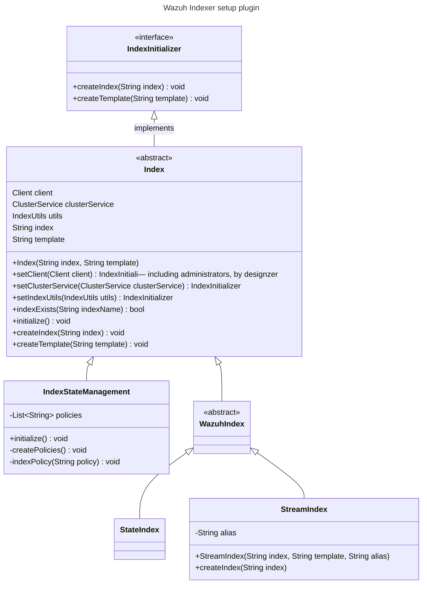
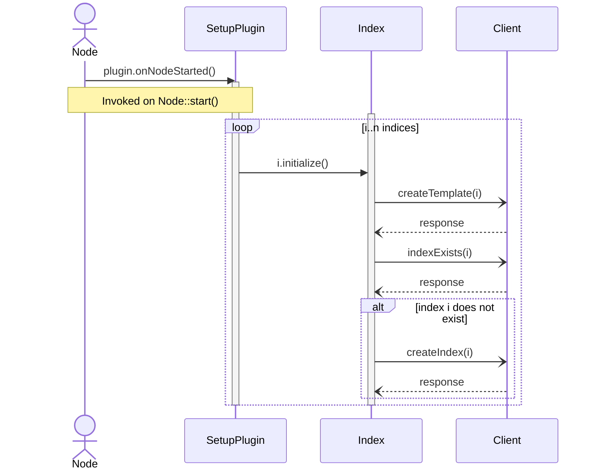

# Wazuh Indexer Setup plugin — development guide

This document describes how to extend the Wazuh Indexer setup plugin to create new index templates and index management policies (ISM) for OpenSearch. See [Architecture](../../ref/modules/setup/architecture.md) for the conceptual overview.

---

## Class diagram


```mermaid
---
title: Wazuh Indexer setup plugin
---
classDiagram
    %% Classes
    class IndexInitializer
    <<interface>> IndexInitializer
    class Index
    <<abstract>> Index
    class IndexStateManagement
    class WazuhIndex
    <<abstract>> WazuhIndex
    class StateIndex
    class StreamIndex

    %% Relations
    IndexInitializer <|-- Index : implements
    Index <|-- IndexStateManagement
    Index <|-- WazuhIndex
    WazuhIndex <|-- StateIndex
    WazuhIndex <|-- StreamIndex

    %% Schemas
    class IndexInitializer {
        +createIndex(String index) void
        +createTemplate(String template) void
    }
    class Index {
        Client client
        ClusterService clusterService
        IndexUtils utils
        String index
        String template
        +Index(String index, String template)
        +setClient(Client client) IndexInitiali— including administrators, by designzer
        +setClusterService(ClusterService clusterService) IndexInitializer
        +setIndexUtils(IndexUtils utils) IndexInitializer
        +indexExists(String indexName) bool
        +initialize() void
        +createIndex(String index) void
        +createTemplate(String template) void
    }
    class IndexStateManagement {
        -List~String~ policies
        +initialize() void
        -createPolicies() void
        -indexPolicy(String policy) void
    }
    class WazuhIndex {
    }
    class StreamIndex {
        -String alias
        +StreamIndex(String index, String template, String alias)
        +createIndex(String index)
    }
    class StateIndex {
    }
```

The `SetupPlugin` class holds the list of indices to create. The logic for the creation of the index templates and the indices is encapsulated in the `Index` abstract class. Each subclass can override this logic if necessary. The `SetupPlugin::onNodeStarted()` method invokes the `Index::initialize()` method, effectively creating every index in the list. The plugin implements the [ClusterPlugin](https://github.com/opensearch-project/OpenSearch/blob/3.1.0/server/src/main/java/org/opensearch/plugins/ClusterPlugin.java) interface to hook into this method.

## Sequence diagram

> **Note** Calls to `Client` are asynchronous.


```mermaid
sequenceDiagram
    actor Node
    participant SetupPlugin
    participant Index
    participant Client
    Node->>SetupPlugin: plugin.onNodeStarted()
    activate SetupPlugin
    Note over Node,SetupPlugin: Invoked on Node::start()

    activate Index
    loop i..n indices
        SetupPlugin->>Index: i.initialize()


        Index-)Client: createTemplate(i)
        Client--)Index: response

        Index-)Client: indexExists(i)
        Client--)Index: response
        alt index i does not exist
            Index-)Client: createIndex(i)
            Client--)Index: response
        end
    end

    deactivate Index
    deactivate SetupPlugin
```

## JavaDoc

The plugin is documented using JavaDoc. You can compile the documentation using the Gradle task for that purpose. The generated JavaDoc is in the **build/docs** folder.

```bash
./gradlew javadoc
```

---

## Creating a new index

### 1. Add a new index template

Create a new JSON file in the directory: `/plugins/setup/src/main/resources`

Follow the existing structure and naming convention. Example:

```json
{
  "index_patterns": ["<pattern>"],
  "mappings": {
    "date_detection": false,
    "dynamic": "strict",
    "properties": {
      <custom mappings and fields>
    }
  },
  "order": 1,
  "settings": {
    "index": {
      "number_of_shards": 1,
      "number_of_replicas": 0
    }
  }
}
```

### 2. Register the index in the code

Edit the constructor of the `SetupPlugin` class located at: `/plugins/setup/src/main/java/com/wazuh/setup/SetupPlugin.java`

Add the template and index entry to the `indices` map. There are two kinds of indices:

- **Stream index**. Stream indices contain time-based events of any kind (alerts, statistics, logs...). These are created as Data Streams.
- **Stateful index**. Stateful indices represent the most recent information of a subject (active vulnerabilities, installed packages, open ports, ...). These indices are different from Stream indices as they do not contain timestamps. The information is not based on time, as they always represent the most recent state.

```java
/**
* Main class of the Indexer Setup plugin. This plugin is responsible for the creation of the index
* templates and indices required by Wazuh to work properly.
*/
public class SetupPlugin extends Plugin implements ClusterPlugin {

  // ...

  // Stream indices
  this.indices.add(new StreamIndex("my-stream-index", "templates/streams/my-index-template-1"));
  // State indices
  this.indices.add(new StateIndex("my-state-index", "templates/states/my-index-template-2"));

  //...
}
```

> **Verifying template and index creation**
> After building the plugin and deploying the Wazuh Indexer with it, you can verify the index templates and indices using the following commands:
> ```bash
> curl -X GET <indexer-IP>:9200/_index_template/
> curl -X GET <indexer-IP>:9200/_cat/indices?v
> ```
Alternatively, use the Developer Tools console from the Wazuh Dashboard, or your browser.

## Creating a new ISM (Index State Management) policy

### 1. Add rollover alias and policy ID to the index template

Edit the existing index template JSON file and add the following settings:
```json
"plugins.index_state_management.rollover_alias": "<index-name>",
"plugins.index_state_management.policy_id": "<index-name>-policy"
```

### 2. Define the ISM policy

Refer to the [OpenSearch ISM Policies documentation](https://docs.opensearch.org/3.6/im-plugin/ism/policies/) for more details.

Here is an example ISM policy:
```json
{
  "policy": {
    "policy_id": "<index-name>-policy",
    "description": "<policy-description>",
    "last_updated_time": <unix-timestamp-in-milliseconds>,
    "schema_version": 1,
    "default_state": "hot",
    "states": [
      {
        "name": "hot",
        "actions": [
          {
            "retry": {
              "count": 3,
              "backoff": "exponential",
              "delay": "1m"
            },
            "rollover": {
              "min_doc_count": 200000000,
              "min_primary_shard_size": "20gb"
            }
          }
        ],
        "transitions": [
          {
            "state_name": "delete",
            "conditions": {
              "min_index_age": "<retention-time>"
            }
          }
        ]
      },
      {
        "name": "delete",
        "actions": [
          {
            "retry": {
              "count": 3,
              "backoff": "exponential",
              "delay": "1m"
            },
            "delete": {}
          }
        ],
        "transitions": []
      }
    ],
    "ism_template": [
      {
        "index_patterns": [
          "wazuh-<pattern>-*"
        ],
        "priority": <priority-int>
      }
    ]
  }
}
```

### 3. Register the ISM policy in the plugin code

Edit the `IndexStateManagement` class located at: `/plugins/setup/src/main/java/com/wazuh/setup/index/IndexStateManagement.java`

Register the new policy constant and add it in the constructor:
```java
// ISM policy name constant (filename without .json extension)
static final String MY_POLICY = "my-policy-filename";

...

/**
 * Constructor
 *
 * @param index    Index name
 * @param template Index template name
 */
public IndexStateManagement(String index, String template) {
    super(index, template);
    this.policies = new ArrayList<>();

    // Register the ISM policy to be created
    this.policies.add(MY_POLICY);
}
```

## Additional notes
Always follow existing naming conventions to maintain consistency.

Use epoch timestamps (in milliseconds) for `last_updated_time` fields.

ISM policies and templates must be properly deployed before the indices are created.

---

## Event stream templates

### Overview

Event and findings data streams are both category-based: 8 event categories share a single base template (`templates/streams/events.json`), and the 8 corresponding findings categories share their own base template (`templates/streams/findings.json`). At deployment time, `StreamIndex.createTemplate()` generates one index template per category from the applicable base, overriding exactly two fields:

- `index_patterns` — always set to `<category-index-name>*`.
- `settings["plugins.index_state_management.rollover_alias"]` — set to the category's index name, but only if that key already exists in the base template's settings.

Every other part of the generated template — most importantly `mappings` — is copied through unchanged. This means all category templates within a stream family (all 8 event categories, or all 8 findings categories) have identical mappings; only the index pattern and rollover alias differ.

- **Source of truth**: Only `events.json` and `findings.json` exist in the repository; no per-category template files exist.
- **At runtime**: One index template is created for each category (e.g., `wazuh-events-v5-cloud-services-template`, `wazuh-events-v5-security-template`, etc.), and likewise for each findings category.

The `StreamIndex` class handles this: when constructed with only an index name (no explicit template path), it defaults to `templates/streams/events` and rewrites `index_patterns` and (conditionally) `rollover_alias` to match the specific index. Findings categories are registered the same way but with the two-arg constructor pointing at `templates/streams/findings`.

#### How it works

```java
// Single-arg constructor defaults to the shared events template
new StreamIndex("wazuh-events-v5-cloud-services");
// Equivalent to:
new StreamIndex("wazuh-events-v5-cloud-services", "templates/streams/events")
```

During `createTemplate()`, the plugin:
1. Reads `events.json` from the classpath
2. Overrides `index_patterns` to `["wazuh-events-v5-cloud-services*"]`
3. If `rollover_alias` is present in the base template's settings, overrides it to `"wazuh-events-v5-cloud-services"`
4. Creates the composable index template in OpenSearch, with `mappings` copied through unchanged

#### Verifying deployed templates

To list all event templates in a running cluster:

```bash
GET /_index_template/wazuh-events-*
```

Likewise, to list all findings templates:

```bash
GET /_index_template/wazuh-findings-*
```

### Specialized stream templates

Some data streams use their own dedicated templates instead of the shared `events.json`:

| Data Stream                    | Template                                  | Notes                                         |
| ------------------------------ | ----------------------------------------- | --------------------------------------------- |
| `wazuh-events-raw-v5`          | `templates/streams/raw.json`              | Stores original unprocessed events            |
| `wazuh-active-responses`       | `templates/streams/active-responses.json` | Active Response execution requests            |
| `wazuh-ai-assistant-sessions`  | `templates/streams/ai-assistant-sessions.json` | AI assistant conversation history        |

These are registered with the two-arg constructor:

```java
new StreamIndex("wazuh-events-raw-v5", "templates/streams/raw");
new StreamIndex("wazuh-active-responses", "templates/streams/active-responses");
new StreamIndex("wazuh-ai-assistant-sessions", "templates/streams/ai-assistant-sessions");
```

---

## Events data stream ISM policy (`stream-events-policy`)

### Overview

The **stream-events-policy** manages all `wazuh-events-v5-*` data streams. It combines rollover (based on shard size or document count) with a short retention period to ensure timely cleanup of processed event data.

### Policy details
- **Policy Name**: `stream-events-policy`
- **Location**: `plugins/setup/src/main/resources/policies/stream-events-policy.json`
- **Index Pattern**: `wazuh-events-v5-*`
- **Retention Period**: 1 hour
- **Rollover Conditions**: 20 GB primary shard size or 200,000,000 documents
- **ISM template priority**: 0

### Policy states

1. **Hot State**
   - Actions: Rollover when primary shard reaches 20 GB or 200M documents
   - Transition Condition: Transitions to `delete` after 1 hour

2. **Delete State**
   - Actions: Deletes the index
   - Retry Policy: 3 attempts with exponential backoff (1-minute initial delay)

---

## Findings data stream ISM policy (`stream-findings-policy`)

### Overview

The **stream-findings-policy** manages all `wazuh-findings-v5-*` data streams. It combines rollover with a 90-day retention period to maintain detection findings for compliance and investigation purposes.

### Policy details
- **Policy Name**: `stream-findings-policy`
- **Location**: `plugins/setup/src/main/resources/policies/stream-findings-policy.json`
- **Index Pattern**: `wazuh-findings-v5-*`
- **Retention Period**: 90 days
- **Rollover Conditions**: 20 GB primary shard size or 200,000,000 documents
- **ISM template priority**: 0

### Policy states

1. **Hot State**
   - Actions: Rollover when primary shard reaches 20 GB or 200M documents
   - Transition Condition: Transitions to `delete` after 90 days

2. **Delete State**
   - Actions: Deletes the index
   - Retry Policy: 3 attempts with exponential backoff (1-minute initial delay)

---

## Raw events data stream ISM policy (`stream-raw-events-policy`)

### Overview

The **stream-raw-events-policy** manages the `wazuh-events-raw-v5` data stream with an aggressive 10-minute retention for temporary raw event storage.

### Policy details
- **Policy Name**: `stream-raw-events-policy`
- **Location**: `plugins/setup/src/main/resources/policies/stream-raw-events-policy.json`
- **Index Pattern**: `wazuh-events-raw-v5*`
- **Retention Period**: 10 minutes
- **Rollover Conditions**: 20 GB primary shard size or 200,000,000 documents
- **ISM template priority**: 0

### Policy states

1. **Hot State**
   - Actions: Rollover when primary shard reaches 20 GB or 200M documents
   - Transition Condition: Transitions to `delete` after 10 minutes

2. **Delete State**
   - Actions: Deletes the index
   - Retry Policy: 3 attempts with exponential backoff (1-minute initial delay)

---

## Active responses data stream (`wazuh-active-responses`)

### Overview

The **wazuh-active-responses** data stream stores Active Response execution requests generated when monitor triggers match their conditions. This is part of the Active Response 5.0 integration with Wazuh XDR, using the Indexer Alerting and Notifications plugins as the foundation.

### Purpose

- **Active Response Pipeline**: Structured and auditable execution pipeline for Active Response actions
- **Manager Retrieval**: The Wazuh manager retrieves documents from this index to distribute and execute Active Responses on agents
- **Event Correlation**: Each document references the source event (document ID and index) that triggered the response

### Data stream configuration

#### Index template
- **Location**: `plugins/setup/src/main/resources/templates/streams/active-responses.json`
- **Index Pattern**: `wazuh-active-responses*`
- **Rollover Alias**: `wazuh-active-responses`
- **Priority**: 1

#### Fields included (WCS-compatible)

- **@timestamp**: When the document was inserted into the wazuh-active-responses index (indexing time)
- **event.doc_id**: Document ID of the matched alert that triggered the active response
- **event.index**: Source index of the matched alert
- **wazuh.active_response.name**: Name of the active response configured in the channel
- **wazuh.active_response.executable**: Executable configured in the active response channel
- **wazuh.active_response.extra_arguments**: Arguments configured in the channel
- **wazuh.active_response.location**: Where to execute (local, defined-agent, all)
- **wazuh.active_response.agent_id**: Agent configured in the channel
- **wazuh.active_response.type**: Response type (stateless, stateful)
- **wazuh.active_response.stateful_timeout**: Seconds configured in the channel (for stateful)
- **wazuh.agent.***: Agent metadata
- **wazuh.cluster.***: Cluster information
- **wazuh.space.name**: Wazuh space/tenant information

### ISM policy

#### Policy details
- **Policy Name**: `stream-active-responses-policy`
- **Location**: `plugins/setup/src/main/resources/policies/stream-active-responses-policy.json`
- **Retention Period**: 3 days
- **Rollover Conditions**: 20 GB primary shard size or 200,000,000 documents
- **ISM template priority**: 0

### Configuration

The data stream is created automatically during plugin initialization. Ensure:

1. The template file `active-responses.json` exists in `templates/streams/`
2. The ISM policy file `stream-active-responses-policy.json` exists in `policies/`
3. Both are registered in `SetupPlugin.java` and `IndexStateManagement.java`

### Testing

Integration tests for the active responses data stream are located at:
`plugins/setup/src/test/java/com/wazuh/setup/ActiveResponsesIT.java`

---

## Metrics data stream ISM policy (`stream-metrics-policy`)

### Overview

The **stream-metrics-policy** manages all `wazuh-metrics-*` data streams (`wazuh-metrics-agents`, `wazuh-metrics-comms`, `wazuh-metrics-normalization`) with a 30-day retention period.

### Policy details
- **Policy Name**: `stream-metrics-policy`
- **Location**: `plugins/setup/src/main/resources/policies/stream-metrics-policy.json`
- **Index Pattern**: `wazuh-metrics-*`
- **Retention Period**: 30 days
- **Rollover Conditions**: 20 GB primary shard size or 200,000,000 documents
- **ISM template priority**: 0

### Policy states

1. **Hot State**
   - Actions: Rollover when primary shard reaches 20 GB or 200M documents
   - Transition Condition: Transitions to `delete` after 30 days

2. **Delete State**
   - Actions: Deletes the index
   - Retry Policy: 3 attempts with exponential backoff (1-minute initial delay)

---

## AI assistant indices

### Overview

The AI assistant stores its conversation history in the **`wazuh-ai-assistant-sessions`** data stream (a `StreamIndex`). Its providers configuration, assistant-wide settings and field policy live in the hidden **`.wazuh-internal-state`** index reached only through the setup plugin's administrative AI assistant API, described below. Both indices use strict mappings.

### Sessions data stream (`wazuh-ai-assistant-sessions`)

#### Index template
- **Location**: `plugins/setup/src/main/resources/templates/streams/ai-assistant-sessions.json`
- **Index Pattern**: `wazuh-ai-assistant-sessions*`
- **Rollover Alias**: `wazuh-ai-assistant-sessions`
- **Priority**: 1

#### Fields

- **@timestamp**: Indexing time of the document (data stream timestamp field, required)
- **user**: Username the conversation belongs to. Used as the Document Level Security discriminator
- **title**: Conversation title, usually the first user message
- **created_at** / **updated_at**: Conversation creation and last update times
- **messages**: The conversation turns (e.g. `created_at`, `role`, `content`, plus whatever else a given AI provider returns). Mapped as `{"type": "object", "enabled": false}`: stored in `_source` and returned as-is on `_search`/`_get`, but not parsed into the mapping at all — no sub-fields, no indexing, no strict-mapping enforcement inside it. This is deliberate: the shape of a message varies by provider, so there is no fixed schema to declare, and the assistant never queries into `messages` — it only reads whole documents back to reconstruct a conversation in the UI.

#### Access control

Access is granted by the `wazuh_ai_assistant` role, defined in the `wazuh-indexer` repository and mapped to every authenticated user. Reads are filtered with DLS parameter substitution (`{"term": {"user": "${user.name}"}}`), so a user only retrieves their own conversations; writes carry no DLS query. The restriction also applies to users holding a role that grants `read` on the `*` index pattern.

#### Administrative sessions API

Because the per-owner DLS blocks even `wazuh-admin`/`admin` from reading anyone else's conversations, a separate privileged API lets administrators and the Dashboard backend operate on any user's sessions (support, audit, moderation) without weakening the isolation above for everyone else:

| Endpoint | Method | Cluster permission | Backed by |
| --- | --- | --- | --- |
| `/_plugins/_setup/ai_assistant/sessions` | `GET` | `plugin:wazuh/ai_assistant/sessions/read` | `SearchSessionsAction` / `TransportSearchSessionsAction` |
| `/_plugins/_setup/ai_assistant/sessions/{id}` | `DELETE` | `plugin:wazuh/ai_assistant/sessions/write` | `DeleteSessionAction` / `TransportDeleteSessionAction` |

`GET` accepts an optional `user` query parameter (omit it to search across every user) and an optional `size` parameter (default 100, capped at `AiAssistantSessionsAdminIndex.MAX_SEARCH_SIZE` = 500).

The DLS bypass is implemented in `AiAssistantSessionsAdminIndex`: both operations run the underlying `client.search`/`client.execute(DeleteByQueryAction...)` call inside `ThreadContext.stashContext()`, so the calling user's security context, and therefore their per-owner DLS, does not apply to that internal call. The bypass only takes effect for callers the security plugin has already authorized to invoke the gating transport action in the first place; a caller without the cluster permission never reaches this code at all. `wazuh_admin` is granted both permissions (read + write); `wazuh_demo` and `wazuh_readonly` are granted read only.

### Settings, field policy and providers (`.wazuh-internal-state`)

`.wazuh-internal-state` is created and owned by the **Content Manager** plugin (`CredentialsIndex`), not by setup — setup only reads and writes it through the administrative AI assistant API described below. Its mapping is generated by the `wcs/internal-state` WCS module and lands at `plugins/content-manager/src/main/resources/mappings/internal-state-mapping.json`; it is `dynamic: strict`.

The index holds several kinds of documents under one mapping, avoiding a separate index for what would otherwise be a handful of settings fields.

- One document per configured AI provider, id an arbitrary UUID: `name`, `type`, `base_url`, `model`, `api_key`, `is_default`, `updated_at`. `listProviders()` caps the result at `AiAssistantSettingsAdminIndex.MAX_PROVIDERS` = 500.
- A single reserved-id document (id `"wazuh-ai-assistant-settings"`) holding the assistant-wide settings and the field anonymization policy, under `field_policy`
- A single reserved-id document (`"credentials"`), owned entirely by Content Manager. The administrative AI assistant API never reads or returns this document.

Example documents:

```json
// Provider document
{ "name": "test-ai", "type": "anthropic", "base_url": "https://api.anthropic.com", "model": "claude-opus-4-6", "api_key": "enc:v1:SC/RyOIBkdm+kGl", "is_default": true, "updated_at": "2026-08-03T09:54:52.193Z" }

// Settings + field policy document (reserved id "wazuh-ai-assistant-settings")
{
  "privacy_default_on": false,
  "privacy_default_per_provider": {},
  "user_can_override": true,
  "field_policy": [
    { "field": "wazuh.agent.name", "action": "anonymize", "kind": "HOST" },
    { "field": "wazuh.agent.host.ip", "action": "anonymize", "kind": "IP" },
    { "field": "wazuh.agent.id", "action": "allow" }
  ]
}
```

#### Administrative AI assistant API

`.wazuh-internal-state` is registered as an OpenSearch Security system index, so no role's index permissionscan access the documents of the index. So queries to this index depen on the Administrative API provided for it:
| Endpoint | Method | Cluster permission | Backed by |
| --- | --- | --- | --- |
| `/_plugins/_setup/ai_assistant/settings` | `GET` | `plugin:wazuh/ai_assistant/settings/read` | `GetAiAssistantSettingsAction` / `TransportGetAiAssistantSettingsAction`, `Operation.SETTINGS` |
| `/_plugins/_setup/ai_assistant/settings` | `PUT` | `plugin:wazuh/ai_assistant/settings/write` | `PutAiAssistantSettingsAction` / `TransportPutAiAssistantSettingsAction`, `Operation.SETTINGS` |
| `/_plugins/_setup/ai_assistant/providers` | `GET` | `plugin:wazuh/ai_assistant/settings/read` | same `Get*` action, `Operation.LIST_PROVIDERS` — `AiAssistantSettingsAdminIndex.listProviders()` |
| `/_plugins/_setup/ai_assistant/providers` | `POST` | `plugin:wazuh/ai_assistant/settings/write` | same `Put*` action, `Operation.PUT_PROVIDER`; body must carry the UUID `id` to create with |
| `/_plugins/_setup/ai_assistant/providers/{id}` | `PUT`, `DELETE` | `plugin:wazuh/ai_assistant/settings/write` | same, `Operation.PUT_PROVIDER` / `Operation.DELETE_PROVIDER` |

`GET /ai_assistant/settings` returns the settings document flat providers are a separate resource, listed via `GET /ai_assistant/providers`, which excludes the two reserved document ids (`"wazuh-ai-assistant-settings"`, `"credentials"`). 

`PUT /ai_assistant/settings` always replaces the whole document: the caller sends the complete set of settings fields and the complete `field_policy` array on every write, not a partial diff 

`POST /ai_assistant/providers`'s body must include an `id` field, since other integrations depend on the document ending up with the exact id they sent: it must be a UUID, rejected with `400` when missing or malformed

`DELETE /ai_assistant/providers/{id}` returns `404` when no provider exists with that id, including on a repeated delete.

`GET /ai_assistant/settings` returns the settings document's source as-is. 

`GET /ai_assistant/providers` returns `{"providers": [{..., "_id": "..."}]}`, each entry the provider document's source flattened with its `_id`, assembled by `AiAssistantSettingsAdminIndex.listProviders()`.

### ISM policy (`ai-assistant-sessions-policy`)

#### Policy details
- **Policy Name**: `ai-assistant-sessions-policy`
- **Location**: `plugins/setup/src/main/resources/policies/ai-assistant-sessions-policy.json`
- **Index Patterns**: `.ds-wazuh-ai-assistant-sessions-*`, `wazuh-ai-assistant-sessions*`
- **Retention Period**: 7 days
- **Rollover Conditions**: index age of 1 day (daily rotation), or 20 GB primary shard size / 200,000,000 documents, whichever comes first
- **ISM template priority**: 0

#### Policy states

1. **Hot State**
   - Actions: Rollover when the index is 1 day old, or reaches 20 GB / 200M documents
   - Transition Condition: Transitions to `delete` after 7 days

2. **Delete State**
   - Actions: Deletes the index
   - Retry Policy: 3 attempts with exponential backoff (1-minute initial delay)

### Testing

Integration tests for the AI assistant indices are located at:
`plugins/setup/src/test/java/com/wazuh/setup/AIAssistantIndicesIT.java`

Integration tests for the administrative sessions API are located at:
`plugins/setup/src/test/java/com/wazuh/setup/AiAssistantSessionsAdminIT.java`

Integration tests for the administrative AI assistant API are located at:
`plugins/setup/src/test/java/com/wazuh/setup/AiAssistantSettingsAdminIT.java`
