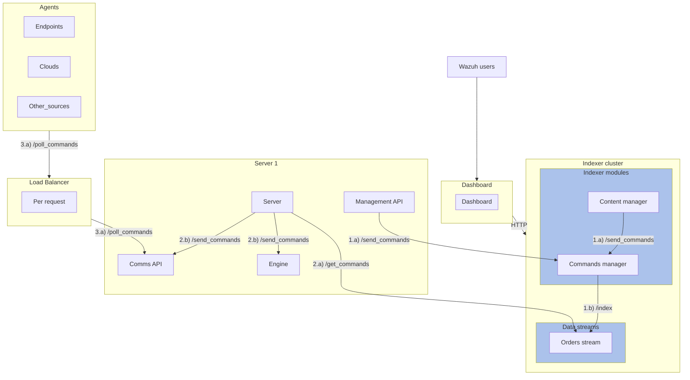

# Command Manager

The [Command Manager plugin](https://github.com/wazuh/wazuh-indexer/issues/349) appears for the first time in Wazuh 5.0.0.

The plugin is one of the pillars of the agent commands mechanism. Wazuh Agents can receive orders anytime to change their behavior, for example, restarting, changing its group or run a program on the monitored system. The Command Manager plugin receives these commands, prepares them and sends them to the Wazuh Server for their delivery to the destination Agent. The processed commands are stored in an index for their consulting and management of their lifecycle, and eventually removed from the index when completed or past due. The document ID is sent from end to end, so the result of the order can be set by the Wazuh Server.

**Key Concepts:**
- **Command:** the raw command as received by the POST /commands endpoint.
- **Order:** processed command, as stored in the index. A subset of this information is sent to the Wazuh Server.

**Key Features:**
- The plugin exposes a Rest API with a single endpoint that listens for POST requests.
- The plugin extends the Job Scheduler plugin via its SPI. The job periodically looks for orders in “pending” state and sends them to the Management API of the Wazuh Server.
- The plugin introduces an HTTP Rest client using the Apache HTTP Client library to send the orders to the Wazuh Server.
- The plugin reads the Wazuh Server information from the key store. This information is considered sensitive as it contains the public IP address of the server and the access credentials.
- The plugin uploads the “commands” index template to the cluster when the first command is received.