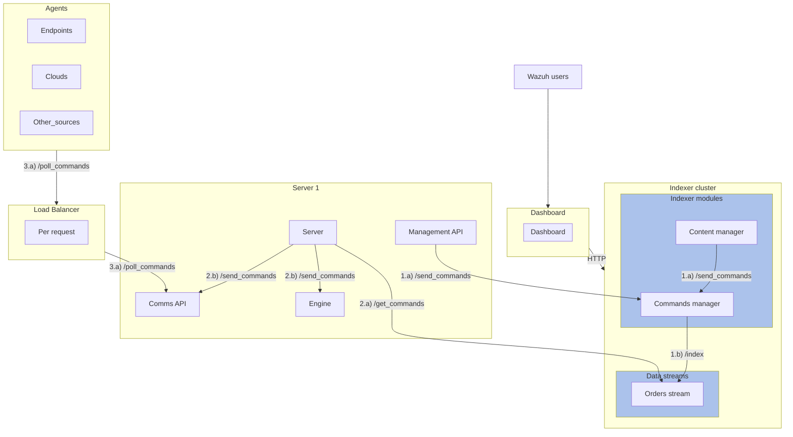

# Command Manager

This plugin is one of the pillars of the new communication mechanism used across the different components of Wazuh: the commands. The commands are used to deliver specific actions to other components. For example, a command can order a group of agents to restart, update its configuration, change group or run an active response action. The Command Manager plugin receives these commands through its HTTP REST API, validates and stores them in an index. The Wazuh Server periodically queries the index looking for new commands and sends them to the final destination, which can be an agent or a server (engine).

The Command Manager generates a unique ID for each of the order received. This ID is required for updating the result of the order, so it's sent together with the order details to the target. Orders are expected to be executed before a given amount of time. The Command Manager periodically searches for past due commands and updates its status to the "failed" state.

**Key Concepts:**
- **Command:** the raw command as received by the `POST /_plugins/_command_manager/commands` endpoint.
- **Order:** processed command, as stored in the index. A subset of this information is fetched by the Wazuh and sent to the order's target.

**Key Features:**
- The plugin exposes a Rest API with a single endpoint that listens for POST requests.
- The plugin extends the Job Scheduler plugin via its SPI. The job periodically looks for past due orders in “pending” state and changes their state to "failed".

The [Command Manager plugin](https://github.com/wazuh/wazuh-indexer/issues/349) appears for the first time in Wazuh 6.0.0.