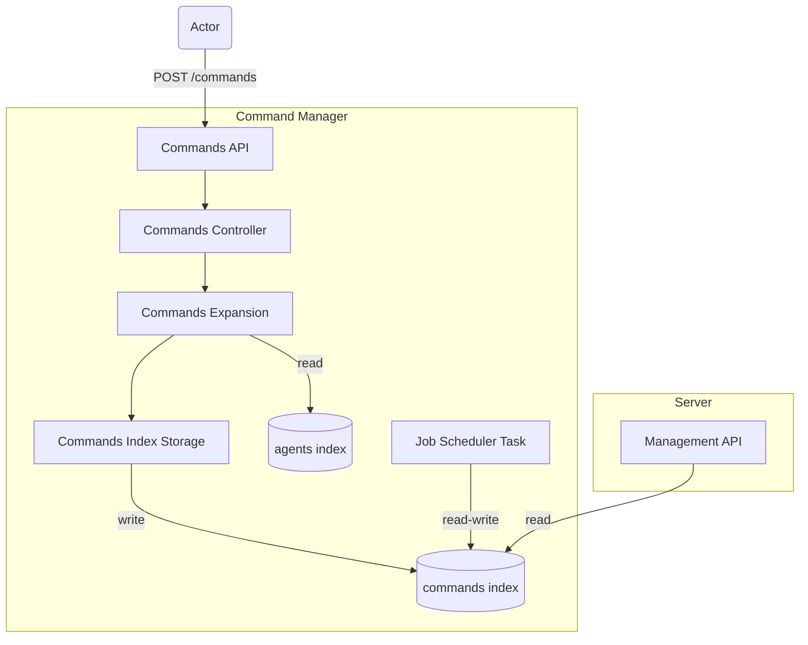

# Architecture

## Command manager context diagram



## Commands API

Issue: [https://github.com/wazuh/wazuh-indexer-plugins/issues/69](https://github.com/wazuh/wazuh-indexer-plugins/issues/69)

The Command Manager API is described formally in OpenAPI format. Check it out [here](https://github.com/wazuh/wazuh-indexer-plugins/blob/main/plugins/command-manager/openapi.yml).

> **Important**: The `action.name` attribute must always be provided before `action.args` in the JSON. Otherwise, the command is rejected. This is necessary for proper validation of the arguments, which depends on the command type, defined by `action.name`.

### fetch-config

The `fetch-config` command is used to order an agent to update its remote configuration.

Accepted values for `target.type` are `agent` and `group`. The `target.id` represents the agent's ID or group's name, respectively.

The command takes no arguments (`action.args`). Any provided argument is ignored.

```json
{
  "commands": [
    {
      "action": {
        "name": "fetch-config",
        "args": {},
        "version": "5.0.0"
      },
      "source": "Users/Services",
      "user": "Management API",
      "timeout": 100,
      "target": {
        "id": "d5b250c4-dfa1-4d94-827f-9f99210dbe6c",
        "type": "agent"
      }
    }
  ]
}
```

### set-group

The `set-group` command is used to change the groups of an agent.

Accepted values for `target.type` are `agent` and `group`. The `target.id` represents the agent's ID or group's name, respectively.

The command takes the `groups` argument, an array of strings depicting the **full list** of groups the agent belongs too. Any other value than an array of strings is rejected. Additional arguments are ignored.

```json
{
  "commands": [
    {
      "action": {
        "name": "set-group",
        "args": {
          "groups": [
            "group_1",
            "group_2"
          ]
        },
        "version": "5.0.0"
      },
      "source": "Users/Services",
      "user": "Management API",
      "timeout": 100,
      "target": {
        "id": "d5b250c4-dfa1-4d94-827f-9f99210dbe6c",
        "type": "agent"
      }
    }
  ]
}
```

### update

The `update` command is used to notify about new content being available. We usually refer to content to the CVE and Ruleset catalog.

Only accepted value for `target.type` is `server`. The `target.id` represents the server's module that is interested on the new content.

The command takes the `index` and `offset` arguments, strings depicting the index where the new content is and its version, respectively. Any other value than a string is rejected. Additional arguments are ignored.

```json
{
  "commands": [
    {
      "action": {
        "name": "update",
        "args": {
          "index": "content-index",
          "offset": "1111"
        },
        "version": "5.0.0"
      },
      "source": "Content Manager",
      "timeout": 100,
      "target": {
        "id": "vulnerability-detector",
        "type": "server"
      }
    }
  ]
}
```
### refresh
The `refresh` command is used to refresh the specified indices, ensuring that the most recent data is available for the system.

Only accepted value for `target.type` is `server`. The `target.id` specifies the server's module that requires the refresh of the data.

The command accepts an optional `index` argument, which can be an array of strings representing the indices to be refreshed. Any other value than a string or array is rejected. Additional arguments are ignored.
``` json
{
  "commands": [
    {
      "action": {
        "name": "refresh",
        "args": {
          "index": ["index-a", "index-b"], // Optional
        },
        "version": "5.0.0"
      },
      "source": "Users/Services",
      "timeout": 100,
      "target": {
        "id": "rbac",
        "type": "server"
      }
    }
  ]
}
```

## Commands expansion

Commands can be targeted to a group of agents, too. This is achieved by setting `group` as the target type and the name of the group as the target ID. For example:

```json
{
  "commands": [
    {
      "action": {
        "name": "fetch-config",
        "args": {},
        "version": "5.0.0"
      },
      "source": "Users/Services",
      "user": "Management API",
      "timeout": 100,
      "target": {
        "id": "group002",
        "type": "group"
      }
    }
  ]
}
```

The command is processed by the Command Manager and expanded. We refer to expansion as the generation of analogous commands targeting the individual agents that belong to that group. For example, if the `windows-group-A` group contains 10 agents, 10 commands will be generated, one for each of the agents. The target type and ID for these commands are set to `agent` and the ID of the agent, respectively.

```json
[
  {
    "command": {
      "source": "Users/Services",
      "user": "Management API",
      "target": {
        "type": "agent",
        "id": "agent82"
      },
      "action": {
        "name": "fetch-config",
        "args": {},
        "version": "5.0.0"
      },
      "timeout": 100,
      "status": "pending"
    }
  },
  {
    "command": {
      "source": "Users/Services",
      "user": "Management API",
      "target": {
        "type": "agent",
        "id": "agent21"
      },
      "action": {
        "name": "fetch-config",
        "args": {},
        "version": "5.0.0"
      },
      "timeout": 100,
      "status": "pending"
    }
  },
  {
    "command": {
      "source": "Users/Services",
      "user": "Management API",
      "target": {
        "type": "agent",
        "id": "agent28"
      },
      "action": {
        "name": "fetch-config",
        "args": {},
        "version": "5.0.0"
      },
      "timeout": 100,
      "status": "pending"
    }
  }
]
```

Issue: [https://github.com/wazuh/wazuh-indexer-plugins/issues/88](https://github.com/wazuh/wazuh-indexer-plugins/issues/88)

## Orders storage

The processed commands, the orders, are stored in the `wazuh-commands` index.

```json
GET wazuh-commands/_search
{
  "took": 4,
  "timed_out": false,
  "_shards": {
    "total": 1,
    "successful": 1,
    "skipped": 0,
    "failed": 0
  },
  "hits": {
    "total": {
      "value": 1,
      "relation": "eq"
    },
    "max_score": 1,
    "hits": [
      {
        "_index": "wazuh-commands",
        "_id": "yu5Li5UB5IfLPVSubqhW",
        "_score": 1,
        "_source": {
          "agent": {
            "groups": [
              "group002"
            ]
          },
          "command": {
            "source": "Users/Services",
            "user": "Management API",
            "target": {
              "type": "agent",
              "id": "agent28"
            },
            "action": {
              "name": "set-group",
              "args": {
                "groups": [
                  "group_1",
                  "group_2"
                ]
              },
              "version": "5.0.0"
            },
            "timeout": 100,
            "status": "pending",
            "order_id": "ye5Li5UB5IfLPVSubqhW",
            "request_id": "yO5Li5UB5IfLPVSubqhW"
          },
          "@timestamp": "2025-03-12T16:58:51Z",
          "delivery_timestamp": "2025-03-12T17:00:31Z"
        }
      }
    ]
  }
}
```

Issue: [https://github.com/wazuh/wazuh-indexer-plugins/issues/42](https://github.com/wazuh/wazuh-indexer-plugins/issues/42)

## The Job Scheduler task

A periodic task performs an [updateByQuery](https://opensearch.org/docs/latest/api-reference/document-apis/update-by-query/) query to set the status of past due orders to "failed".

Issue: [https://github.com/wazuh/wazuh-indexer-plugins/issues/87](https://github.com/wazuh/wazuh-indexer-plugins/issues/87)
