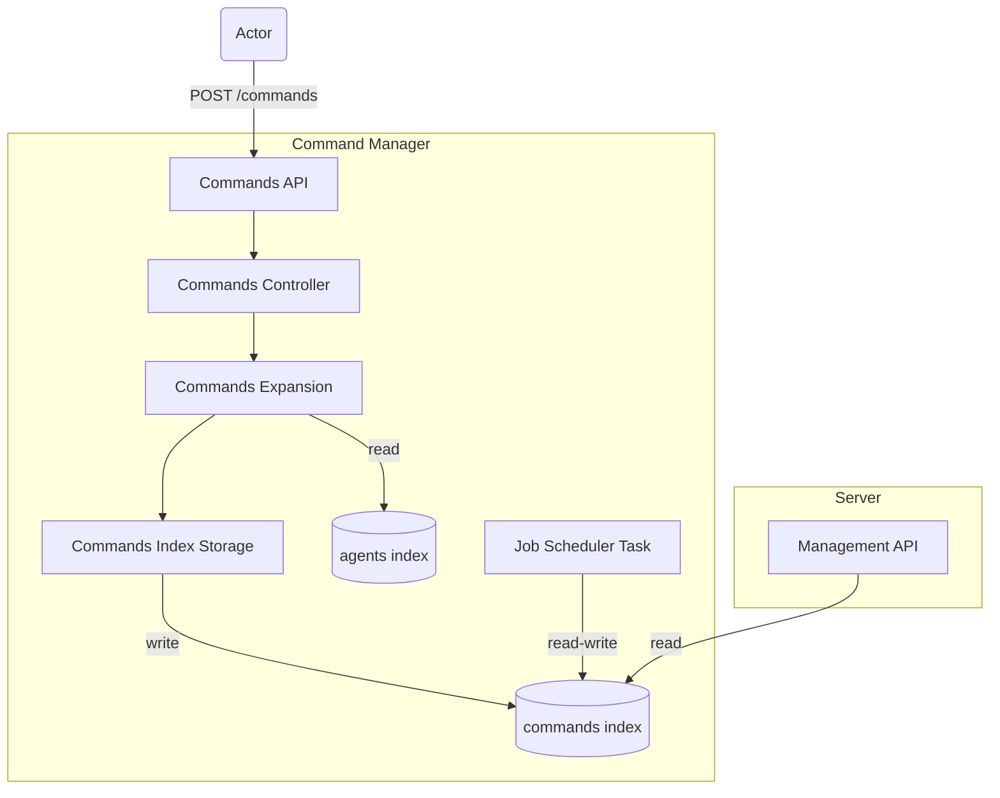
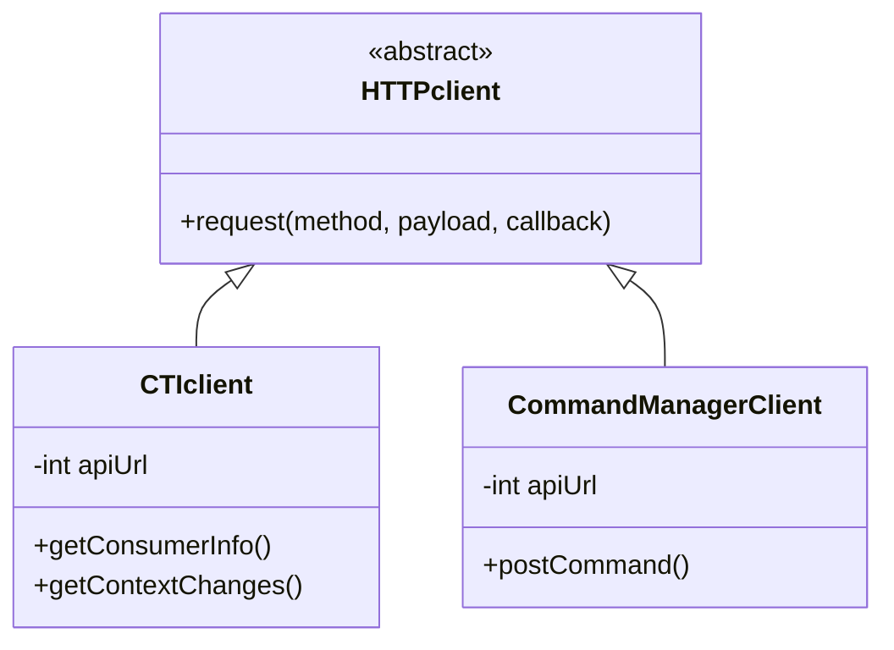

# Architecture

## Command manager context diagram



## Commands API

Status: Completed

Documentation TBD.

Issue: [https://github.com/wazuh/wazuh-indexer-plugins/issues/69](https://github.com/wazuh/wazuh-indexer-plugins/issues/69)

Input JSON:

```json
{
  "commands": [
    {
      "action": {
        "name": "restart",
        "args": {},
        "version": "5.0.0"
      },
      "source": "Users/Services",
      "user": "Management API",
      "timeout": 100,
      "target": {
        "id": "d5b250c4-dfa1-4d94-827f-9f99210dbe6c",
        "type": "agent"
      }
    }
  ]
}
```
**Important:** The `action.name` attribute must always appear before `action.args` in the JSON. This is necessary because the validation of `action.args` depends on the value of `action.name`.



## Commands expansion

Status: Completed
Documentation  TBD
Issue: [https://github.com/wazuh/wazuh-indexer-plugins/issues/88](https://github.com/wazuh/wazuh-indexer-plugins/issues/88)

## Orders storage

Status: Completed
Documentation TBD.
Issue: [https://github.com/wazuh/wazuh-indexer-plugins/issues/42](https://github.com/wazuh/wazuh-indexer-plugins/issues/42)

## The Job Scheduler task

Status: Completed
Documentation TBD.
Issue: [https://github.com/wazuh/wazuh-indexer-plugins/issues/87](https://github.com/wazuh/wazuh-indexer-plugins/issues/87)

## Configuration and key store management

Status: Completed
Documentation TBD.
Issue: [https://github.com/wazuh/wazuh-indexer-plugins/issues/95](https://github.com/wazuh/wazuh-indexer-plugins/issues/95 )

## Orders sending

Status: Completed
Issue: [https://github.com/wazuh/wazuh-indexer-plugins/issues/89](https://github.com/wazuh/wazuh-indexer-plugins/issues/89)
Output JSON:

```json
{
    "orders": [
        {
            "action": {
              "name": "restart",
              "args": {},
              "version": "5.0.0"
            },
            "source": "Users/Services",
            "document_id": "A8-62pMBBmC6Jrvqj9kW",
            "user": "Management API",
            "target": {
                "id": "d5b250c4-dfa1-4d94-827f-9f99210dbe6c",
                "type": "agent"
            }
        }
    ]
}
```
