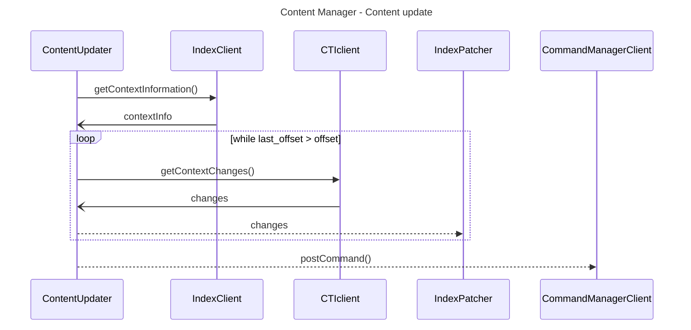

# Content Manager

The Content Manager is a plugin for Wazuh 5.0 responsible for the management of the Wazuh Catalog within the Indexer. The **catalog** is structured into **contexts**. Each context contains a collection of **resources**. Each **change** made to these resources generates a new **offset**. A **consumer** is a customized view of a context, and it's used to consume the catalog within the CTI API.

The Content Manager manages multiple Contexts, having a single Consumer each. These are preconfigured in the plugin by default, and not configurable.

The Content Manager periodically looks for new content on the CTI API by comparing the offsets. On its first run, the content is initialized using a snapshot. From there on, the content is patched to match the latest offset available. Simple information about the context, the consumer, the current offset and the snapshot URL are saved in an index.

The Content Manager also offers the possibility of offline content updates, from a snapshot file. The content is stored in indices.

On new content, the Content Manager generates a new command for the Command Manager.

1. [**ONLINE**] For each context, the scheduled job checks if there is new content available on the CTI API.
    1. If the offset is `0`, the context will be initialized from a snapshot
        1. The Content Manager gets the URL for the latest snapshot from `GET /api/v1/catalog/contexts/:context/consumers/:consumer`
        2. The Content Manager downloads the snapshot.
        3. The Content Manager unzips the snapshot.
        4. The Content Manager reads and indexes the content of the snapshot into an index using JSON Streaming.
        5. Generate a command for the Command Manager.
    2. If the offset is the same as the offset fetched from the CTI API for that context and consumer. The content is up-to-date and nothing needs to be done.
    3. If the offset is lower than the offset fetched from the CTI API for that context and consumer, so the content needs to be updated.
        1. Subtract the difference in offsets: `difference = latest_offsest - local_offset`
        2. While `difference > 0`
            - Fetch changes in batches of 1000 elements as maximum
            - Apply JSON-patch to the content.
        3. Generate a command for the Command Manager.
2. [**OFFLINE**] The Content Manager exposes an API endpoint that accepts the URI to the snapshot file (e.g. `file:///tmp/snapshot.zip`).
   1. From `1.1.2` to `1.1.5`



## Schema of the `wazuh-content` index

[ONLINE]
```json
[
  {
    "_index": "wazuh-content",
    "_id": "vd_1.0.0",
    "_source": {
      "vd_4.8.0": {
        "offset": 75019,
        "last_offset": 85729
      }
    }
  },
]
```
[OFFLINE] or [INITIALIZATION]
```json
[
  {
    "_index": "wazuh-content",
    "_id": "vd_1.0.0",
    "_source": {
      "vd_4.8.0": {
        "offset": 0,
        "snapshot": "uri-to-snapshot"
      }
    }
  }
]
```
