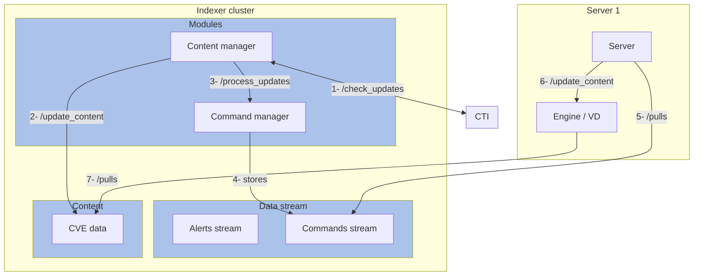
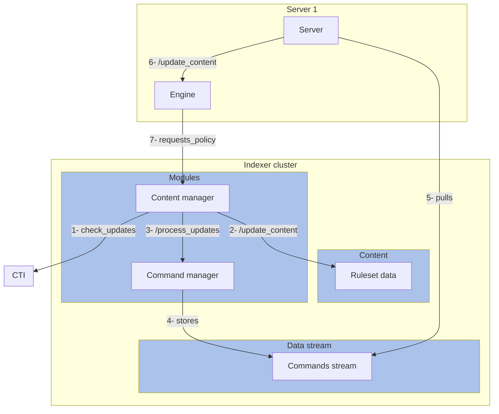
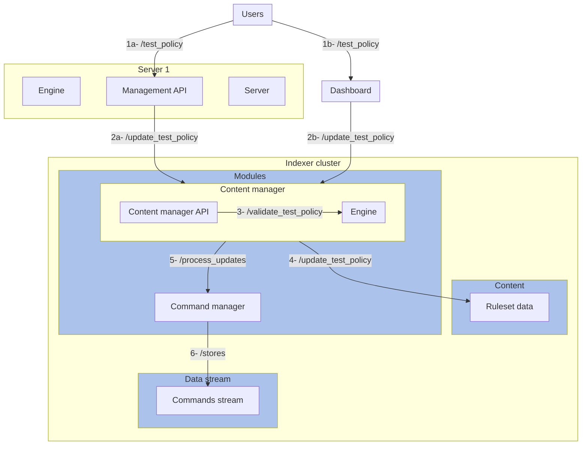
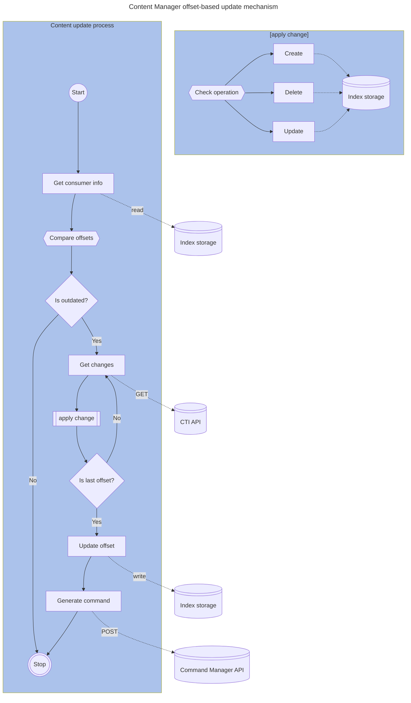

# Architecture

## Use case: sync content from CTI to Indexer

Wazuh Indexer will store threat intelligence content such as CVE definitions or rules in indices for its distribution to the Servers (Engine).

### CVEs context

In the case of CVEs, the new content is fetched periodically by the Content Manager from the CTI API (**1**). Following a successful update of the content (**2**), the Content Manager generates a command (**3**) (**4**) to notify about new content being available. Ultimately, the Server's periodic search for new commands reads the notification about the new content (**5**) and notifies the Engine (**6**), that updates its CVE content with the latest copy in the Indexer's CVE index (**7**).

### Ruleset context

In the case of the ruleset, the new content is fetched periodically by the Content Manager from the CTI API (**1**). Following a successful update of the content (**2**), the Content Manager generates a command (**3**) (**4**) to notify about new content being available. Ultimately, the Server's periodic search for new commands reads the notification about the new content (**5**) and notifies the Engine (**6**), that updates its ruleset content (**7**).

## Use case: save user-made content to Indexer

Wazuh Indexer will store user-made content, such as custom rules, in indices for its distribution to the Servers (Engine).

Users may create new content by interacting with the Management API (**1a**) or UI (**1b**). In any case, the new content arrives to the Content Manager API (**2a**) (**2b**). The Content Manager validates the data (**3**), and stores it on the appropriate index (**4**) in case of being valid. Ultimately, the Content Manager generates a command (**5**)  (**6**) To notify about new content being available.

## Content update process

The update process of the Content Manager compares the offset values for the consumer

To update the content, the Content Manager uses the CTI client to fetch the changes. It then processes the data and transforms it into create, update or delete operations to the content index. When the update is completed, it generates a command for the Command Manager using the API.

The Content Updater module is the orchestrator of the update process, delegating the fetching and indexing operations to other modules.

The update process is as follows:

1. The Content Updater module compares the "offsets" in the `wazuh-context` index. If these values differ, it means that the version of the content in the Indexer and in CTI are different.
2. If the content is outdated, it requests the CTI API for the newest changes, which are in JSON patch format. For performance purposes, these changes are obtained in chunks.
3. Each of these chunks are applied to the content one by one. If the operation fails, the update process is interrupted and a recovery from a snapshot is required.
4. The update continues until the offsets are equal.
5. Once completed, the update is committed by updating the offset in the `wazuh-context` index and generating a command for the Command Manager notifying about the update's success.

