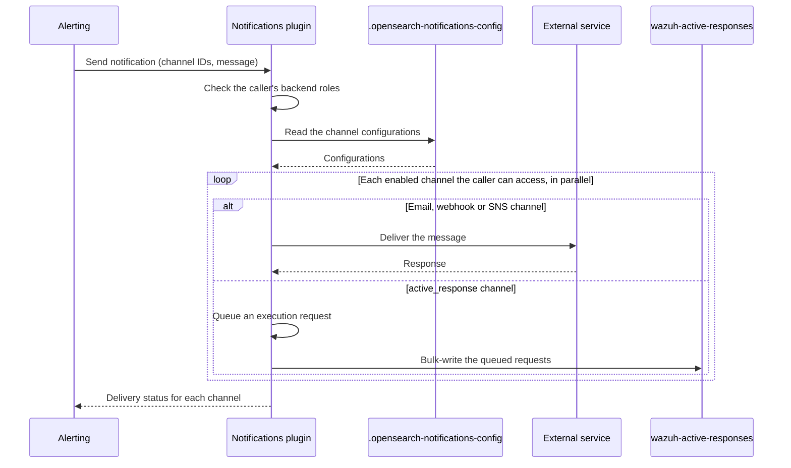

# Architecture

The Notifications plugin follows a layered architecture that separates destination definitions, transport logic, and plugin orchestration.

## High-level architecture

The Notifications plugin runs inside the Wazuh Indexer and acts as a bridge between internal producers of alerts (such as Alerting, Reporting, and ISM) and external delivery services like SMTP servers, webhooks, and AWS services.

At a high level, the architecture is composed of three main parts:

- **Notification producers (inside the Indexer)**
  Internal plugins such as **Alerting**, **Reporting**, **ISM**, and other Wazuh Indexer components generate alerts and events. When they need to send a notification (for example, a Slack message or an email), they call the **Notifications plugin** either through the **REST API** exposed by the Indexer, or internal transport actions.

- **Notifications plugin (inside the Indexer)**
  The plugin itself is structured in several layers:

  - **REST / Transport layer** — exposes the `/_plugins/_notifications/...` REST endpoints. Receives requests to create, update, list, and delete notification channel configurations, send test notifications, and query features. Validates requests and delegates the work internally.
  - **Security integration** — uses the Security plugin to validate permissions for each request. When `filter_by_backend_roles` is enabled, it filters which notification configurations each user can see or use based on backend roles.
  - **Destination and transport layer** — defines each supported channel type (Slack, Chime, Microsoft Teams, custom webhook, SMTP, SES, SNS) and the corresponding delivery logic. Manages HTTP client pools, connection and socket timeouts, host deny lists, and HTTP response size limits. Reads SMTP credentials from the Wazuh Indexer keystore. SES and SNS authenticate with the AWS default credentials chain, optionally assuming the IAM role set in the channel's `role_arn`.
  - **Persistence and configuration** — stores notification channel configurations in the `.opensearch-notifications-config` system index, and uses the `.opensearch-notifications-config-locks` system index to serialize the [resource creation limit](configuration.md#resource-creation-limits-pluginsnotifications) checks. The plugin keeps no record of the notifications it sends.

- **External destination services (outside the Indexer)**
  After the plugin resolves the destination type, the corresponding transport sends the message to SMTP servers (corporate mail, Gmail, etc.), webhook endpoints (Slack, Microsoft Teams, Amazon Chime, custom HTTP integrations), or AWS services such as SES and SNS.

  Once delivery is attempted, the plugin returns a delivery status for each channel (a status code and text) to the caller (Alerting, Reporting, or the user calling the REST API). The status is not stored.

The `active_response` channel type is the exception: it delivers nothing to an external service. It writes an execution request to the `wazuh-active-responses` data stream, which the Wazuh Manager reads to run the response on agents. See [Active Response](../alerting/index.md#active-response).

For the underlying module layout, class hierarchy, and REST handler mapping, see the [development guide](../../../dev/plugins/notifications.md).

## Send notification sequence

The following sequence describes the flow when an internal plugin (e.g., Alerting) sends a notification:

1. The alerting monitor triggers an alert and calls the Notification plugin via the internal transport interface.
2. The plugin verifies the caller: when `filter_by_backend_roles` is enabled, a user without backend roles is rejected.
3. The plugin reads the channel configurations from the `.opensearch-notifications-config` index. A channel that does not exist, that the caller cannot access, or that is disabled gets an error status and receives nothing.
4. For each remaining channel, in parallel, the plugin resolves the destination type and delegates to the matching transport (email via SMTP or SES, webhook for Slack/Chime/Teams/custom, or SNS). The plugin has no retry setting: only the default retry policy of its HTTP client applies, to webhook deliveries. An `active_response` channel instead queues an execution request built from the event that triggered the alert. Queued requests are bulk-written to the `wazuh-active-responses` data stream every `opensearch.notifications.active_response.bulk_flush_interval_ms`, or as soon as `opensearch.notifications.active_response.bulk_max_actions` requests accumulate.
5. The plugin returns the delivery status of each channel to the caller. If any channel fails, the call fails and carries the status of every channel.
6. The calling plugin acknowledges the result and updates its own alert status.

## Configuration management sequence

1. A user (via Dashboard or REST API) creates or updates a notification channel configuration.
2. The configuration is validated and persisted in the `.opensearch-notifications-config` index. Creations are first checked against the resource creation limits.
3. On retrieval, configurations can be filtered by type, name, status, and other fields.
