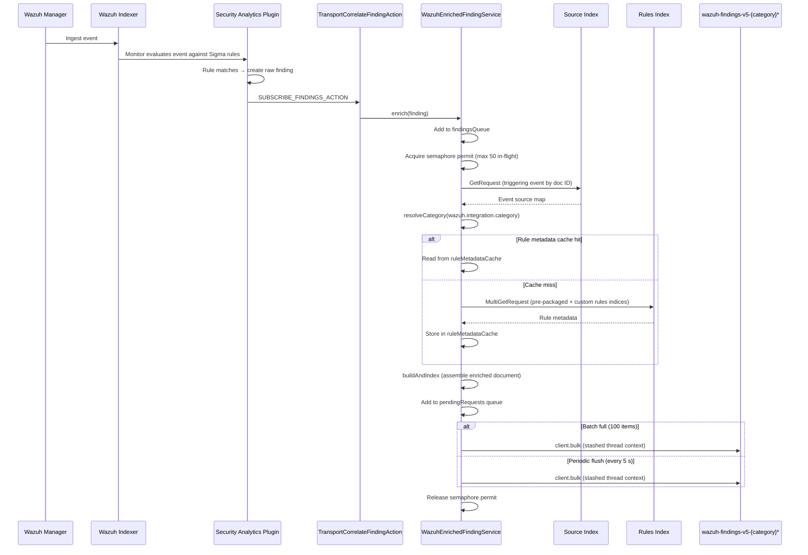

# Architecture

## Enrichment pipeline

When SAP produces a finding, `WazuhEnrichedFindingService` runs an asynchronous enrichment chain that fetches the triggering event and the matching rule's metadata, assembles an enriched document, and bulk-indexes it into `wazuh-findings-v5-{category}*`.

The complete flow is shown in the sequence diagram below:

## Detector Provisioning

Threat detectors for Wazuh integrations are created dynamically based on CTI content. The system has moved away from hardcoded configurations to a request-driven model via `WIndexDetectorRequest`.

### Dynamic Detector Factory

The `DetectorFactory` class is responsible for assembling the `Detector` object. Instead of using fixed values, it now consumes parameters provided by the Content Manager:

- **Enabled Status**: Controlled by CTI to activate or deactivate detectors globally.
- **Scan Interval**: Customizable per integration (e.g., critical integrations can have shorter intervals).
- **Source Indices**: Defines the target indices or index patterns the detector will monitor.

#### Fallback Logic
To ensure system stability, the `DetectorFactory` implements a fallback mechanism for source indices:
- If the `sources` list is provided and not empty, it is used as the detector's input.
- If `sources` is null or empty, the factory defaults to the legacy pattern: `wazuh-events-v5-{category}`.

## Implementation details

### Fire-and-forget execution

`WazuhEnrichedFindingService.enrich()` returns immediately after adding the finding to the internal queue. All network I/O and document assembly happen on async transport threads. Failures are logged at `WARN` level and never surface to the SAP write path.

### Bounded concurrency

A `Semaphore` with `MAX_IN_FLIGHT` permits limits how many enrichment chains run simultaneously. Findings that arrive while all permits are held are queued in a `ConcurrentLinkedQueue` and processed as permits become available. This prevents transport-layer overload on resource-constrained nodes.

### Rule metadata cache

Rule metadata (severity level, compliance mappings, MITRE ATT&CK tags) is stored in an in-memory `ConcurrentHashMap` keyed by rule ID. On the first finding for a given rule, the service issues a `MultiGetRequest` against both the pre-packaged rules index (`opensearch-pre-packaged-rules`) and the custom rules index (`opensearch-custom-rules`). Subsequent findings from the same detector reuse the cached entry, eliminating repeated round-trips.

The cache is unbounded and lives for the lifetime of the node. It is cleared only on plugin reload or node restart.

### Bulk indexing

Index requests are accumulated in a `ConcurrentLinkedQueue<IndexRequest>`. Two flush paths drain this queue:

- **Batch trigger**: every time `pendingCount` reaches a multiple of `BULK_BATCH_SIZE`, the thread that incremented the counter calls `drainAndFlush()` immediately.
- **Periodic flush**: a fixed-delay scheduler fires `drainAndFlush()` every `FLUSH_INTERVAL` to drain any remainder that has not yet reached the batch threshold.

`drainAndFlush()` polls all pending requests into a single `BulkRequest` and calls `client.bulk()`. The call is wrapped in `threadPool.getThreadContext().stashContext()` so the security plugin accepts the request regardless of which thread pool the flush runs on.

### Category resolution

Before assembling an enriched document, the service reads `wazuh.integration.category` from the triggering event. If the field is absent or its value is not one of the recognized `LOG_CATEGORY` values, enrichment is skipped for that finding and a `WARN` log entry is emitted.

### Dynamic Configuration Injection
The `WTransportIndexDetectorAction` serves as the entry point for detector creation. It extracts the `enabled`, `interval`, and `sources` fields from the `WIndexDetectorRequest` and injects them into the factory method. This ensures that any change in the CTI catalog is reflected in the Security Analytics engine without requiring code changes or restarts.

## Technical parameters

| Parameter            | Value                            | Description                                                     |
| -------------------- | -------------------------------- | --------------------------------------------------------------- |
| `BULK_BATCH_SIZE`    | `100`                            | Pending index requests accumulated before a batch-trigger flush |
| `MAX_IN_FLIGHT`      | `50`                             | Maximum concurrent async enrichment chains                      |
| `FLUSH_INTERVAL`     | `5 s`                            | Interval between periodic flush runs                            |
| Target data stream   | `wazuh-findings-v5-{category}*`  | Data stream destination, resolved per finding                   |
| Rule metadata cache  | Unbounded, in-memory             | `ConcurrentHashMap`, keyed by rule ID, cleared on restart       |
| Index operation type | `CREATE`                         | Prevents overwriting existing enriched findings                 |

## System indices

| Index                                   | Description                                                  |
| --------------------------------------- | ------------------------------------------------------------ |
| `.opensearch-sap-{category}-findings-*` | Raw SAP findings written by the Security Analytics Plugin    |
| `.opensearch-pre-packaged-rules`        | Wazuh-provided Sigma rules; source for rule metadata         |
| `.opensearch-custom-rules`              | User-created custom rules; fallback source for rule metadata |
| `wazuh-findings-v5-{category}*`         | Enriched findings written by `WazuhEnrichedFindingService`   |
