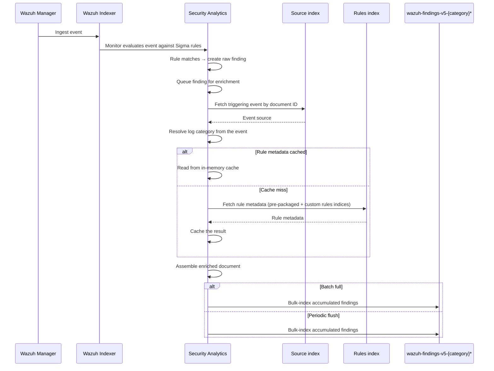

# Architecture

## Enrichment pipeline

When a Sigma rule matches an event, Security Analytics writes a raw finding, and an asynchronous enrichment step fetches the triggering event and the matching rule's metadata, assembles an enriched document, and bulk-indexes it into `wazuh-findings-v5-{category}*`.

The complete flow is shown in the sequence diagram below:

Enrichment is fire-and-forget: it never blocks the write path for the raw finding, and failures are logged without propagating to the caller. Concurrency is bounded so that heavy finding volume can't overload the transport layer; findings that arrive while the concurrency limit is reached are queued and processed as capacity frees up.

## Detector provisioning

Threat detectors for Wazuh integrations are created dynamically based on CTI content rather than fixed configuration:

- **Enabled status**: controlled by CTI to activate or deactivate detectors globally.
- **Scan interval**: customizable per integration (e.g., critical integrations can have shorter intervals).
- **Source indices**: defines the target indices or index patterns the detector monitors. If no source indices are provided, the detector falls back to the legacy per-category events pattern.

Any change in the CTI catalog is reflected in detector configuration without requiring code changes or restarts.

## Behavior notes

- **Rule metadata caching**: rule metadata (severity level, compliance mappings, MITRE ATT&CK tags) is cached in memory, keyed by rule ID, so repeated findings from the same detector don't repeatedly query the rules indices. The cache size is bounded by `enriched_findings_rule_cache_max_size` (see [Configuration](configuration.md)); least-recently-used entries are evicted and re-fetched on demand.
- **Category resolution**: if the triggering event doesn't carry a recognized log category, enrichment is skipped for that finding and a warning is logged.
- **Document layout**: the enriched document is a copy of the triggering event's source, with rule metadata nested under `wazuh.rule` (id, title, tags, and any of level, status, compliance, MITRE present in the rule). The original event source is never mutated.
- **Write semantics**: enriched findings are indexed as new documents, never overwriting an existing enriched finding for the same event.

## Technical parameters

See [Configuration](configuration.md) for the settings that control batch size, flush interval, concurrency, and cache size.

## System indices

| Index                                   | Description                                                  |
| --------------------------------------- | ------------------------------------------------------------ |
| `.opensearch-sap-{category}-findings-*` | Raw findings written by the Security Analytics plugin        |
| `.opensearch-pre-packaged-rules`        | Wazuh-provided Sigma rules; source for rule metadata         |
| `.opensearch-custom-rules`              | User-created custom rules; fallback source for rule metadata |
| `wazuh-findings-v5-{category}*`         | Enriched findings                                             |
