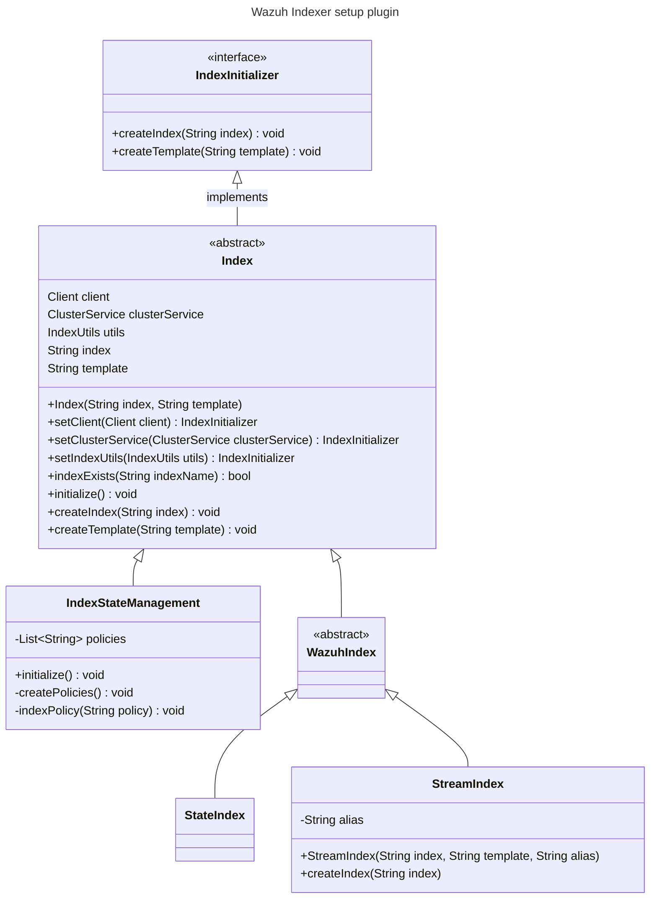
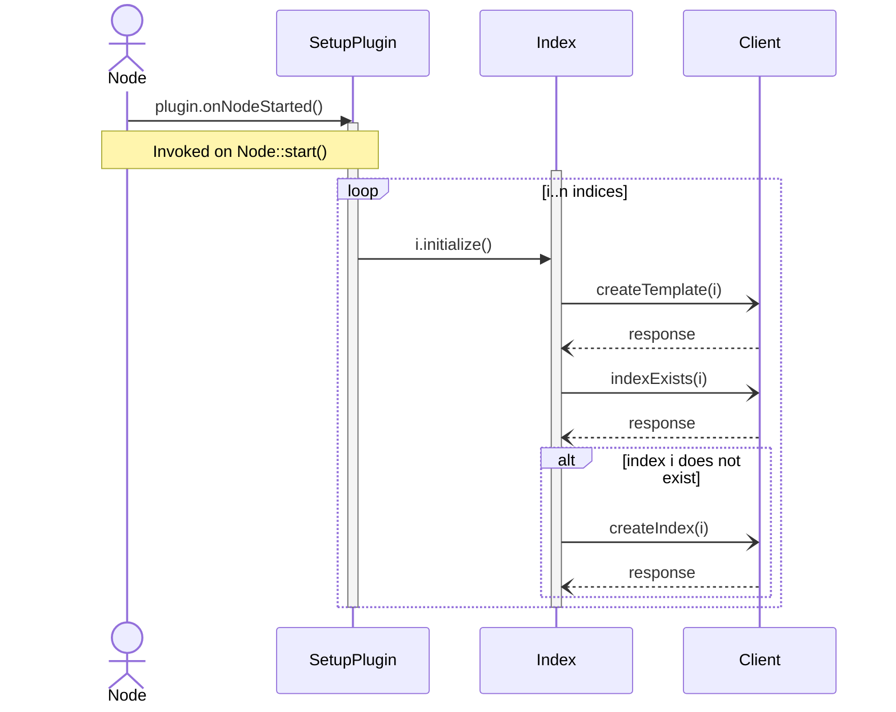

# Architecture

## Design

The plugin implements the [ClusterPlugin](https://github.com/opensearch-project/OpenSearch/blob/3.1.0/server/src/main/java/org/opensearch/plugins/ClusterPlugin.java) interface in order to be able to hook into the node’s lifecycle overriding the `onNodeStarted()` method.

The `SetupPlugin` class holds the list of indices to create. The logic for the creation of the index templates and the indices is encapsulated in the `Index` abstract class. Each subclass can override this logic if necessary. The `SetupPlugin::onNodeStarted()` method invokes the `Index::initialize()` method, effectively creating every index in the list.

By design, the plugin will overwrite any existing index template under the same name.

## Class diagram



## Sequence diagram

> **Note** Calls to `Client` are asynchronous.




## Wazuh Common Schema

Refer to the [docs](https://github.com/wazuh/wazuh-indexer-plugins/tree/main/ecs) for complete definitions of the indices. The indices inherit the settings and mappings defined in the [index templates](https://github.com/wazuh/wazuh-indexer-plugins/tree/main/plugins/setup/src/main/resources).

## JavaDoc

The plugin is documented using JavaDoc. You can compile the documentation using the Gradle task for that purpose. The generated JavaDoc is in the **build/docs** folder.

```bash
./gradlew javadoc
```

## Wazuh default Internal Users

Wazuh defines internal users and roles for the different Wazuh components to handle index management.

These users and roles are defined in the `internal_users.wazuh.yml`, `roles.wazuh.yml`, and `roles_mapping.wazuh.yml` files on the `distribution/src/config/security` directory from the [Wazuh Indexer repository](https://github.com/wazuh/wazuh-indexer).

### Users

| User             | Description                                                                                     | Roles                                                                                                                       |
| ---------------- | ----------------------------------------------------------------------------------------------- | ---------------------------------------------------------------------------------------------------------------------------- |
| `wazuh-server`    | Server-side user with read/write access to stateful and write-only access to stateless.         | `stateless-write`, `stateful-delete`, `stateful-write`, `stateful-read`|
| `wazuh-dashboard` | Dashboard user with read access to stateful/stateless, and write access to monitoring indices.  | `sample-data-management`, `metrics-write`, `metrics-read`, `stateless-read`, `stateful-read` |

---

### Roles

| Role Name                | Access Description                                                   | Index Patterns                           | Permissions                         |
| ------------------------ | -------------------------------------------------------------------- | ---------------------------------------- | ----------------------------------- |
| `stateful-read`          | Read-only access to stateful index data                              | `wazuh-states-*`                         | `read`                              |
| `stateful-write`         | Write-only access to stateful index data                             | `wazuh-states-*`                         | `index`                             |
| `stateful-delete`        | Delete access to stateful index data                                 | `wazuh-states-*`                         | `delete`                            |
| `stateless-read`         | Read-only access to stateless alert and archive indexes              | `wazuh-alerts*`, `wazuh-archives*`       | `read`                              |
| `stateless-write`        | Write-only access to stateless alert and archive indexes             | `wazuh-alerts*`, `wazuh-archives*`       | `index`                             |
| `metrics-read`           | Read access to monitoring and statistics indexes                     | `wazuh-monitoring*`, `wazuh-statistics*` | `read`                              |
| `metrics-write`          | Write access to monitoring and statistics indexes                    | `wazuh-monitoring*`, `wazuh-statistics*` | `index`                             |
| `sample-data-management` | Full access to internal dashboard sample data                        | `*-sample-*`                             | `data_access`, `manage`             |

---

## Configuration Files

### `roles.wazuh.yml`

<details><summary>full yaml file</summary>

```yaml
stateful-read:
  cluster_permissions: []
  index_permissions:
  - index_patterns:
    - "wazuh-states-*"
    dls: ""
    fls: []
    masked_fields: []
    allowed_actions:
    - "read"
  tenant_permissions: []
  static: true

stateful-write:
  cluster_permissions: []
  index_permissions:
  - index_patterns:
    - "wazuh-states-*"
    dls: ""
    fls: []
    masked_fields: []
    allowed_actions:
    - "index"
  tenant_permissions: []
  static: true

stateful-delete:
  cluster_permissions: []
  index_permissions:
  - index_patterns:
    - "wazuh-states-*"
    dls: ""
    fls: []
    masked_fields: []
    allowed_actions:
    - "delete"
  tenant_permissions: []
  static: true

stateless-read:
  cluster_permissions: []
  index_permissions:
  - index_patterns:
    - "wazuh-alerts*"
    - "wazuh-archives*"
    dls: ""
    fls: []
    masked_fields: []
    allowed_actions:
    - "read"
  tenant_permissions: []
  static: true

stateless-write:
  cluster_permissions: []
  index_permissions:
  - index_patterns:
    - "wazuh-alerts*"
    - "wazuh-archives*"
    dls: ""
    fls: []
    masked_fields: []
    allowed_actions:
    - "index"
  tenant_permissions: []
  static: true

metrics-read:
  cluster_permissions: []
  index_permissions:
  - index_patterns:
    - "wazuh-monitoring*"
    - "wazuh-statistics*"
    dls: ""
    fls: []
    masked_fields: []
    allowed_actions:
    - "read"
  tenant_permissions: []
  static: true

metrics-write:
  cluster_permissions: []
  index_permissions:
  - index_patterns:
    - "wazuh-monitoring*"
    - "wazuh-statistics*"
    dls: ""
    fls: []
    masked_fields: []
    allowed_actions:
    - "index"
  tenant_permissions: []
  static: true

sample-data-management:
  cluster_permissions: []
  index_permissions:
  - index_patterns:
    - "*-sample-*"
    dls: ""
    fls: []
    masked_fields: []
    allowed_actions:
    - "data_access"
    - "manage"
  tenant_permissions: []
  static: true
```
</details>

---

### `internal_users.wazuh.yml`

<details><summary>full yaml file</summary>

```yaml
wazuh-server:
  # The hash is the hash of the password "wazuh-server"
  hash: "$2y$12$4pwjkynhYg09QJtJ5zxAcuqUSOV8JBziFDca6u9cV/H9oglVCGZEW"
  reserved: true
  backend_roles: []
  description: "Wazuh Server user with read/write access to stateful and write-only access to stateless indexes."

wazuh-dashboard:
  # The hash is the hash of the password "wazuh-dashboard"
  hash: "$2y$12$Mn2XvokTfwo2NWL2AK83yOkio1qmJyZrAp0iEWqs3lz0L8ruhu9LK"
  reserved: true
  backend_roles: []
  description: "Wazuh Dashboard user with read access to stateful and stateless indexes, write access to metrics indexes and management for sample data indexes."
```
</details>

---

### `roles_mapping.wazuh.yml`

<details><summary>full yaml file</summary>

```yaml
stateful-read:
  reserved: true
  hidden: false
  backend_roles: []
  hosts: []
  users:
    - "wazuh-server"
    - "wazuh-dashboard"
  and_backend_roles: []

stateful-write:
  reserved: true
  hidden: false
  backend_roles: []
  hosts: []
  users:
    - "wazuh-server"
  and_backend_roles: []

stateful-delete:
  reserved: true
  hidden: false
  backend_roles: []
  hosts: []
  users:
    - "wazuh-server"
  and_backend_roles: []

stateless-write:
  reserved: true
  hidden: false
  backend_roles: []
  hosts: []
  users:
    - "wazuh-server"
  and_backend_roles: []

stateless-read:
  reserved: true
  hidden: false
  backend_roles: []
  hosts: []
  users:
    - "wazuh-dashboard"
  and_backend_roles: []

metrics-read:
  reserved: true
  hidden: false
  backend_roles: []
  hosts: []
  users:
    - "wazuh-dashboard"
  and_backend_roles: []

metrics-write:
  reserved: true
  hidden: false
  backend_roles: []
  hosts: []
  users:
    - "wazuh-dashboard"
  and_backend_roles: []

sample-data-management:
  reserved: true
  hidden: false
  backend_roles: []
  hosts: []
  users:
    - "wazuh-dashboard"
  and_backend_roles: []
```
</details>
