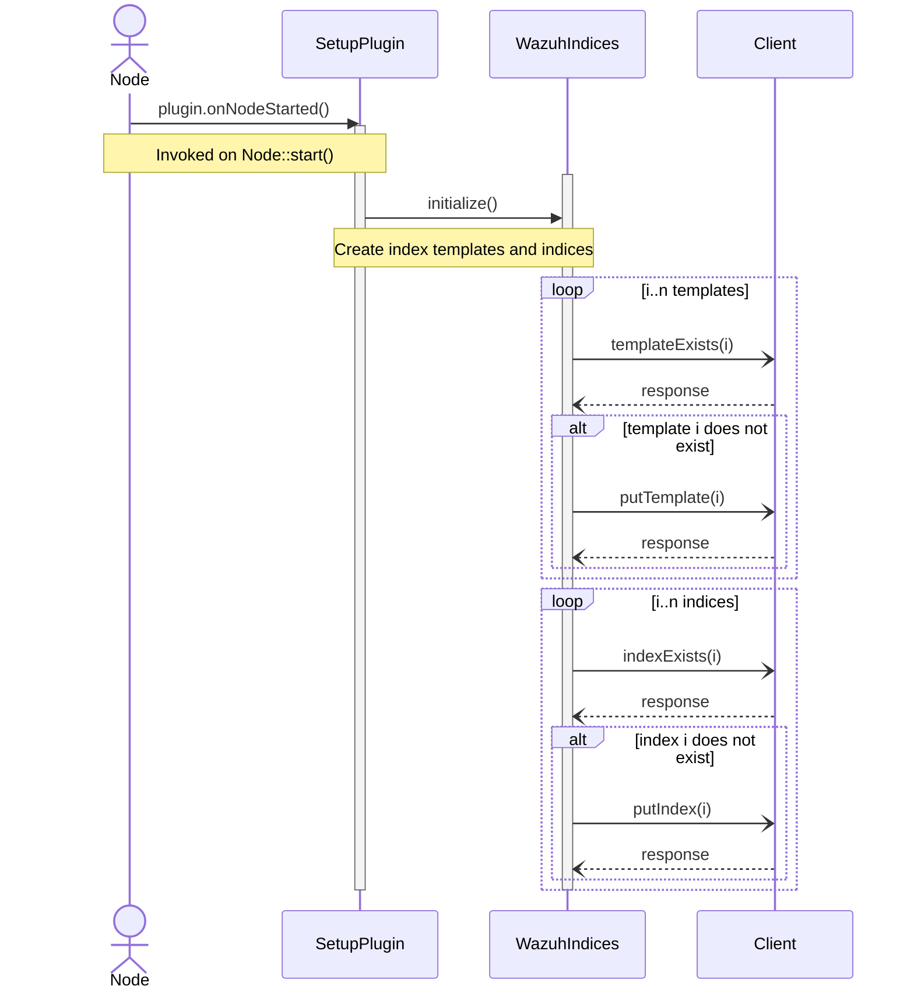
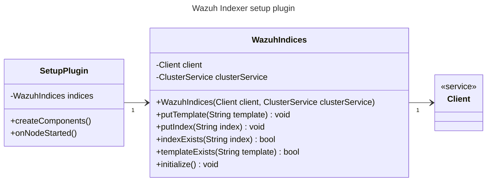

# Architecture

## Design

The plugin implements the [ClusterPlugin](https://github.com/opensearch-project/OpenSearch/blob/2.13.0/server/src/main/java/org/opensearch/plugins/ClusterPlugin.java) interface in order to be able to hook into the node’s lifecycle overriding the `onNodeStarted()` method. The logic for the creation of the index templates and the indices is encapsulated in the `WazuhIndices` class. The `onNodeStarted()` method invokes the `WazuhIndices::initialize()` method, which handles everything.

By design, the plugin will overwrite any existing index template under the same name.

## JavaDoc

The plugin is documented using JavaDoc. You can compile the documentation using the Gradle task for that purpose. The generated JavaDoc is in the **build/docs** folder.

```bash
./gradlew javadoc
```

## Indices

Refer to the [docs](https://github.com/wazuh/wazuh-indexer-plugins/tree/main/ecs) for complete definitions of the indices. The indices inherit the settings and mappings defined in the [index templates](https://github.com/wazuh/wazuh-indexer-plugins/tree/main/plugins/setup/src/main/resources).

## Sequence diagram

> **Note** Calls to `Client` are asynchronous.




## Class diagram


