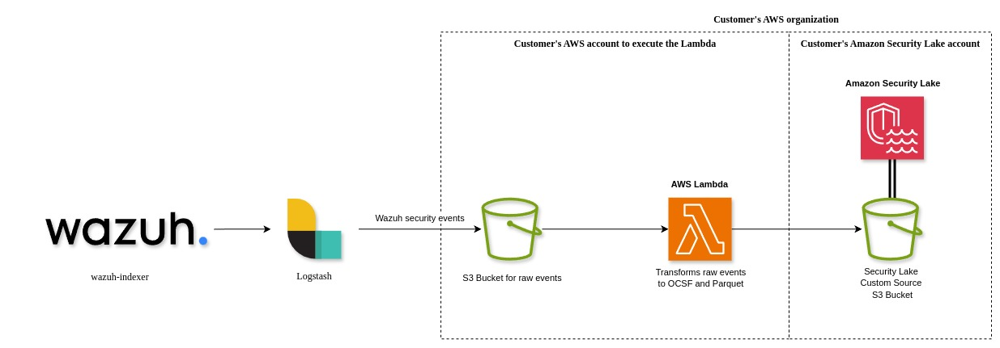
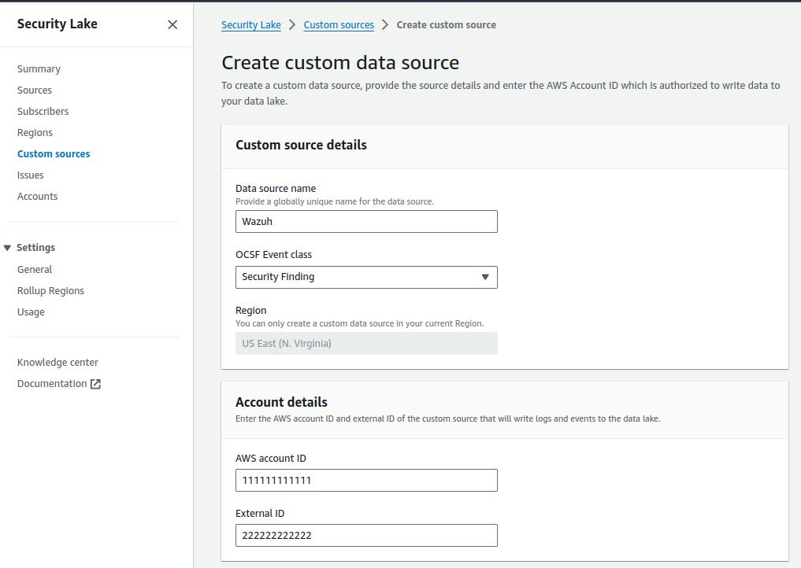
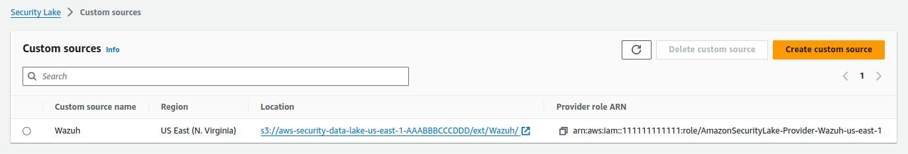
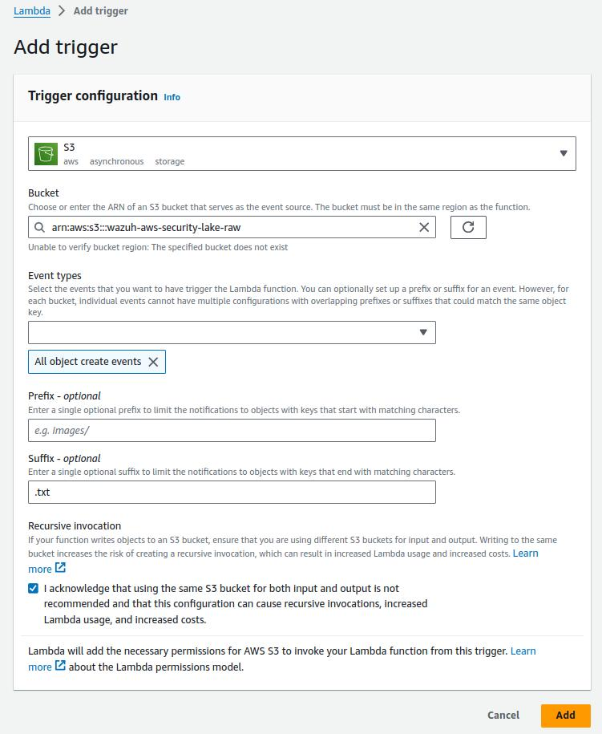

# Wazuh to Amazon Security Lake Integration Guide

## Table of Contents

- [Wazuh to Amazon Security Lake Integration Guide](#wazuh-to-amazon-security-lake-integration-guide)
  - [Table of Contents](#table-of-contents)
  - [Introduction](#introduction)
    - [Amazon Security Lake](#amazon-security-lake)
    - [Open Cybersecurity Schema Framework](#open-cybersecurity-schema-framework)
    - [Wazuh Security Events](#wazuh-security-events)
    - [Wazuh Security Events to Amazon Security Lake](#wazuh-security-events-to-amazon-security-lake)
  - [Prerequisites](#prerequisites)
  - [Integration guide](#integration-guide)
    - [Configure Amazon Security Lake](#configure-amazon-security-lake)
      - [Create a custom source for Wazuh](#create-a-custom-source-for-wazuh)
    - [Create an S3 bucket to store events](#create-an-s3-bucket-to-store-events)
    - [Create an AWS Lambda function](#create-an-aws-lambda-function)
    - [Validation](#validation)
    - [Install and configure Logstash](#install-and-configure-logstash)
      - [Configure the Logstash pipeline](#configure-the-logstash-pipeline)
      - [Running Logstash](#running-logstash)
  - [OCSF Mapping](#ocsf-mapping)
    - [Metadata](#metadata)
      - [Security events](#security-events)
  - [Troubleshooting](#troubleshooting)
  - [Support](#support)

## Introduction

### Amazon Security Lake

Amazon Security Lake automatically centralizes security data from AWS environments, SaaS providers, on premises, and cloud sources into a purpose-built data lake stored in your account. With Security Lake, you can get a more complete understanding of your security data across your entire organization. You can also improve the protection of your workloads, applications, and data. Security Lake has adopted the Open Cybersecurity Schema Framework (OCSF), an open standard. With OCSF support, the service normalizes and combines security data from AWS and a broad range of enterprise security data sources.

### Open Cybersecurity Schema Framework

The Open Cybersecurity Schema Framework is an open-source project, delivering an extensible framework for developing schemas, along with a vendor-agnostic core security schema. Vendors and other data producers can adopt and extend the schema for their specific domains. Data engineers can map differing schemas to help security teams simplify data ingestion and normalization, so that data scientists and analysts can work with a common language for threat detection and investigation. The goal is to provide an open standard, adopted in any environment, application, or solution, while complementing existing security standards and processes.

### Wazuh Security Events

Wazuh uses rules to monitor the events and logs in your network to detect security threats. When the events and logs meet the test criteria that is defined in the rules, an alert is created to show that a security attack or policy breach is suspected.

**References**:

- https://documentation.wazuh.com/current/user-manual/ruleset/getting-started.html#github-repository
- https://github.com/wazuh/wazuh/tree/main/ruleset/rules
- https://github.com/wazuh/wazuh/blob/main/extensions/elasticsearch/7.x/wazuh-template.json

### Wazuh Security Events to Amazon Security Lake

Wazuh Security Events can be converted to OCSF events and Parquet format, required by Amazon Security Lake, by using an AWS Lambda Python function, a Logstash instance and an AWS S3 bucket.

A properly configured Logstash instance can send the Wazuh Security events to an AWS S3 bucket, automatically invoking the AWS Lambda function that will transform and send the events to the Amazon Security lake dedicated S3 bucket.

The diagram below illustrates the process of converting Wazuh Security Events to OCSF events and to Parquet format for Amazon Security Lake:



> The diagram above represents the recommended deployment using cross-account. Although recommended, the use of cross-account is not mandatory.

## Prerequisites

1. Amazon Security Lake is enabled.
2. At least one up and running `wazuh-indexer` instance with populated `wazuh-alerts-4.x-*` indices.
3. A Logstash instance.
4. An S3 bucket to store raw events.
5. An AWS Lambda function, using the Python 3.12 runtime.
6. (Optional) An S3 bucket to store OCSF events, mapped from raw events.
7. (Optional) Two AWS accounts:
    - One to execute the AWS Lambda function, referred to as Lambda AWS Account.
    - One for Amazon Security Lake, referred to as Security Lake AWS Account.

## Integration guide

### Configure Amazon Security Lake

On Security Lake AWS Account, enable Amazon Security Lake as per the [official instructions](https://docs.aws.amazon.com/security-lake/latest/userguide/what-is-security-lake.html).

#### Create a custom source for Wazuh

Follow the [official documentation](https://docs.aws.amazon.com/security-lake/latest/userguide/custom-sources.html) to register Wazuh as a custom source.

To create the custom source:

1. From the Amazon Security Lake console, click on _Custom Sources_.
2. Click on the _Create custom source_ button.
3. Enter "Wazuh" as the _Data source name_.
4. Select "Security Finding" as the _OCSF Event class_.
5. For _Account details_, enter the AWS account ID and External ID of the custom source that will write logs and events to the data lake.
6. For _Service Access_, create and use a new service role or use an existing service role that gives Security Lake permission to invoke AWS Glue.
   
   Ensure the policy created for the Role associated with the Custom Source matches the policy below:
   ```json
    {
        "Version": "2025-04-04",
        "Statement": [
            {

                "Sid": "1",
                "Effect": "Allow",
                "Principal": {
                    "AWS": "arn:aws:iam::<Lambda AWS Account ID>:root"
                },
                "Action": "sts:AssumeRole"
            }
        ]
    }
   ```
7. Choose _Create_. Upon creation, Amazon Security Lake automatically creates an AWS Service Role with permissions to push files into the Security Lake bucket, under the proper prefix named after the custom source name. An AWS Glue Crawler is also created to populate the AWS Glue Data Catalog automatically.
   
8. Finally, collect the S3 bucket details, as these will be needed in the next step. Make sure you have the following information:
   - The Amazon Security Lake S3 region.
   - The S3 bucket name (e.g, `aws-security-data-lake-us-east-1-AAABBBCCCDDD`).

### Create an S3 bucket to store events

On the Lambda AWS Account, follow the [official documentation](https://docs.aws.amazon.com/AmazonS3/latest/userguide/create-bucket-overview.html) to create an S3 bucket within your organization. Use a descriptive name, for example: `wazuh-aws-security-lake-raw`.

### Create an AWS Lambda function

On the Lambda AWS Account, follow the [official documentation](https://docs.aws.amazon.com/lambda/latest/dg/getting-started.html) to create an AWS Lambda:

- Select Python 3.12 as the runtime.
- Configure the runtime to have 512 MB of memory and 30 seconds timeout.
- Configure a trigger so every object with `.txt` extension uploaded to the S3 bucket created previously invokes the Lambda.
  
- Use the [Makefile](./Makefile) to generate the zip package `wazuh_to_amazon_security_lake.zip`, and upload it to the S3 bucket created previously as per [these instructions](https://docs.aws.amazon.com/lambda/latest/dg/gettingstarted-package.html#gettingstarted-package-zip). See [CONTRIBUTING](./CONTRIBUTING.md) for details about the Makefile.
- Configure the Lambda with the at least the required _Environment Variables_ below:

  | Environment variable | Required | Value                                                                                                    |
  | -------------------- | -------- | -------------------------------------------------------------------------------------------------------- |
  | AWS_BUCKET           | True     | The name of the Custom Source S3 bucket in the **Security Lake AWS Account**                             |
  | SOURCE_LOCATION      | True     | The _Data source name_ of the _Custom Source_                                                            |
  | ACCOUNT_ID           | True     | Enter the ID that you specified when creating your Amazon Security Lake custom source                    |
  | ROLE_ARN             | True     | The ARN of the role that the Lambda function assumes to write data to the Amazon Security Lake S3 bucket |
  | EXTERNAL_ID          | True     | The External ID that you specified when creating your Amazon Security Lake custom source                 |
  | REGION               | True     | The AWS Region of the AWS Lambda                                                                         |
  | S3_BUCKET_OCSF       | False    | The name of the S3 bucket created to store the OCSF events in the **Lambda AWS Account**                 |
  | OCSF_CLASS           | False    | The OCSF class to map the events into. Can be "SECURITY_FINDING" (default) or "DETECTION_FINDING".       |

### Validation

To validate that the Lambda function works as it should, add the sample events below to the `sample.txt` file and upload it to the S3 bucket.

```
{"cluster":{"name":"wazuh-cluster","node":"wazuh-manager"},"timestamp":"2024-04-22T14:20:46.976+0000","rule":{"mail":false,"gdpr":["IV_30.1.g"],"groups":["audit","audit_command"],"level":3,"firedtimes":1,"id":"80791","description":"Audit: Command: /usr/sbin/crond"},"location":"","agent":{"id":"004","ip":"47.204.15.21","name":"Ubuntu"},"data":{"audit":{"type":"NORMAL","file":{"name":"/etc/sample/file"},"success":"yes","command":"cron","exe":"/usr/sbin/crond","cwd":"/home/wazuh"}},"predecoder":{},"manager":{"name":"wazuh-manager"},"id":"1580123327.49031","decoder":{},"@version":"1","@timestamp":"2024-04-22T14:20:46.976Z"}
{"cluster":{"name":"wazuh-cluster","node":"wazuh-manager"},"timestamp":"2024-04-22T14:22:03.034+0000","rule":{"mail":false,"gdpr":["IV_30.1.g"],"groups":["audit","audit_command"],"level":3,"firedtimes":1,"id":"80790","description":"Audit: Command: /usr/sbin/bash"},"location":"","agent":{"id":"007","ip":"24.273.97.14","name":"Debian"},"data":{"audit":{"type":"PATH","file":{"name":"/bin/bash"},"success":"yes","command":"bash","exe":"/usr/sbin/bash","cwd":"/home/wazuh"}},"predecoder":{},"manager":{"name":"wazuh-manager"},"id":"1580123327.49031","decoder":{},"@version":"1","@timestamp":"2024-04-22T14:22:03.034Z"}
{"cluster":{"name":"wazuh-cluster","node":"wazuh-manager"},"timestamp":"2024-04-22T14:22:08.087+0000","rule":{"id":"1740","mail":false,"description":"Sample alert 1","groups":["ciscat"],"level":9},"location":"","agent":{"id":"006","ip":"207.45.34.78","name":"Windows"},"data":{"cis":{"rule_title":"CIS-CAT 5","timestamp":"2024-04-22T14:22:08.087+0000","benchmark":"CIS Ubuntu Linux 16.04 LTS Benchmark","result":"notchecked","pass":52,"fail":0,"group":"Access, Authentication and Authorization","unknown":61,"score":79,"notchecked":1,"@timestamp":"2024-04-22T14:22:08.087+0000"}},"predecoder":{},"manager":{"name":"wazuh-manager"},"id":"1580123327.49031","decoder":{},"@version":"1","@timestamp":"2024-04-22T14:22:08.087Z"}
```

A successful execution of the Lambda function will map these events into the OCSF Security Finding Class and write them to the Amazon Security Lake S3 bucket in Paquet format, properly partitioned based on the Custom Source name, Account ID, AWS Region and date, as described in the [official documentation](https://docs.aws.amazon.com/security-lake/latest/userguide/custom-sources.html#custom-sources-best-practices).

### Install and configure Logstash

Install Logstash on a dedicated server or on the server hosting the `wazuh-indexer`. Logstash forwards the data from the `wazuh-indexer` to the [AWS S3 bucket created previously](#create-an-s3-bucket-to-store-events).

1. Follow the [official documentation](https://www.elastic.co/guide/en/logstash/current/installing-logstash.html) to install Logstash.
2. Install the [logstash-input-opensearch](https://github.com/opensearch-project/logstash-input-opensearch) plugin and the [logstash-output-s3](https://www.elastic.co/guide/en/logstash/8.13/plugins-outputs-s3.html) plugin (this one is installed by default in most cases).

   ```console
   sudo /usr/share/logstash/bin/logstash-plugin install logstash-input-opensearch
   ```

3. Copy the `wazuh-indexer` root certificate on the Logstash server, to any folder of your choice (e.g, `/usr/share/logstash/root-ca.pem`).
4. Give the `logstash` user the required permissions to read the certificate.

   ```console
   sudo chmod -R 755 </PATH/TO/WAZUH_INDEXER/CERTIFICATE>/root-ca.pem
   ```

#### Configure the Logstash pipeline

A [Logstash pipeline](https://www.elastic.co/guide/en/logstash/current/configuration.html) allows Logstash to use plugins to read the data from the `wazuh-indexer`and send them to an AWS S3 bucket.

The Logstash pipeline requires access to the following secrets:

- `wazuh-indexer` credentials: `INDEXER_USERNAME` and `INDEXER_PASSWORD`.
- AWS credentials for the account with permissions to write to the S3 bucket: `AWS_ACCESS_KEY_ID` and `AWS_SECRET_ACCESS_KEY`.
- AWS S3 bucket details: `AWS_REGION` and `S3_BUCKET` (bucket name).

1. Use the [Logstash keystore](https://www.elastic.co/guide/en/logstash/current/keystore.html) to securely store these values.
<!-- NOTE maybe add commands to create the keystore and set up the values -->

2. Create the configuration file `indexer-to-s3.conf` in the `/etc/logstash/conf.d/` folder:

   ```console
   sudo touch /etc/logstash/conf.d/indexer-to-s3.conf
   ```

3. Add the following configuration to the `indexer-to-s3.conf` file.

   ```console
   input {
     opensearch {
         hosts =>  ["<WAZUH_INDEXER_ADDRESS>:9200"]
         user  =>  "${INDEXER_USERNAME}"
         password  =>  "${INDEXER_PASSWORD}"
         ssl => true
         ca_file => "</PATH/TO/WAZUH_INDEXER/CERTIFICATE>/root-ca.pem"
         index =>  "wazuh-alerts-4.x-*"
         query =>  '{
               "query": {
                 "range": {
                     "@timestamp": {
                       "gt": "now-5m"
                     }
                 }
               }
         }'
         schedule => "*/5 * * * *"
     }
   }

   output {
     stdout {
         id => "output.stdout"
         codec => json_lines
     }
     s3 {
         id => "output.s3"
         access_key_id => "${AWS_ACCESS_KEY_ID}"
         secret_access_key => "${AWS_SECRET_ACCESS_KEY}"
         region => "${AWS_REGION}"
         bucket => "${S3_BUCKET}"
         codec => "json_lines"
         retry_count => 0
         validate_credentials_on_root_bucket => false
         prefix => "%{+YYYY}%{+MM}%{+dd}"
         server_side_encryption => true
         server_side_encryption_algorithm => "AES256"
         additional_settings => {
           "force_path_style" => true
         }
         time_file => 5
     }
   }
   ```

#### Running Logstash

1. Once you have everything set, run Logstash from the CLI with your configuration:

   ```console
   sudo systemctl stop logstash
   sudo -E /usr/share/logstash/bin/logstash -f /etc/logstash/conf.d/indexer-to-s3.conf --path.settings /etc/logstash --config.test_and_exit
   ```

2. After confirming that the configuration loads correctly without errors, run Logstash as a service.

   ```console
   sudo systemctl enable logstash
   sudo systemctl start logstash
   ```

## OCSF Mapping

The integration maps Wazuh Security Events to the **OCSF v1.1.0** [Security Finding (2001)](https://schema.ocsf.io/classes/security_finding) Class.
The tables below represent how the Wazuh Security Events are mapped into the OCSF Security Finding Class.

> **NOTE**: This does not reflect any transformations or evaluations of the data. Some data evaluation and transformation will be necessary for a correct representation in OCSF that matches all requirements.

### Metadata

| **OCSF Key**                 | **OCSF Value Type** | **Value**          |
| ---------------------------- | ------------------- | ------------------ |
| category_uid                 | Integer             | 2                  |
| category_name                | String              | "Findings"         |
| class_uid                    | Integer             | 2001               |
| class_name                   | String              | "Security Finding" |
| type_uid                     | Long                | 200101             |
| metadata.product.name        | String              | "Wazuh"            |
| metadata.product.vendor_name | String              | "Wazuh, Inc."      |
| metadata.product.version     | String              | "4.9.1"            |
| metadata.product.lang        | String              | "en"               |
| metadata.log_name            | String              | "Security events"  |
| metadata.log_provider        | String              | "Wazuh"            |

#### Security events

| **OCSF Key**           | **OCSF Value Type** | **Wazuh Event Value**                  |
| ---------------------- | ------------------- | -------------------------------------- |
| activity_id            | Integer             | 1                                      |
| time                   | Timestamp           | timestamp                              |
| message                | String              | rule.description                       |
| count                  | Integer             | rule.firedtimes                        |
| finding.uid            | String              | id                                     |
| finding.title          | String              | rule.description                       |
| finding.types          | String Array        | input.type                             |
| analytic.category      | String              | rule.groups                            |
| analytic.name          | String              | decoder.name                           |
| analytic.type          | String              | "Rule"                                 |
| analytic.type_id       | Integer             | 1                                      |
| analytic.uid           | String              | rule.id                                |
| risk_score             | Integer             | rule.level                             |
| attacks.tactic.name    | String              | rule.mitre.tactic                      |
| attacks.technique.name | String              | rule.mitre.technique                   |
| attacks.technique.uid  | String              | rule.mitre.id                          |
| attacks.version        | String              | "v13.1"                                |
| nist                   | String Array        | rule.nist_800_53                       |
| severity_id            | Integer             | convert(rule.level)                    |
| status_id              | Integer             | 99                                     |
| resources.name         | String              | agent.name                             |
| resources.uid          | String              | agent.id                               |
| data_sources           | String Array        | ['_index', 'location', 'manager.name'] |
| raw_data               | String              | full_log                               |

## Troubleshooting

| **Issue**                                                                                                                                     | **Resolution**                                                                                                                                                                                       |
| --------------------------------------------------------------------------------------------------------------------------------------------- | ---------------------------------------------------------------------------------------------------------------------------------------------------------------------------------------------------- |
| The Wazuh alert data is available in the Amazon Security Lake S3 bucket, but the Glue Crawler fails to parse the data into the Security Lake. | This issue typically occurs when the custom source that is created for the integration is using the wrong event class. Make sure you create the custom source with the Security Finding event class. |

## Support

The integration guide is an open source project and not a Wazuh product. As such, it carries no formal support, expressed, or implied. If you encounter any issues while deploying the integration guide, you can create an issue on our GitHub repository for bugs, enhancements, or other requests.

Amazon Security Lake is an AWS product. As such, any questions or problems you experience with this service should be handled through a support ticket with AWS Support.
